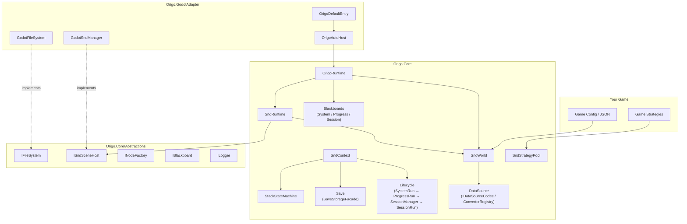
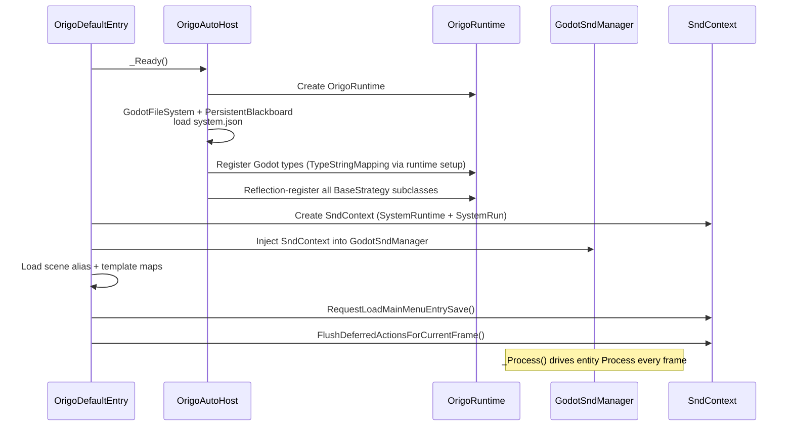

# Origo

[简体中文](README.zh-CN.md)

<!-- badges placeholder -->

**Origo** is a platform-agnostic, pure C# game framework built around the **SND (Strategy–Node–Data)** entity model and the **strategy pattern**. All engine-specific code is isolated behind interfaces so the Core library remains completely engine-free. An official **Godot 4** adapter is included.

> **Audience:** This README is for **game developers integrating Origo** into a project — API surface, setup instructions, naming conventions, on-disk layouts, and subsystem boundaries. Implementation internals live in code and tests.

---

## Table of contents

**Basics & governance:** [Design principles](#design-principles-and-consensus) · [Save I/O contracts](#save-system-contracts) · [Release checklist](#release-checklist) · [Testing](#testing) · [License](#license)

**Getting started:** [Features](#features) · [Project layout](#project-layout) · [Quick Start (Godot 4)](#quick-start-godot-4) · [Architecture overview](#architecture-overview) · [Core concepts](#core-concepts)

**Reference:** [API reference](#api-reference) · [Built-in console](#built-in-console-commands) · [JSON & config](#json--config-formats) · [Startup (Godot)](#startup-sequence-godot) · [Key flows](#key-flows) · [Side effects & threading](#side-effects--threading-model) · [Naming](#naming-conventions) · [GodotAdapter modules](#godotadapter-modules) · [Abstractions](#abstractions-interfaces) · [How to extend](#how-to-extend)

**Advanced:** [Custom type serialization](#custom-type-serialization-tutorial) · [DataSourceNode lifecycle](#datasourcenode-resource-lifecycle)

On GitHub, fragment IDs are generated from heading text (emoji is stripped). [`README.zh-CN.md`](README.zh-CN.md) uses explicit `<a id="…">` tags with the **same** English fragment names so bilingual jumps stay aligned.

---

## ✨ Features

- **SND entity model** — compose entities from Data, Nodes, and Strategies instead of deep class hierarchies
- **Stateless strategy pool** — shared, reference-counted, pooled strategy instances with fail-fast type safety
- **Four-layer lifecycle** — `SystemRun` → `ProgressRun` → `SessionManager` → `SessionRun` with matching blackboards and structured parameter passing
- **Complete save system** — slot-based save/load, continue, auto-save, level switching, and `meta.map` for UI
- **Stack state machines** — push/pop string-based state machines with strategy hooks, persisted per layer
- **Typed blackboards** — `IBlackboard` with `TypedData` values that survive serialization round-trips
- **Built-in developer console** — 8 built-in commands (`help`, `spawn`, `snd_count`, `find_entity`, `clear_entities`, `bb_get`, `bb_set`, `bb_keys`) with pub/sub output and custom command extensibility
- **Deterministic stateless RNG** — XorShift128+ helper methods; caller owns `(s0,s1)` state progression
- **Procedural noise map helper** — generate `Simplex + Worley` blended maps (`70%/30%`) in `0..1` range for gameplay-facing systems
- **Platform-agnostic Core** — depends only on .NET 8; no engine symbols leak into `Origo.Core`
- **Background sessions** — foreground and background levels share the same `ISessionRun` interface, differing only in the injected `ISndSceneHost`. Create via `ctx.SessionManager.CreateBackgroundSession(key, levelId)` for in-memory simulation; serialization and persistence are managed by `SessionManager` internally
- **Godot 4 adapter** — thin implementations + DI wiring; swap with your own adapter for Unity, MonoGame, etc.

Stateless RNG quick usage:

```csharp
var (s0, s1) = RandomNumberGenerator.CreateStateFromSeed("battle-seed");
var (roll, nextS0, nextS1) = RandomNumberGenerator.NextUInt64(s0, s1);
// Persist nextS0/nextS1 yourself, then continue:
var (nextRoll, s2, s3) = RandomNumberGenerator.NextUInt64(nextS0, nextS1);
```

Noise map quick usage:

```csharp
var size = 256;
var map = NoiseMapGenerator.GenerateSimplexWorleyBlendMap(size);
// map is row-major and length is size * size
// each value is normalized to 0..1
```

---

## 📂 Project Layout

Paths below are relative to **this repository’s root** (the directory that contains `Origo.sln`). If you embed Origo as a **Git submodule** inside a game repo, `cd` into the submodule folder first — it is still the Origo root for all commands here.

```
Origo.Core/               Pure C# core (Microsoft.NET.Sdk, net8.0, no engine dependency)
Origo.GodotAdapter/       Godot 4 adapter (Godot.NET.Sdk 4.6.1, thin implementations + DI)
Origo.Core.Tests/         Core unit tests (xUnit v3; see Testing for current count)
Origo.GodotAdapter.Tests/ Adapter tests (xUnit v3; bootstrap/path/serialization guardrails)
scripts/                  ci.sh (full CI pipeline), run-test.sh (test-only shortcut)
Directory.Build.props     Shared MSBuild properties
Origo.sln                 Solution file
```

---

## Design principles and consensus

Origo is written for **integrators**: stable boundaries and observable behavior outweigh hiding every implementation detail.

- **Engine-free Core** — `Origo.Core` targets only .NET; any engine API stays behind interfaces implemented in an adapter project.
- **Fail-fast contracts** — save I/O, deserialization, and strategy resolution prefer explicit errors over silent coercion (see [Save system contracts](#save-system-contracts)).
- **One session abstraction** — foreground and background levels share `ISessionRun`; they differ by the injected `ISndSceneHost` and who ticks them, not by parallel type systems.
- **Pooled, stateless strategies** — strategies are shared instances; instance fields on a strategy type are invalid and guarded by tests.
- **What belongs in this README** — setup, on-disk layout, public APIs, and integration contracts. Internals belong in source and `Origo.Core.Tests`.
- **Placeholder types are intentional** — `EmptySessionManager`, `NullNodeFactory`, and similar types document null-object / no-op edges; they are not “unfinished gameplay modules”.

**Release scope for this repository** — [`Origo.Core`](Origo.Core), [`Origo.GodotAdapter`](Origo.GodotAdapter). Games that consume Origo validate full-stack behaviour on their side.

---

## Save system contracts

Rules integrators should rely on for **Origo.Core** persistence (`SaveStorageFacade`, `SavePayloadReader`).

### Strict reads (fail-fast)

For each level on disk, reads use **strict** semantics:

- If **none** of the three files exist (`snd_scene.json`, `session.json`, `session_state_machines.json`), the level is treated as **having no save yet** — APIs may return `null`; upper layers decide whether that is legal.
- If **only some** files exist, data is treated as **corrupt** — `InvalidOperationException` is thrown (with path hints); there is **no** silent merge.

Regression coverage: `SaveStorageAndPayloadTests` (`ReadCurrent_ActiveLevelPartial_*`, `ReadCurrent_BackgroundLevelPartial_*`, `TryReadLevelPayloadFromCurrent_AllFilesAbsent_ReturnsNull`).

### `WriteSavePayloadToCurrentThenSnapshot` (two steps, not atomic)

1. Write payload to `current/` (including `.write_in_progress` marker handling).
2. Copy `current/` wholesale to `save_{newSaveId}/` (temp directory + rename).

If **step 2 fails**, `current/` may already be updated while the slot directory is incomplete — index and disk can diverge. The library logs **Error** (message includes `Snapshot failed after current/ was written`) and **rethrows**; the marker may **remain** so hosts can detect interrupted writes.

**Integration guidance:** tell the player that the last save did not finish, offer retry / restore from another slot, or clear the marker only after you have verified consistency.

Regression coverage: `WriteSavePayloadToCurrentThenSnapshot_WhenSnapshotFails_LogsError_LeavesMarkerAndUpdatedCurrent`.

### `SnapshotCurrentToSave`

Snapshots are always a **full copy** of `current/`.

---

## Release checklist

Use before tagging or publishing a package built from this repo.

### 1. Documentation & metadata

- [ ] `README.md` / `README.zh-CN.md` commands and API notes match this tree.
- [ ] [`LICENSE`](LICENSE) exists and is linked from the README.
- [ ] [`THIRD_PARTY_NOTICES.md`](THIRD_PARTY_NOTICES.md) is updated when adding, removing, or upgrading vendored dependencies.

### 2. Build, tests, coverage

- [ ] `bash scripts/ci.sh` succeeds from the repo root (same entry point as [`.github/workflows/ci.yml`](.github/workflows/ci.yml)).
- [ ] `Origo.Core` **line coverage ≥ 90 %** via Coverlet in `Origo.Core.Tests` (`Runtime/OrigoAutoInitializer.cs` and `Addons/FastNoiseLite/FastNoiseLite.cs` excluded — see `Origo.Core.Tests.csproj`).
- [ ] Optional: `dotnet test … --list-tests` for release notes.

### 3. Saves vs product expectations

- [ ] Behaviour under [Save system contracts](#save-system-contracts) matches your shipping profile.
- [ ] Manual smoke: save → load → change level (staging build or integrated game).

### 4. Feature completeness

- [ ] No `TODO` / `FIXME` / `NotImplementedException` on ship paths in `Origo.Core` or `Origo.GodotAdapter` (test-only stubs excluded).
- [ ] Known placeholders (`EmptySessionManager`, `NullNodeFactory`, …) are understood as contracts, not hidden WIP.

### 5. CI

- [ ] GitHub Actions on the default branch runs `bash scripts/ci.sh` without divergent extra steps.

### Module → tests (sample map)

| Area | Main tests |
|------|------------|
| Save I/O / strict read | `SaveStorageAndPayloadTests` |
| Two-phase write failure | `WriteSavePayloadToCurrentThenSnapshot_*` |
| Sessions / background | `BackgroundSessionTests`, `CoreArchitectureGuardrailTests` |
| State machine container | `RandomAndStateMachine.ContainerTests` |
| Console / spawn | `ConsoleTests`, `ConsoleCommandExtendedTests`, `SpawnTemplateCommandHandlerTests` |
| Memory filesystem | `MemoryFileSystemTests` |
| Discovery / type mapping | `SndWorldAndDiscoveryCoverageTests`, `AutoInitializerGuardTests` |

---

## 🚀 Quick Start (Godot 4)

### 1. Add Origo to your Godot C# project

Reference both projects in your game `.csproj`:

```xml
<!-- In your game .csproj -->
<ProjectReference Include="../Origo.Core/Origo.Core.csproj" />
<ProjectReference Include="../Origo.GodotAdapter/Origo.GodotAdapter.csproj" />
```

### 2. Create the directory structure

```
res://origo/
  entry/
    entry.json            ← main-menu entity definitions
  maps/
    scene_aliases.map     ← short name → PackedScene path
    snd_templates.map     ← template key → SndMetaData JSON path
  initial/                ← read-only initial save (shipped with game)
```

### 3. Add the entry node to your main scene

Attach `OrigoDefaultEntry` as the root (or a child) node. Its exported properties control paths:

| Property | Default | Purpose |
|----------|---------|---------|
| `ConfigPath` | `res://origo/entry/entry.json` | Main-menu entity definitions |
| `SceneAliasMapPath` | `res://origo/maps/scene_aliases.map` | Scene alias mapping |
| `SndTemplateMapPath` | `res://origo/maps/snd_templates.map` | SND template mapping |
| `SaveRootPath` | `user://origo_saves` | Runtime save directory |
| `InitialSaveRootPath` | `res://origo/initial` | Read-only initial save |
| `AutoDiscoverStrategies` | `true` | Auto-register strategy subclasses via reflection |

You can override `ConfigureSaveMetadataContributors(ISndContext context)` to register custom `meta.map` contributors.

### 4. Write your first strategy

```csharp
using Origo.Core.Snd;
using Origo.Core.Snd.Strategy;

[StrategyIndex("game.player_move")]
public sealed class PlayerMoveStrategy : EntityStrategyBase
{
    public override void Process(ISndEntity entity, double delta, ISndContext ctx)
    {
        // Read state from entity Data — strategies must be stateless
        var (found, speed) = entity.TryGetData<float>("speed");
        if (!found) return;

        // Game logic here...
    }

    public override void AfterSpawn(ISndEntity entity, ISndContext ctx)
    {
        // Initialize entity data on spawn
        entity.SetData("speed", 200f);
    }
}
```

### 5. Define an entity in JSON

```json
{
  "name": "Player",
  "node": { "pairs": { "sprite": "player_sprite" } },
  "strategy": { "indices": ["game.player_move"] },
  "data": { "pairs": { "speed": { "type": "Single", "data": 200.0 } } }
}
```

### 6. Run

Launch your Godot project. `OrigoDefaultEntry._Ready()` bootstraps the entire framework, loads the entry save, and begins calling `Process` on entities each frame.

---

## 🏗 Architecture Overview



### Key Design Principles

1. **Core is platform-agnostic** — all engine touchpoints go through `Abstractions/` interfaces
2. **Adapter implements interfaces + wires DI** — no business rules in the adapter
3. **Strategies are shared, pooled, stateless** — mutable state lives in entity Data or blackboards
4. **Composition over inheritance** — `SndEntity` composes Data, Nodes, and Strategies
5. **Explicit lifecycles** — `SystemRun` → `ProgressRun` → `SessionManager` → `SessionRun` form a 4-layer runtime hierarchy
6. **Fail-fast, no silent fallback** — missing data, bad indices, and invalid state throw immediately
7. **One-way capability flow** — runtime abilities flow strictly downward; lower layers cannot access upper-layer internals
8. **Structured parameter passing** — each layer constructor takes exactly (Runtime, Parameters); no scattered loose arguments

### Runtime Hierarchy

Origo's runtime is organized into four layers, each holding a structured Runtime container and accepting a structured Parameters record:

```
SystemRun (Layer 1)
  └─ holds SystemRuntime
       ├─ Logger, FileSystem, OrigoRuntime, StorageService, SavePathPolicy
       └─ convenience: SndWorld, SndRuntime, SystemBlackboard

ProgressRun (Layer 2)
  constructor: (SystemRuntime, ProgressParameters)
  └─ builds ProgressRuntime
       ├─ Logger, StorageService, SndWorld, SndRuntime, ForegroundSceneHost
       ├─ StateMachineContext, SndContext, SavePathPolicy
       └─ convenience: JsonCodec, ConverterRegistry

SessionManager (Layer 3)
  constructor: (ProgressRuntime, SessionManagerParameters, ProgressBlackboard)
  └─ builds SessionManagerRuntime
       ├─ Logger, StorageService, SndWorld, SndRuntime
       ├─ ForegroundSceneHost, StateMachineContext, SndContext
       └─ convenience: JsonCodec, ConverterRegistry

SessionRun (Layer 4)
  constructor: (SessionManagerRuntime, SessionParameters)
  └─ SessionParameters = (LevelId, SessionBlackboard, SceneHost, IsFrontSession)
```

**Front Session vs Background Session:**

Both are the same `SessionRun` class — no subclass or branching logic. The only distinction is the `IsFrontSession` flag, set by `SessionManager` at creation time:

| | Front Session | Background Session |
|---|---|---|
| Count | Exactly 1 (enforced by `ForegroundKey`) | 0..N |
| `IsFrontSession` | `true` | `false` |
| Scene host | Engine adapter host (injected) | `FullMemorySndSceneHost` |
| Flag source | `SessionManager.CreateForegroundSession` | `SessionManager.CreateBackgroundSession` |

The flag flows: `SessionParameters.IsFrontSession` → `SessionRun.IsFrontSession` → `ISndContext.IsFrontSession` (via `SessionSndContext`). Strategy hooks receive this through `ctx.IsFrontSession` — no cross-layer queries needed.

**Runtime flow direction (strictly one-way):**

```
SystemRuntime → ProgressRuntime → SessionManagerRuntime → SessionRun
```

**Parameter flow direction:**

```
ProgressParameters → SessionManagerParameters → SessionParameters
```

Each layer's Runtime only exposes what the current layer and its children need — no upward access is possible. For example, `SessionRun` cannot access `SystemBlackboard` or `ProgressRun`'s internal state.

### Object Relationship Graph

```
OrigoDefaultEntry (Godot entry node)
  └─ OrigoAutoHost (creates Runtime + injects adapter)
       └─ OrigoRuntime
            ├─ SndWorld (StrategyPool / TypeMapping / Mappings / JsonCodec / ConverterRegistry)
            ├─ SndRuntime (ISndSceneHost facade)
            └─ SystemBlackboard
       └─ SndContext (save / load / change-level orchestration)
            └─ SystemRun (holds SystemRuntime)
                 └─ ProgressRun (holds ProgressRuntime)
                      └─ SessionManager (holds SessionManagerRuntime)
                           └─ SessionRun × N
```

---

## 🧩 Core Concepts

### SND Entity Model

SND (**Strategy–Node–Data**) models game objects as a composition of three orthogonal concerns:

| Component | What it holds | Example |
|-----------|--------------|---------|
| **Strategy** | Behavior (stateless, pooled) | `game.player_move`, `ui.main_menu` |
| **Node** | Visual / scene representation | Sprites, meshes, UI panels |
| **Data** | Mutable state (typed key-value) | `health: 100`, `speed: 200.0` |

An `SndEntity` is the aggregate root composing `SndDataManager`, `SndNodeManager`, and `SndStrategyManager`. Entities are described by `SndMetaData` (JSON-serializable) and spawned through `SndRuntime`.

#### Entity Lifecycle

```
Spawn / Load
    │
    ▼
AfterSpawn / AfterLoad          ← one-time initialization
    │
    ▼
Process(entity, delta, ctx)     ← called every frame
    │
    ▼
BeforeSave                      ← before persisting
    │
    ▼
BeforeQuit / BeforeDead         ← teardown
    │
    ▼
Dispose
```

---

### Strategy System

Strategies are **shared, pooled, stateless objects** registered by a dot-namespace index. They must have **no instance fields** (enforced at registration).

#### Strategy Hierarchy

```
BaseStrategy                       ← root type (index + pool identity)
  ├── EntityStrategyBase           ← entity lifecycle hooks
  ├── StateMachineStrategyBase     ← push/pop state machine hooks
  └── (future domain bases)
```

#### EntityStrategyBase — Virtual Methods

```csharp
public virtual void Process(ISndEntity entity, double delta, ISndContext ctx);
public virtual void AfterSpawn(ISndEntity entity, ISndContext ctx);
public virtual void AfterLoad(ISndEntity entity, ISndContext ctx);
public virtual void AfterAdd(ISndEntity entity, ISndContext ctx);
public virtual void BeforeRemove(ISndEntity entity, ISndContext ctx);
public virtual void BeforeSave(ISndEntity entity, ISndContext ctx);
public virtual void BeforeQuit(ISndEntity entity, ISndContext ctx);
public virtual void BeforeDead(ISndEntity entity, ISndContext ctx);
```

#### Registration

Every concrete strategy **must** declare `[StrategyIndex("dot.namespace")]`. Discovery fails fast if the attribute is missing, empty, or the type has instance fields.

```csharp
[StrategyIndex("combat.attack")]
public sealed class AttackStrategy : EntityStrategyBase
{
    // No instance fields allowed — state goes in entity Data or blackboards
    public override void Process(ISndEntity entity, double delta, ISndContext ctx)
    {
        var (found, cooldown) = entity.TryGetData<double>("attack_cooldown");
        if (found && cooldown > 0)
            entity.SetData("attack_cooldown", cooldown - delta);
    }
}
```

Resolve with `SndStrategyPool.GetStrategy<EntityStrategyBase>(index)` — wrong `TBase` for an index throws `InvalidOperationException`.

---

### Blackboard System

Blackboards are typed key-value stores used for cross-cutting state.

#### `IBlackboard` Contract

```csharp
void Set<T>(string key, T value);
(bool found, T value) TryGet<T>(string key);
void Clear();
IReadOnlyCollection<string> GetKeys();
IReadOnlyDictionary<string, TypedData> SerializeAll();
void DeserializeAll(IReadOnlyDictionary<string, TypedData> data);
```

#### Three Semantic Layers

| Layer | Blackboard | Lifetime | Persisted to |
|-------|-----------|----------|-------------|
| **System** | `SystemBlackboard` | Entire process | `saveRoot/system.json` (via `PersistentBlackboard`) |
| **Progress** | `ProgressBlackboard` | Save slot / flow | `current/progress.json` and `save_*/progress.json` |
| **Session** | `SessionBlackboard` | Current level | `current/level_*/session.json` |

Each blackboard layer aligns 1:1 with its corresponding **Run** object:

- `SystemRun` ↔ `SystemBlackboard` — lives for the whole process
- `ProgressRun` ↔ `ProgressBlackboard` — created/replaced on save load or continue
- `SessionRun` ↔ `SessionBlackboard` — recreated on level change

#### PersistentBlackboard

`PersistentBlackboard` wraps `IBlackboard` and auto-persists to disk on every `Set`, `Clear`, and `DeserializeAll` call. Used by the Godot adapter for `SystemBlackboard`.

#### Well-Known Keys

```csharp
WellKnownKeys.ActiveSaveId       = "origo.active_save_id";
WellKnownKeys.SessionTopology    = "origo.session_topology";
```

`ProgressRun` no longer stores a standalone active level key in `ProgressBlackboard`.
The foreground level is derived from `WellKnownKeys.SessionTopology` (`__foreground__=levelId=syncProcess`).

---

### State Machine System

`StackStateMachine` implements `IStateMachine` — a **stack of string values** with strategy-driven hooks.

Each machine is constructed with a **machine key**, a **push strategy index**, and a **pop strategy index** (both must be `StateMachineStrategyBase` implementations).

#### StateMachineStrategyBase — Virtual Methods

```csharp
public virtual void OnPushRuntime(StateMachineStrategyContext context, IStateMachineContext ctx);
public virtual void OnPushAfterLoad(StateMachineStrategyContext context, IStateMachineContext ctx);
public virtual void OnPopRuntime(StateMachineStrategyContext context, IStateMachineContext ctx);
public virtual void OnPopBeforeQuit(StateMachineStrategyContext context, IStateMachineContext ctx);
```

#### StateMachineStrategyContext

```csharp
public readonly struct StateMachineStrategyContext
{
    public string MachineKey { get; }
    public string? BeforeTop { get; }
    public string? AfterTop { get; }
}
```

#### Hook Semantics

| Operation | Hook | When |
|-----------|------|------|
| Runtime push | `OnPushRuntime` | After the new value is on the stack |
| Load rebuild | `OnPushAfterLoad` | Called bottom → top for each stack level |
| Runtime pop | `OnPopRuntime` | Before the top value is removed |
| Quit unwind | `OnPopBeforeQuit` | When unwinding the stack on quit |

#### Persistence

State machines are managed by `StateMachineContainer`, scoped to `ProgressRun` or `SessionRun`:

- `progress_state_machines.json` — progress-scoped machines
- `session_state_machines.json` — session-scoped machines

Access via `SndContext.GetProgressStateMachines()` / `SessionManager.ForegroundSession?.GetSessionStateMachines()`.

---

### Serialization / DataSource Abstraction

All serialization in Origo goes through a **DataSource abstraction layer** (`Origo.Core/DataSource/`), decoupling the entire Core from any concrete JSON library (e.g. `System.Text.Json`).

#### Key Components

| Type | Responsibility |
|------|----------------|
| `DataSourceNode` | Immutable tree node: Object, Array, String, Number, Boolean, Null — with lazy expansion |
| `IDataSourceCodec` | Encode / Decode between `DataSourceNode` and raw text (JSON, `.map`, etc.) |
| `DataSourceConverterRegistry` | Type-safe read/write of domain objects ↔ `DataSourceNode` |
| `DataSourceConverter<T>` | Abstract base for per-type conversion logic |
| `DataSourceFactory` | Factory that creates a pre-configured registry with all built-in converters |

#### Codec Implementations

- **`JsonDataSourceCodec`** — wraps `System.Text.Json` internally; the only place STJ appears
- **`MapDataSourceCodec`** — simple `key: value` line-based format for `.map` files

#### How It Works

```
Domain Object  ←→  DataSourceNode  ←→  Raw Text (JSON / .map)
     ↑ registry.Write/Read ↑    ↑ codec.Encode/Decode ↑
```

`SndWorld` exposes `JsonCodec` and `ConverterRegistry` so all subsystems (Save, StateMachine, Blackboard) serialize without depending on any JSON library.

#### Extending with Custom Types

To add serialization support for engine-specific types (e.g. Godot `Vector2`):

1. Implement `DataSourceConverter<T>` for your type
2. Register it during bootstrap:

```csharp
sndWorld.ConverterRegistry.Register(new MyVector2Converter());
```

See `GodotJsonConverterRegistry.RegisterDataSourceConverters()` for a complete example of registering engine types.

---

### Save / Load System

The save system uses a **workspace + snapshot** model:

1. `current/` is the live working copy (always writable)
2. `save_*/` directories are immutable snapshots
3. Saving writes to `current/` first, then snapshots to `save_xxx/`
4. Loading restores a snapshot to `current/`, then rebuilds runs

#### Save Directory Layout

```
saveRoot/
  system.json                       ← SystemBlackboard
  current/                          ← writable working copy
    progress.json                   ← ProgressBlackboard
    progress_state_machines.json    ← progress state machines
    meta.map                        ← display metadata (key: value)
    level_default/                  ← current level data
      snd_scene.json                ← serialized SND entities
      session.json                  ← SessionBlackboard
      session_state_machines.json   ← session state machines
  save_000/                         ← immutable snapshot
    progress.json
    progress_state_machines.json
    meta.map
    level_default/
      ...
  save_001/
    ...
```

#### Strict Semantics

- **Required files:** missing required files or fields is treated as corruption (throws exceptions)
- **`progress.json`** must exist and deserialize successfully — no silent fallback
- **Fail-fast:** unregistered strategy index, invalid state machine payload, or missing template → immediate error

#### Save Path Conventions (Godot defaults)

| Path | Purpose |
|------|---------|
| `res://origo/initial/` | Read-only initial save shipped with the project |
| `user://origo_saves/` | Runtime read/write save root |
| `res://origo/entry/` | Entry configuration (main menu entities) |
| `res://origo/maps/` | Alias and template map files |

---

## 📘 API Reference

### SndContext

`SndContext` implements `ISndContext` — the primary facade strategies interact with for blackboards, save/load, level switching, and console. `ISndContext` exposes the complete business API needed by entity strategies; internal details (`SndRuntime`, file paths) remain on the concrete class only.

#### Properties (via `ISndContext`)

| Property | Type | Description |
|----------|------|-------------|
| `SystemBlackboard` | `IBlackboard` | System-level blackboard (always available) |
| `ProgressBlackboard` | `IBlackboard?` | Progress-level blackboard (available after load) |
| `SessionManager` | `ISessionManager` | Sole entry point for creating, serializing, persisting, and destroying sessions; access `ForegroundSession` and background sessions through this manager |
| `CurrentSession` | `ISessionRun?` | The session bound to the current strategy context; for global context this is the current foreground session |

#### Concrete-only Properties (not on `ISndContext`)

| Property | Type | Description |
|----------|------|-------------|
| `SndRuntime` | `SndRuntime` | SND entity runtime (internal detail) |
| `SaveRootPath` | `string` | Root path for save files |
| `InitialSaveRootPath` | `string` | Path to initial (read-only) save |
| `EntryConfigPath` | `string` | Path to entry configuration JSON |

#### Entity & Deferred Methods

| Method | Description |
|--------|-------------|
| `EnqueueBusinessDeferred(Action)` | Enqueue action for end-of-frame business phase |
| `FlushDeferredActionsForCurrentFrame()` | Flush all deferred actions immediately |
| `GetPendingPersistenceRequestCount()` | Always returns `0` in the simplified single-startup flow |
| `CloneTemplate(string templateKey, string? overrideName)` | Clone an entity from a template |

#### Startup Method

| Method | Description |
|--------|-------------|
| `RequestLoadMainMenuEntrySave()` | Load main-menu entry (no implicit save) |

#### Console Methods

| Method | Description |
|--------|-------------|
| `TrySubmitConsoleCommand(string commandLine)` | Submit a console command |
| `ProcessConsolePending()` | Process pending console commands |
| `SubscribeConsoleOutput(Action<string>)` | Subscribe to console output |
| `UnsubscribeConsoleOutput(long subscriptionId)` | Unsubscribe from console output |

#### State Machine Methods

| Method | Description |
|--------|-------------|
| `GetProgressStateMachines()` | Access progress-scoped state machines |
| `SessionManager.ForegroundSession?.GetSessionStateMachines()` | Access foreground session-scoped state machines (via `ISessionRun`) |

---

### OrigoRuntime

Top-level runtime object created by the adapter.

| Member | Kind | Description |
|--------|------|-------------|
| `Logger` | property | `ILogger` logging interface |
| `SndWorld` | property | Strategy pool, type mapping, JsonCodec, ConverterRegistry |
| `Snd` | property | `SndRuntime` entity runtime facade |
| `SystemBlackboard` | property | System blackboard |
| `ConsoleInput` | property | `ConsoleInputQueue?` console input source |
| `ConsoleOutputChannel` | property | `IConsoleOutputChannel?` console output channel |
| `Console` | property | `OrigoConsole?` console instance |
| `EnqueueBusinessDeferred(Action)` | method | Enqueue business-phase deferred action |
| `EnqueueSystemDeferred(Action)` | method | Enqueue system-phase deferred action |
| `FlushEndOfFrameDeferred()` | method | Flush Business then System deferred queues |
| `ResetConsoleState()` | method | Reset console to initial state |

---

### SndRuntime

Facade combining `SndWorld` and `ISndSceneHost`.

| Member | Kind | Description |
|--------|------|-------------|
| `World` | property | Access to strategy pool and mappings |
| `SceneHost` | property | Scene host for entity operations |
| `Spawn(SndMetaData)` | method | Spawn a single entity |
| `SpawnMany(IEnumerable<SndMetaData>)` | method | Batch-spawn entities |
| `SerializeMetaList()` | method | Serialize all entity metadata |
| `ClearAll()` | method | Remove all entities |
| `GetEntities()` | method | Get all active entities |
| `FindByName(string)` | method | Find entity by name |

### Foreground & Background Levels

In Origo, a **level** is a combination of an `ISndSceneHost` (entity management) with the lifecycle infrastructure (`IStateMachineContext` / `ProgressRun` / `SessionRun`). Both foreground and background levels implement the same `ISessionRun` interface — the concrete `SessionRun` class is an internal implementation detail. The only difference is the injected **scene host / node factory**:

| | Foreground Level | Background Level |
|---|---|---|
| Session type | `ISessionRun` | `ISessionRun` (same interface) |
| Scene host | Engine adapter's `ISndSceneHost` (e.g. Godot adapter) | `FullMemorySndSceneHost` |
| Node factory | Engine adapter (e.g. `GodotPackedSceneNodeFactory`) | `NullNodeFactory` (name-only, no instantiation) |
| Rendering | Nodes are instantiated and visible | No nodes, no rendering |
| Entity type | Real `SndEntity` with full strategy hooks | Real `SndEntity` with full strategy hooks |
| Progress blackboard | Shared | Shared (when created from `IStateMachineContext`) |
| Session blackboard | Own | Own |
| State machines | Own | Own |
| Process / Tick | Engine calls `_Process` | Caller manually calls `ProcessAll(delta)` on `FullMemorySndSceneHost` |
| Format | Save/load via standard `LevelPayload` | Same — fully interchangeable |

Both use the **same** `SndEntity` code path, the **same** strategy lifecycle, and produce **identical** serialized formats. A background level can be saved to disk and later loaded as a foreground level, and vice versa. Strategy hooks receive `ctx.IsFrontSession` to distinguish front/background without class branching.

#### Architecture: Why Foreground and Background Share `ISessionRun`

The foreground level is always unique and **permanently resident** — it exists for the entire game session and is managed by `ProgressRun`. Background levels are **ephemeral** — they are created on demand (e.g. for runtime procedural generation, AI simulation) and disposed when no longer needed. The `IsFrontSession` flag is injected at construction time, so strategy hooks can check it without querying `SessionManager`.

Because the foreground level is "always there", background levels are conceptually **dependent** on the foreground level. When `ctx.SessionManager.CreateBackgroundSession(key, levelId)` is called, it:

1. **Copies shared references** from the foreground level — `SndWorld` (strategy pool, codecs), `ProgressBlackboard`, `IFileSystem`, `SaveRootPath`
2. **Creates isolated data** unique to the background level — new `SessionBlackboard`, new `StateMachineContainer`, new `FullMemorySndSceneHost`
3. **Auto-mounts** the session in `SessionManager` under the given key and returns an `ISessionRun`

This design ensures:
- **Consistency** — background levels automatically see the same strategies, templates, and progress data as the foreground
- **Isolation** — each background level has its own session state and entities that cannot interfere with the foreground scene
- **Simplicity** — no separate class or wrapper; the caller works with the familiar `ISessionRun` contract

#### Creating a Background Level

**From an existing `SndContext`** (recommended for production — shares strategy pool, progress blackboard, and file system):

```csharp
// Inside a strategy or game logic that has access to SndContext:
using var bgSession = ctx.SessionManager.CreateBackgroundSession("dungeon", "generated_dungeon");

// SceneHost provides full entity operations directly — no casting required.
var host = bgSession.SceneHost;

// All strategies registered on the foreground SndWorld are available.
host.Spawn(new SndMetaData
{
    Name = "Boss_01",
    NodeMetaData = new NodeMetaData(),
    StrategyMetaData = new StrategyMetaData { Indices = { "ai.boss" } },
    DataMetaData = new DataMetaData()
});

// Set session data for the background level.
bgSession.SessionBlackboard.Set("difficulty", "nightmare");

// Write to ProgressBlackboard — visible to the foreground level too.
ctx.ProgressBlackboard!.Set("dungeon_ready", true);

// Run a frame — Process fires on all entities.
host.ProcessAll(0.016);

// Serialization and persistence are managed by SessionManager internally.
// Background session lifecycle and persistence are managed by SessionManager internals.
```

**For tests** — use `CreateForegroundContext` pattern (see `BackgroundSessionTests.cs`):

```csharp
// Create a background session for testing via SessionManager:
using var bg = ctx.SessionManager.CreateBackgroundSession("test", "test_level");
var host = bg.SceneHost;

// Spawn entities — AfterSpawn hook fires on each strategy.
var guard = host.Spawn(new SndMetaData
{
    Name = "Guard_01",
    NodeMetaData = new NodeMetaData(),
    StrategyMetaData = new StrategyMetaData { Indices = { "patrol" } },
    DataMetaData = new DataMetaData()
});

// Read/write blackboards.
bg.SessionBlackboard.Set("alert_level", 3);

// Run one frame — calls Process on every entity.
host.ProcessAll(0.016);

// Dynamically add/remove strategies at runtime.
guard.AddStrategy("combat");
guard.RemoveStrategy("patrol");

// Serialize all entities.
var snapshot = bg.SceneHost.SerializeMetaList();

// Kill a specific entity — BeforeDead hook fires.
host.DeadByName("Guard_01");

// Dispose clears all entities (BeforeQuit fires) and tears down the runtime.
```

> **Persistence:** Save payload topology still includes all sessions managed by `SessionManager` (foreground + background), restored via `ProgressBlackboard` key `WellKnownKeys.SessionTopology`.
>
> **Lifecycle ownership:** `SessionManager` fully owns the `SessionRun` lifecycle. Sessions are always created through `SessionManager` and auto-mounted — there are no separate Mount/Unmount operations. Background sessions are destroyed via `ctx.SessionManager.DestroySession(key)`. The caller is still responsible for ticking sessions each frame; use `ctx.SessionManager.ProcessAllSessions(delta)` for convenience.
>
> **Serialization:** Serialization and persistence of session state (blackboards, state machines, entities) are managed internally by `SessionManager`. `ISessionRun` no longer exposes `SerializeToPayload()`, `LoadFromPayload()`, or `PersistLevelState()`.

#### Serializing & Loading Background Sessions

Background sessions support the same `LevelPayload` serialization format as foreground levels. Serialization and persistence are managed internally by `SessionManager`.

**Restore from payload:**

```csharp
// Create a background session, then restore payload through SessionManager internals.
using var restored = ctx.SessionManager.CreateBackgroundSession("arena", "ai_arena");
((SessionManager)ctx.SessionManager).LoadSessionFromPayload("arena", payload);
```

**Round-trip: background → foreground level:**

```csharp
// 1. Background session builds a level.
using var bg = ctx.SessionManager.CreateBackgroundSession("dungeon", "procedural_dungeon");
var host = bg.SceneHost;
// ... populate entities ...

// 2. SessionManager handles persistence internally.
// 3. Foreground mounting remains controlled by lifecycle internals.
```

**Create background session for simulation:**

```csharp
// Create a background session for AI simulation.
using var simulation = ctx.SessionManager.CreateBackgroundSession("sim", "sim_arena");
var simHost = simulation.SceneHost;

// Run 100 simulated frames.
for (int i = 0; i < 100; i++)
    simHost.ProcessAll(0.016);

// Read results from the simulation's blackboard.
var (_, score) = simulation.SessionBlackboard.TryGet<int>("final_score");
```

#### Session Recovery Mechanism (Chain of Responsibility)

Origo uses a **Chain of Responsibility** pattern for session serialization and deserialization. Each layer in the runtime hierarchy handles only its own data and delegates the rest to the next layer. **No pre-built runtime objects (such as `IBlackboard` instances) are passed between layers** — each module reads and writes its own persistent data autonomously.

**Design philosophy: self-read/write, entry requires only saveId.**

- `ProgressRun` always creates its own blank `ProgressBlackboard` internally. The constructor accepts only a `saveId` string (via `ProgressParameters`), never an injected blackboard.
- Recovery is triggered exclusively through `LoadFromPayload()`, which reads a `SaveGamePayload` and deserializes each layer's data in chain order.
- Modules communicate session metadata via lightweight structures (topology strings stored in well-known blackboard keys), not pre-populated object instances.

**Serialization chain** (save):

```
SessionRun            → serializes own data (SessionBlackboard, state machines, entities → LevelPayload)
  ↓ returns LevelPayload
SessionManager        → collects all LevelPayloads from background sessions
  ↓ returns Dictionary<key, LevelPayload>
ProgressRun           → writes session topology to ProgressBlackboard (WellKnownKeys.SessionTopology)
                      → serializes ProgressBlackboard, progress state machines
                      → builds final SaveGamePayload
```

**Deserialization chain** (load):

```
ProgressRun           → deserializes own data (ProgressBlackboard, progress state machines)
                      → reads session topology from its own ProgressBlackboard
  ↓ passes topology descriptors to SessionManager
SessionManager        → iterates topology descriptors
                      → creates/mounts each SessionRun with correct properties
                        (foreground identity via ForegroundKey, tick state via syncProcess)
  ↓ delegates data loading to SessionRun
SessionRun            → deserializes own data (SessionBlackboard, session state machines, SND scene entities)
```

**Properties restored after deserialization:**

| Property | Mechanism |
|----------|-----------|
| Foreground identity (`IsFrontSession`) | Topology entry with key `ISessionManager.ForegroundKey` → mounted as foreground |
| Tick registration (syncProcess) | Topology entry's third field (`true`/`false`) → passed to `CreateBackgroundSession` |
| ProgressBlackboard reference | All sessions share the same `ProgressBlackboard` instance from `ProgressRun` |
| SessionBlackboard isolation | Each session gets a new `IBlackboard` instance; data restored from `LevelPayload.SessionJson` |

`syncProcess` controls only whether a session participates in `SessionManager.ProcessAllSessions(...)`.
Foreground entries are intentionally serialized as `__foreground__=levelId=false`; this means "not updated through the background batch process", not "foreground does not update". Foreground updates are driven by the runtime/engine foreground scene loop.

**Foreground uniqueness constraint:** At most one session can be mounted at `ISessionManager.ForegroundKey`. The `SessionManager` enforces this: mounting a new foreground session automatically destroys the previous one.

#### API Surface

Since background levels implement the standard `ISessionRun` interface, the API is the same as foreground levels:

| Member | Kind | Description |
|--------|------|-------------|
| `ISessionManager.ForegroundKey` | `ISessionManager` constant | Reserved mount key for the foreground session (`"__foreground__"`) |
| `ctx.SessionManager.ForegroundSession` | `ISessionManager` property | Access the foreground session (available after load); equivalent to `TryGet(ForegroundKey)` |
| `ctx.SessionManager.Keys` | `ISessionManager` property | All mounted session keys (including foreground if present) |
| `ctx.SessionManager.Contains(key)` | `ISessionManager` method | Check whether a session with the given key is mounted |
| `ctx.SessionManager.TryGet(key)` | `ISessionManager` method | Look up a session by key |
| `ctx.SessionManager.CreateBackgroundSession(key, levelId, syncProcess?)` | `ISessionManager` method | Create a background `ISessionRun` (auto-mounted) — shares `SndWorld`, `ProgressBlackboard`, file system. When `syncProcess` is `true`, the session participates in `ProcessAllSessions` updates |
| `ctx.SessionManager.DestroySession(key)` | `ISessionManager` method | Destroy and dispose a background session |
| `ctx.SessionManager.ProcessAllSessions(delta, includeForeground?)` | `ISessionManager` method | Process one frame for sessions with `syncProcess=true` (primarily background sessions) |
| `LevelId` | `ISessionRun` property | Level identifier |
| `SessionBlackboard` | `ISessionRun` property | Session-level blackboard (own) |
| `GetSessionStateMachines()` | `ISessionRun` method | Access session-level state machines |
| `SceneHost` | `ISessionRun` property | `ISndSceneHost` — provides full entity operations (Spawn/FindByName/GetEntities) directly, no casting required |
| `Dispose()` | `ISessionRun` method | Shutdown level (clears entities, blackboard, state machines) |

Entity operations available on `SceneHost` via the `ISndSceneHost` interface:

| Member | Kind | Description |
|--------|------|-------------|
| `Spawn(SndMetaData)` | method | Spawn entity → `AfterSpawn` |
| `FindByName(string)` | method | Lookup by name |
| `GetEntities()` | method | All alive entities |
| `ClearAll()` | method | Remove all → `BeforeQuit` |
| `SerializeMetaList()` | method | Snapshot all metadata → `BeforeSave` |
| `LoadFromMetaList(IEnumerable)` | method | Clear and reload from metadata |

Additional methods on `FullMemorySndSceneHost` (background levels only):

| Member | Kind | Description |
|--------|------|-------------|
| `DeadByName(string)` | method | Kill entity by name → `BeforeDead` |
| `ProcessAll(double)` | method | `Process` all entities for one frame |

#### Supporting Types

| Type | Description |
|------|-------------|
| `FullMemorySndSceneHost` | `ISndSceneHost` backed by real `SndEntity` instances (no engine nodes); additionally provides `DeadByName` and `ProcessAll` |
| `MemoryFileSystem` | Pure in-memory `IFileSystem` — no disk I/O |

#### Allowed vs Prohibited Differences

Because foreground and background levels share the `ISessionRun` contract, code consuming sessions should remain type-agnostic:

| | Allowed ✅ | Prohibited ❌ |
|---|---|---|
| Scene access | Different `ISndSceneHost` implementations (foreground engine adapter vs background `FullMemorySndSceneHost`) | Business logic branching based on session type (e.g. `if (isForeground) { … }`) |
| Entity operations | Using `ISndSceneHost` methods uniformly via `SceneHost` | Casting `ISessionRun` to the concrete `SessionRun` class |
| Extension | Custom `ISndSceneHost` implementations for new backends | Hardcoded foreground / background checks in strategies or game logic |

> **Rule of thumb:** If your code needs to know *which kind* of session it is running in, the design should be revisited. Session-type-specific behaviour belongs in the injected `ISndSceneHost` / `INodeFactory`, not in the consumer.

#### Injectable Services

The following interfaces decouple lifecycle infrastructure from concrete implementations, making it easier to test, swap adapters, and configure behaviour:

| Interface | Replaces | Description |
|-----------|----------|-------------|
| `IStateMachineContext` | direct `SndContext` dependency | Context interface consumed by `StateMachineContainer` — provides `SessionBlackboard` (current session), `SceneAccess` (current session's scene), and session metadata without coupling to the full context. **Two implementations**: `SndContext` acts as the global/process-level default (points to the foreground session); `SessionStateMachineContext` is an internal adapter that binds each session's own blackboard and scene host, so foreground and background session state-machine hooks have **no semantic difference** |
| `ISaveStorageService` | direct file-system save logic | Abstraction for save-slot persistence (list, read, write, snapshot, enumerate). **All** methods — including `EnumerateSaveIds`, `EnumerateSavesWithMetaData`, `WriteSavePayloadToCurrentThenSnapshot`, and `SnapshotCurrentToSave` — are fully driven by the injected `ISavePathPolicy`. Inject to replace file-system storage with cloud, database, or in-memory backends |
| `ISavePathPolicy` | hardcoded path layout | Determines save-file directory structure and naming. When injected via `SndContext` constructor, it is automatically propagated to the default `DefaultSaveStorageService` (both primary and initial), `SystemRuntime`, `SessionRun`, and `LevelBuilder` — **all** storage paths are driven by this single policy instance. Implement to customise save folder layout without modifying core code |

Strategy hooks receive `IStateMachineContext` instead of the concrete `SndContext`, so strategies remain testable and decoupled from the full runtime. Session-level state machines receive `SessionStateMachineContext`, which guarantees that `ctx.SessionBlackboard` and `ctx.SceneAccess` always point to the current session — this holds equally for foreground and background sessions.

---

## 🖥 Built-in Console Commands

The developer console provides 8 built-in commands covering entity management and blackboard inspection. Submit commands via `SndContext.TrySubmitConsoleCommand(string)` and receive output through `SubscribeConsoleOutput`.

### Entity Commands

| Command | Usage | Description |
|---------|-------|-------------|
| `spawn` | `spawn <name> <template>` | Spawn an entity by cloning a registered template |
| | `spawn name=<n> template=<t>` | Named-argument form (cannot mix with positional) |
| `snd_count` | `snd_count` | Print the current number of spawned entities |
| `find_entity` | `find_entity <name>` | Look up an entity by name and display its node info |
| `clear_entities` | `clear_entities` | Destroy all spawned entities |

### Blackboard Commands

| Command | Usage | Description |
|---------|-------|-------------|
| `bb_get` | `bb_get <layer> <key>` | Read a value from the specified blackboard layer |
| `bb_set` | `bb_set <layer> <key> <value>` | Write a value (auto-infers int / float / bool / string) |
| `bb_keys` | `bb_keys <layer>` | List all keys in the specified blackboard layer |

> **layer** — currently supports `system`. Progress / Session layers are available when a `SndContext` with an active run is present.

### Utility Commands

| Command | Usage | Description |
|---------|-------|-------------|
| `help` | `help` | List all registered command names |

### Custom Commands

Register custom commands via `OrigoConsole.RegisterHandler(IConsoleCommandHandler)`.

Each handler declares:

| Property | Description |
|----------|-------------|
| `Name` | Command keyword (case-insensitive) |
| `HelpText` | Usage string shown by the `help` command |
| `MinPositionalArgs` | Minimum positional argument count (inclusive) |
| `MaxPositionalArgs` | Maximum positional argument count (inclusive, -1 = unlimited) |

Extend `ConsoleCommandHandlerBase` to get **automatic argument-count validation** — your `ExecuteCore` is only called when the count is in range:

```csharp
public sealed class TeleportCommandHandler : ConsoleCommandHandlerBase
{
    public override string Name => "teleport";
    public override string HelpText => "teleport <x> <y> — Teleport the player to the given coordinates.";
    public override int MinPositionalArgs => 2;
    public override int MaxPositionalArgs => 2;

    protected override bool ExecuteCore(
        CommandInvocation invocation,
        IConsoleOutputChannel outputChannel,
        out string? errorMessage)
    {
        var x = invocation.PositionalArgs[0];
        var y = invocation.PositionalArgs[1];
        outputChannel.Publish($"Teleported to ({x}, {y}).");
        errorMessage = null;
        return true;
    }
}
```

Register at any time:

```csharp
runtime.Console?.RegisterHandler(new TeleportCommandHandler());
```

The built-in `help` command automatically lists every registered handler's `HelpText`.

---

## 📄 JSON & Config Formats

### SndMetaData

```json
{
  "name": "Player",
  "node": {
    "pairs": {
      "sprite": "player_sprite"
    }
  },
  "strategy": {
    "indices": ["game.player_move", "game.player_combat"]
  },
  "data": {
    "pairs": {
      "health": { "type": "Int32", "data": 100 },
      "speed":  { "type": "Single", "data": 200.0 }
    }
  }
}
```

### Template Shorthand (JSON Arrays)

Entity arrays support both inline definitions and template references:

```json
[
  { "sndName": "MyEntity", "templateKey": "some_template" },
  {
    "name": "InlineEntity",
    "strategy": { "indices": ["game.some_strategy"] },
    "data": { "pairs": {} }
  }
]
```

### `.map` File Format

Simple `key: value` per line. Lines starting with `#` are comments.

```
# Scene aliases — maps short names to PackedScene paths
box: res://scenes/resource/box.tscn
camera: res://scenes/resource/camera.tscn
player_sprite: res://scenes/characters/player.tscn
```

### `meta.map` (Save Display Metadata)

Same format, used for save-slot UI display:

```
# Save display metadata
title: Chapter 2 - Forest
play_time: 03:12:55
player_level: 18
```

Save metadata contributors are handled internally by lifecycle components in this simplified flow.

---

## 🔄 Startup Sequence (Godot)



**Step-by-step:**

1. `OrigoDefaultEntry._Ready()` → `OrigoAutoHost._Ready()` creates `OrigoRuntime`
2. `GodotFileSystem` + `PersistentBlackboard` load `saveRoot/system.json`
3. Register Godot types on the runtime’s `TypeStringMapping` (e.g. `GodotJsonConverterRegistry.RegisterTypeMappings(...)` before building `SndWorld`, as in `OrigoAutoHost`)
4. Reflection registers all concrete `BaseStrategy` subclasses
5. Create `SndContext` (internally creates `SystemRuntime` + `SystemRun`), inject into `GodotSndManager`
6. Load scene alias and template map files
7. `RequestLoadMainMenuEntrySave()` + `FlushDeferredActionsForCurrentFrame()`
8. `GodotSndManager._Process` runs entity `Process` every frame

---

## 🔀 Key Flows

### Startup Main Menu

```
Game calls SndContext.RequestLoadMainMenuEntrySave()
  → Enqueues on SystemDeferred
  → Resets runtime console state
  → Rebuilds ProgressRun and mounts main-menu foreground session
  → Spawns entry entities from `entry.json`
```

### Session Restore (Play-Stop-Play)

```
ProgressRun created with saveId only (blank ProgressBlackboard)
  → LoadFromPayload(payload) called with SaveGamePayload
  → ProgressRun deserializes own data (ProgressBlackboard, state machines)
  → Reads WellKnownKeys.SessionTopology from its own ProgressBlackboard
  → For each descriptor in topology:
      if key == ForegroundKey → SessionManager.CreateForegroundSession (IsFrontSession=true)
      else                   → SessionManager.CreateBackgroundSession (syncProcess preserved)
  → SessionManager delegates data loading to SessionRun.LoadFromPayload
  → SessionRun restores SessionBlackboard, session state machines, SND scene entities
  → Foreground identity, tick registration, and blackboard isolation are fully restored
```

---

## ⚠️ Side Effects & Threading Model

### Deferred Execution

`RequestLoadMainMenuEntrySave` does **not** execute immediately. It enqueues deferred actions on the game loop queue.

| Behavior | Detail |
|----------|--------|
| **When do deferred actions execute?** | Only when `FlushDeferredActionsForCurrentFrame()` is called (typically once per frame by the adapter) |
| **Execution order** | Business deferred → System deferred, strictly sequential |
| **Reentrancy guard** | Only one lifecycle workflow can be in-flight at a time; overlapping requests throw `InvalidOperationException` |
| **Persistence counter** | `GetPendingPersistenceRequestCount()` always returns `0` in simplified flow |

### Threading

| Rule | Detail |
|------|--------|
| **Single-thread assumption** | `SndContext`, all Run types, and entity lifecycle must be accessed from the game loop thread only |
| **Deferred queues** | Thread-safe for enqueue; flush is game-loop-only |
| **Console** | `ConsoleInputQueue.Enqueue()` and `ConsoleOutputChannel.Subscribe/Publish` are thread-safe |
| **Blackboards** | `IBlackboard` implementations are **not** thread-safe |
| **Background sessions** | Created on game loop, then safe to Process on any single thread (not concurrent) |

### Common Pitfalls

- **Accessing `ProgressBlackboard` / `SessionManager.ForegroundSession?.SessionBlackboard` before startup load** — returns `null`; call `RequestLoadMainMenuEntrySave` + flush first
- **Disposing a `SessionRun`** — all property access after disposal throws `ObjectDisposedException`; the disposal order is: auto-persist (best-effort) → auto-unmount from `SessionManager` → pop all state machines → clear state machines → clear scene → clear blackboard
- **Background session lifetime** — background sessions are created and destroyed through `SessionManager`; the caller is responsible for calling `ProcessAllSessions(delta)` or manually ticking each session

---

## 📏 Naming Conventions

All external strings share a consistent style to prevent silent mismatches.

| Context | Convention | Example |
|---------|-----------|---------|
| Strategy index | Dot namespace, `lower_snake_case` segments | `ui.main_menu`, `combat.attack` |
| Blackboard keys | Dot namespace, `lower_snake_case` | `origo.active_save_id` |
| `.map` keys | `lower_snake_case`, unique per file | `player_sprite`, `box` |
| `SndMetaData.name` | `PascalCase` | `Player`, `MainMenu` |

Invalid or missing data **fails fast** — there are no compatibility shims or silent fallbacks.

---

## 🔌 GodotAdapter Modules

| Module | Location | Responsibility |
|--------|----------|----------------|
| **OrigoAutoHost** | `Bootstrap/` | Creates `OrigoRuntime`; `PersistentBlackboard` for system; `ConsoleInputQueue` + `ConsoleOutputChannel` |
| **GodotSndBootstrap** | `Bootstrap/` | One-call `BindRuntimeAndContext(GodotSndManager, SndWorld, ILogger, ISndContext)` |
| **OrigoConsolePump** | `Bootstrap/` | Each frame: `OrigoRuntime.Console.ProcessPending()` |
| **OrigoDefaultEntry** | `Bootstrap/` | Subclasses `OrigoAutoHost`; startup partials; override `ConfigureSaveMetadataContributors(ISndContext)` |
| **GodotFileSystem** | `FileSystem/` | `IFileSystem` for `res://` and `user://` paths |
| **GodotLogger** | `Logging/` | `ILogger` implementation using Godot output |
| **GodotSndEntity** | `Snd/` | Binds `SndEntity` to Godot `Node` lifetime |
| **GodotSndManager** | `Snd/` | `ISndSceneHost`; `_Process` drives entity strategies each frame |
| **GodotPackedSceneNodeFactory** | `Snd/` | `INodeFactory` via Godot `PackedScene` |
| **GodotNodeHandle** | `Snd/` | `INodeHandle` wrapping Godot `Node` |
| **GodotJsonConverterRegistry** | `Serialization/` | Registers Godot types in `TypeStringMapping` + JSON converters |

### OrigoAutoHost Exported Properties

| Property | Default | Description |
|----------|---------|-------------|
| `SystemBlackboardSaveRoot` | `user://origo_saves` | Save root for `PersistentBlackboard` |

---

## 🧱 Abstractions (Interfaces)

All host-provided capabilities are declared in `Origo.Core/Abstractions/`:

| Interface | Responsibility |
|-----------|----------------|
| `IFileSystem` | File I/O, paths, directories (virtual paths like `res://` interpreted by adapter) |
| `INodeFactory` | Create nodes by logical name + resource id → `INodeHandle` |
| `INodeHandle` | Minimal node handle: `Name`, `Native`, `Free()`, `SetVisible()` |
| `ISndSceneHost` | Scene entity operations: `Spawn`, `GetEntities`, `FindByName` |
| `ISndEntity` | Composed of `ISndDataAccess` + `ISndNodeAccess` + `ISndStrategyAccess` |
| `IBlackboard` | Typed key-value store with `SerializeAll` / `DeserializeAll` |
| `IDataSourceCodec` | Encode / Decode between `DataSourceNode` and raw text (e.g. JSON) |
| `ILogger` | `Log(LogLevel level, string tag, string message)` with `LogLevel` enum |
| `IScheduler` | Deferred action scheduling |
| `IStateMachine` | String-stack state machine API |
| `IConsoleInputSource` | Console command input (`TryDequeueCommand`) |
| `IConsoleOutputChannel` | Console output pub/sub (`Publish` / `Subscribe`) |

---

## 🔧 How to Extend

### Adding a New Entity Strategy

1. Create a class extending `EntityStrategyBase`
2. Annotate with `[StrategyIndex("your.namespace")]`
3. Override the lifecycle methods you need
4. Ensure **no instance fields** — the class must be stateless

```csharp
[StrategyIndex("game.enemy_ai")]
public sealed class EnemyAiStrategy : EntityStrategyBase
{
    public override void Process(ISndEntity entity, double delta, ISndContext ctx)
    {
        // AI logic — read/write entity Data for state
    }

    public override void AfterSpawn(ISndEntity entity, ISndContext ctx)
    {
        entity.SetData("ai_state", "idle");
    }
}
```

### Adding a New State Machine Strategy

1. Create a class extending `StateMachineStrategyBase`
2. Annotate with `[StrategyIndex("sm.push.your_machine")]`
3. Override push/pop hooks as needed

```csharp
[StrategyIndex("sm.push.camera")]
public sealed class CameraPushStrategy : StateMachineStrategyBase
{
    public override void OnPushRuntime(StateMachineStrategyContext context, IStateMachineContext ctx)
    {
        // React to state being pushed (e.g., switch camera mode)
    }
}
```

### Adding a New Engine Adapter

To port Origo to a different engine (Unity, MonoGame, etc.):

1. **Implement the Abstractions** — provide concrete types for `IFileSystem`, `ISndSceneHost`, `INodeFactory`, `INodeHandle`, `ILogger`, and any other interfaces your game needs
2. **Bootstrap the runtime** — create an `OrigoRuntime` with your implementations, similar to `OrigoAutoHost`
3. **Drive the frame loop** — call `Process` on entities each frame and `FlushEndOfFrameDeferred()` at frame end
4. **Register engine types** — map CLR types to stable names via `SndWorld.RegisterTypeMappings(...)` (or populate `TypeStringMapping` before constructing `SndWorld`) and register `DataSourceConverter<T>` implementations via `SndWorld.ConverterRegistry`

The Core library has **zero** engine dependencies — only your adapter project references the target engine SDK.

---

## 📦 Custom Type Serialization Tutorial

Origo uses a `DataSourceNode` tree as its intermediate representation for serialization. To serialize and deserialize your own types, you need to:

1. **Write a converter** — implement `DataSourceConverter<T>`
2. **Register it** — add it to the `DataSourceConverterRegistry`
3. **Register the type name** — add it to `TypeStringMapping` (needed for `TypedData` / blackboard usage)

### Step 1: Define Your Type

```csharp
public sealed class Inventory
{
    public string OwnerName { get; set; } = "";
    public int[] ItemIds { get; set; } = [];
    public double TotalWeight { get; set; }
}
```

### Step 2: Implement a Converter

```csharp
using Origo.Core.DataSource;

public sealed class InventoryConverter : DataSourceConverter<Inventory>
{
    public override Inventory Read(DataSourceNode node)
    {
        return new Inventory
        {
            OwnerName = node["ownerName"].AsString(),
            ItemIds   = node["itemIds"].Elements.Select(e => e.AsInt()).ToArray(),
            TotalWeight = node["totalWeight"].AsDouble()
        };
    }

    public override DataSourceNode Write(Inventory value)
    {
        var itemIds = DataSourceNode.CreateArray();
        foreach (var id in value.ItemIds)
            itemIds.Add(DataSourceNode.CreateNumber(id));

        return DataSourceNode.CreateObject()
            .Add("ownerName",   DataSourceNode.CreateString(value.OwnerName))
            .Add("itemIds",     itemIds)
            .Add("totalWeight", DataSourceNode.CreateNumber(value.TotalWeight));
    }
}
```

### Step 3: Register the Converter and Type Name

During startup (e.g. in your bootstrap code), register the converter and type name:

```csharp
// Register the type name (needed for TypedData / Blackboard). Type mapping is internal to SndWorld; use:
sndWorld.RegisterTypeMappings(m => m.RegisterType<Inventory>("Game.Inventory"));

// Register the converter
sndWorld.ConverterRegistry.Register(new InventoryConverter());
```

### Step 4: Use It

```csharp
// Serialize
using var node = registry.Write(myInventory);
string json = jsonCodec.Encode(node);

// Deserialize
using var decoded = jsonCodec.Decode(json);
Inventory restored = registry.Read<Inventory>(decoded);
```

### Supported Built-in Types

All of the following types have built-in converters and can be used directly with `TypedData` and blackboards:

| Primitive Types | Array Types |
|-----------------|-------------|
| `byte`, `sbyte` | `byte[]`, `sbyte[]` |
| `short`, `ushort` | `short[]`, `ushort[]` |
| `int`, `uint` | `int[]`, `uint[]` |
| `long`, `ulong` | `long[]`, `ulong[]` |
| `float`, `double`, `decimal` | `float[]`, `double[]`, `decimal[]` |
| `bool`, `char`, `string` | `bool[]`, `char[]`, `string[]` |

---

## ♻️ DataSourceNode Resource Lifecycle

`DataSourceNode` implements `IDisposable`. It is a **resource** that should be explicitly disposed after use to promptly release the node tree (child nodes, lazy expansion closures, cached strings, etc.).

### One-Shot Deserialization (Most Common)

When you decode JSON, read the data, and are done, wrap the node in a `using` statement:

```csharp
using var node = codec.Decode(json);
var result = registry.Read<MyType>(node);
// node is disposed here — all children are recursively released
```

### One-Shot Serialization

Similarly, when writing data to JSON:

```csharp
using var node = registry.Write(myObject);
string json = codec.Encode(node);
// node is disposed here
```

### Long-Lived DataSourceNode

If you need to hold a `DataSourceNode` beyond a single method (e.g. as a cache or lazy-loaded config), store it as a field and dispose it when the owner is done:

```csharp
public sealed class ConfigCache : IDisposable
{
    private DataSourceNode? _root;

    public void Load(IDataSourceCodec codec, string json)
    {
        _root?.Dispose();           // dispose previous if reloading
        _root = codec.Decode(json);
    }

    public string GetValue(string key) => _root![key].AsString();

    public void Dispose()
    {
        _root?.Dispose();
        _root = null;
    }
}
```

### Key Rules

- **Always use `using`** for transient (decode → read → done) workflows.
- **Store in a field + implement `IDisposable`** if the node must outlive a single method.
- **After `Dispose()`**, any access throws `ObjectDisposedException` — fail-fast, no silent corruption.
- **Dispose is recursive** — disposing the root disposes all children automatically.
- **Dispose is idempotent** — calling it multiple times is safe.

---

## 🧪 Testing

**Same pipeline locally and on GitHub:** from the Origo repository root, run:

```bash
bash scripts/ci.sh
```

That performs `dotnet restore`, `dotnet build` (Release), and `dotnet test` on `Origo.sln` — the workflow in [`.github/workflows/ci.yml`](.github/workflows/ci.yml) invokes this script with no extra steps. **Line coverage is enforced inside `dotnet test`** via Coverlet on `Origo.Core.Tests` (total line coverage for `Origo.Core` ≥ 90%); the script prints a banner before restore/test, and Coverlet prints a summary table after Core tests (the job fails if the gate is not met — there is no separate “coverage-only” step).

Quick test-only shortcut (after you have already built): `bash scripts/run-test.sh` (optional).

Manual equivalent:

```bash
dotnet test Origo.sln --configuration Release
```

CI enforces **line coverage ≥ 90%** for `Origo.Core` (via Coverlet). The files `Runtime/OrigoAutoInitializer.cs` and `Addons/FastNoiseLite/FastNoiseLite.cs` are **excluded** from that percentage (reflection/bootstrap and vendored third-party source); see `Origo.Core.Tests.csproj`. To reproduce the coverage report locally:

```bash
dotnet test Origo.Core.Tests/Origo.Core.Tests.csproj -c Release \
  -p:CollectCoverage=true -p:Threshold=90 -p:ThresholdType=line -p:ThresholdStat=total
```

| Project | Role |
|---------|------|
| `Origo.Core.Tests` | SND, Save, Lifecycle, Console, DataSource, Serialization, Blackboard, Background Sessions |
| `Origo.GodotAdapter.Tests` | Adapter-focused tests (bootstrap contracts, file-system path policies, Godot converter registry) |

Test projects use **xUnit v3**. Use `dotnet test ... --list-tests` for the current test count. For a shipping gate, follow [Release checklist](#release-checklist) and [Save system contracts](#save-system-contracts) above.

### Test Directory Structure

```
Origo.Core.Tests/
├── Abstractions/                 # Null/Memory/Test FS contracts and black-box behavior tests
├── Architecture/                 # architecture and auto-init guardrails
├── Blackboard/                   # Blackboard behavior tests
├── DataSource/                   # codec/registry/data-node tests
├── Logging/                      # LogMessageBuilder tests
├── Random/                       # RNG + noise generator tests
├── Runtime/                      # runtime, lifecycle, console, scheduling tests
│   ├── Console/
│   │   └── CommandImpl/
│   └── Lifecycle/
├── Save/                         # save payload/meta/storage/serialization tests
│   ├── Meta/
│   ├── Serialization/
│   └── Storage/
├── Serialization/                # TypeStringMapping / json-mapping tests
├── Snd/                          # SND context/world/entity/scene/strategy tests
│   ├── Entity/
│   ├── Metadata/
│   ├── Scene/
│   └── Strategy/
├── StateMachine/                 # stack state-machine tests
├── Utils/                        # utility + data-structure tests
│   └── DataStructures/
└── TestSupport/                  # shared test doubles and global usings

Origo.GodotAdapter.Tests/
├── Architecture/                 # adapter architecture guardrails
├── Bootstrap/                    # bootstrap wiring and null-guard tests
├── FileSystem/                   # path helper and file-system contract tests
└── Serialization/                # type mapping and converter registration tests
```

---

## 📜 License

This project is licensed under the [MIT License](LICENSE).

This repository also includes third-party code:

- `FastNoiseLite` (MIT), vendored at `Origo.Core/Addons/FastNoiseLite/FastNoiseLite.cs`
- See [`THIRD_PARTY_NOTICES.md`](THIRD_PARTY_NOTICES.md) and [`licenses/LICENSE.FastNoiseLite`](licenses/LICENSE.FastNoiseLite) for attribution and license text.

---

<p align="center">
  <em>Built for game developers who want structure without the weight of a full engine framework.</em>
</p>
