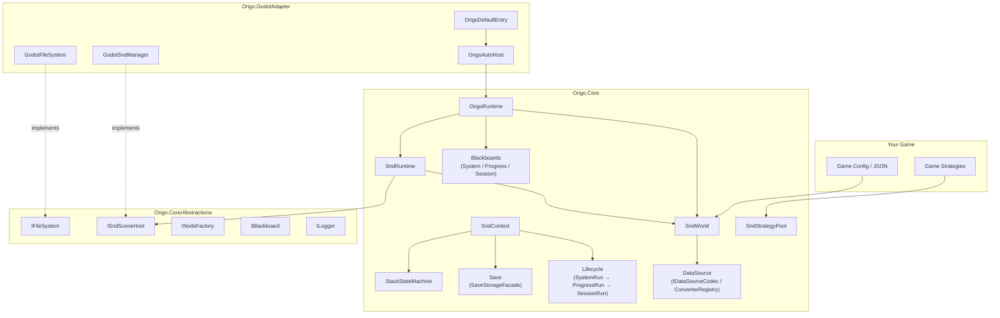
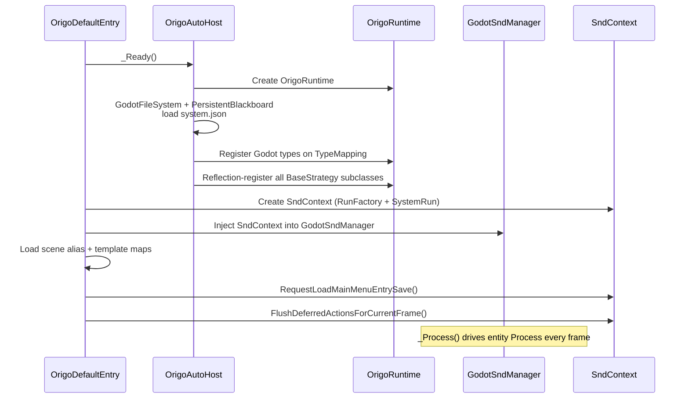

# Origo

[简体中文](README.zh-CN.md)

<!-- badges placeholder -->

**Origo** is a platform-agnostic, pure C# game framework built around the **SND (Strategy–Node–Data)** entity model and the **strategy pattern**. All engine-specific code is isolated behind interfaces so the Core library remains completely engine-free. An official **Godot 4** adapter is included.

> **Audience:** This README is for **game developers integrating Origo** into a project — API surface, setup instructions, naming conventions, on-disk layouts, and subsystem boundaries. Implementation internals live in code and tests.

---

## ✨ Features

- **SND entity model** — compose entities from Data, Nodes, and Strategies instead of deep class hierarchies
- **Stateless strategy pool** — shared, reference-counted, pooled strategy instances with fail-fast type safety
- **Three-layer lifecycle** — `SystemRun` → `ProgressRun` → `SessionRun` with matching blackboards
- **Complete save system** — slot-based save/load, continue, auto-save, level switching, and `meta.map` for UI
- **Stack state machines** — push/pop string-based state machines with strategy hooks, persisted per layer
- **Typed blackboards** — `IBlackboard` with `TypedData` values that survive serialization round-trips
- **Built-in developer console** — 14 built-in commands (`help`, `spawn`, `snd_count`, `find_entity`, `clear_entities`, `bb_get`, `bb_set`, `bb_keys`, `list_saves`, `save`, `load`, `auto_save`, `continue`, `change_level`) with pub/sub output and custom command extensibility
- **Deterministic RNG** — XorShift128+ implementation behind `IRandom`
- **Platform-agnostic Core** — depends only on .NET 8; no engine symbols leak into `Origo.Core`
- **Godot 4 adapter** — thin implementations + DI wiring; swap with your own adapter for Unity, MonoGame, etc.

---

## 📂 Project Layout

```
Origo.Core/               Pure C# core (Microsoft.NET.Sdk, net8.0, no engine dependency)
Origo.GodotAdapter/       Godot 4 adapter (Godot.NET.Sdk 4.6.1, thin implementations + DI)
Origo.Core.Tests/         Core unit tests (xUnit v3, 353 tests)
Origo.GodotAdapter.Tests/ Adapter unit tests (xUnit v3, 1 test)
scripts/                  Build & utility scripts
Directory.Build.props     Shared MSBuild properties
Origo.sln                 Solution file
```

---

## 🚀 Quick Start (Godot 4)

### 1. Add Origo to your Godot C# project

Reference both projects in your game `.csproj`:

```xml
<!-- In your game .csproj -->
<ProjectReference Include="../Origo.Core/Origo.Core.csproj" />
<ProjectReference Include="../Origo.GodotAdapter/Origo.GodotAdapter.csproj" />
```

### 2. Create the directory structure

```
res://origo/
  entry/
    entry.json            ← main-menu entity definitions
  maps/
    scene_aliases.map     ← short name → PackedScene path
    snd_templates.map     ← template key → SndMetaData JSON path
  initial/                ← read-only initial save (shipped with game)
```

### 3. Add the entry node to your main scene

Attach `OrigoDefaultEntry` as the root (or a child) node. Its exported properties control paths:

| Property | Default | Purpose |
|----------|---------|---------|
| `ConfigPath` | `res://origo/entry/entry.json` | Main-menu entity definitions |
| `SceneAliasMapPath` | `res://origo/maps/scene_aliases.map` | Scene alias mapping |
| `SndTemplateMapPath` | `res://origo/maps/snd_templates.map` | SND template mapping |
| `SaveRootPath` | `user://origo_saves` | Runtime save directory |
| `InitialSaveRootPath` | `res://origo/initial` | Read-only initial save |
| `AutoDiscoverStrategies` | `true` | Auto-register strategy subclasses via reflection |

You can override `ConfigureSaveMetadataContributors(SndContext context)` to register custom `meta.map` contributors.

### 4. Write your first strategy

```csharp
using Origo.Core.Snd;
using Origo.Core.Snd.Strategy;

[StrategyIndex("game.player_move")]
public sealed class PlayerMoveStrategy : EntityStrategyBase
{
    public override void Process(ISndEntity entity, double delta, SndContext ctx)
    {
        // Read state from entity Data — strategies must be stateless
        var (found, speed) = entity.TryGetData<float>("speed");
        if (!found) return;

        // Game logic here...
    }

    public override void AfterSpawn(ISndEntity entity, SndContext ctx)
    {
        // Initialize entity data on spawn
        entity.SetData("speed", 200f);
    }
}
```

### 5. Define an entity in JSON

```json
{
  "name": "Player",
  "node": { "pairs": { "sprite": "player_sprite" } },
  "strategy": { "indices": ["game.player_move"] },
  "data": { "pairs": { "speed": { "type": "Single", "data": 200.0 } } }
}
```

### 6. Run

Launch your Godot project. `OrigoDefaultEntry._Ready()` bootstraps the entire framework, loads the entry save, and begins calling `Process` on entities each frame.

---

## 🏗 Architecture Overview



### Key Design Principles

1. **Core is platform-agnostic** — all engine touchpoints go through `Abstractions/` interfaces
2. **Adapter implements interfaces + wires DI** — no business rules in the adapter
3. **Strategies are shared, pooled, stateless** — mutable state lives in entity Data or blackboards
4. **Composition over inheritance** — `SndEntity` composes Data, Nodes, and Strategies
5. **Explicit lifecycles** — `SystemRun` → `ProgressRun` → `SessionRun` mirror blackboard layers
6. **Fail-fast, no silent fallback** — missing data, bad indices, and invalid state throw immediately

### Object Relationship Graph

```
OrigoDefaultEntry (Godot entry node)
  └─ OrigoAutoHost (creates Runtime + injects adapter)
       └─ OrigoRuntime
            ├─ SndWorld (StrategyPool / TypeMapping / Mappings / JsonCodec / ConverterRegistry)
            ├─ SndRuntime (ISndSceneHost facade)
            └─ SystemBlackboard
       └─ SndContext (save / load / change-level orchestration)
            └─ RunFactory
                 └─ SystemRun → ProgressRun → SessionRun
```

---

## 🧩 Core Concepts

### SND Entity Model

SND (**Strategy–Node–Data**) models game objects as a composition of three orthogonal concerns:

| Component | What it holds | Example |
|-----------|--------------|---------|
| **Strategy** | Behavior (stateless, pooled) | `game.player_move`, `ui.main_menu` |
| **Node** | Visual / scene representation | Sprites, meshes, UI panels |
| **Data** | Mutable state (typed key-value) | `health: 100`, `speed: 200.0` |

An `SndEntity` is the aggregate root composing `SndDataManager`, `SndNodeManager`, and `SndStrategyManager`. Entities are described by `SndMetaData` (JSON-serializable) and spawned through `SndRuntime`.

#### Entity Lifecycle

```
Spawn / Load
    │
    ▼
AfterSpawn / AfterLoad          ← one-time initialization
    │
    ▼
Process(entity, delta, ctx)     ← called every frame
    │
    ▼
BeforeSave                      ← before persisting
    │
    ▼
BeforeQuit / BeforeDead         ← teardown
    │
    ▼
Dispose
```

---

### Strategy System

Strategies are **shared, pooled, stateless objects** registered by a dot-namespace index. They must have **no instance fields** (enforced at registration).

#### Strategy Hierarchy

```
BaseStrategy                       ← root type (index + pool identity)
  ├── EntityStrategyBase           ← entity lifecycle hooks
  ├── StateMachineStrategyBase     ← push/pop state machine hooks
  └── (future domain bases)
```

#### EntityStrategyBase — Virtual Methods

```csharp
public virtual void Process(ISndEntity entity, double delta, SndContext ctx);
public virtual void AfterSpawn(ISndEntity entity, SndContext ctx);
public virtual void AfterLoad(ISndEntity entity, SndContext ctx);
public virtual void AfterAdd(ISndEntity entity, SndContext ctx);
public virtual void BeforeRemove(ISndEntity entity, SndContext ctx);
public virtual void BeforeSave(ISndEntity entity, SndContext ctx);
public virtual void BeforeQuit(ISndEntity entity, SndContext ctx);
public virtual void BeforeDead(ISndEntity entity, SndContext ctx);
```

#### Registration

Every concrete strategy **must** declare `[StrategyIndex("dot.namespace")]`. Discovery fails fast if the attribute is missing, empty, or the type has instance fields.

```csharp
[StrategyIndex("combat.attack")]
public sealed class AttackStrategy : EntityStrategyBase
{
    // No instance fields allowed — state goes in entity Data or blackboards
    public override void Process(ISndEntity entity, double delta, SndContext ctx)
    {
        var (found, cooldown) = entity.TryGetData<double>("attack_cooldown");
        if (found && cooldown > 0)
            entity.SetData("attack_cooldown", cooldown - delta);
    }
}
```

Resolve with `SndStrategyPool.GetStrategy<EntityStrategyBase>(index)` — wrong `TBase` for an index throws `InvalidOperationException`.

---

### Blackboard System

Blackboards are typed key-value stores used for cross-cutting state.

#### `IBlackboard` Contract

```csharp
void Set<T>(string key, T value);
(bool found, T value) TryGet<T>(string key);
void Clear();
IReadOnlyCollection<string> GetKeys();
IReadOnlyDictionary<string, TypedData> SerializeAll();
void DeserializeAll(IReadOnlyDictionary<string, TypedData> data);
```

#### Three Semantic Layers

| Layer | Blackboard | Lifetime | Persisted to |
|-------|-----------|----------|-------------|
| **System** | `SystemBlackboard` | Entire process | `saveRoot/system.json` (via `PersistentBlackboard`) |
| **Progress** | `ProgressBlackboard` | Save slot / flow | `current/progress.json` and `save_*/progress.json` |
| **Session** | `SessionBlackboard` | Current level | `current/level_*/session.json` |

Each blackboard layer aligns 1:1 with its corresponding **Run** object:

- `SystemRun` ↔ `SystemBlackboard` — lives for the whole process
- `ProgressRun` ↔ `ProgressBlackboard` — created/replaced on save load or continue
- `SessionRun` ↔ `SessionBlackboard` — recreated on level change

#### PersistentBlackboard

`PersistentBlackboard` wraps `IBlackboard` and auto-persists to disk on every `Set`, `Clear`, and `DeserializeAll` call. Used by the Godot adapter for `SystemBlackboard`.

#### Well-Known Keys

```csharp
WellKnownKeys.ActiveSaveId  = "origo.active_save_id";
WellKnownKeys.ActiveLevelId = "origo.active_level_id";
```

---

### State Machine System

`StackStateMachine` implements `IStateMachine` — a **stack of string values** with strategy-driven hooks.

Each machine is constructed with a **machine key**, a **push strategy index**, and a **pop strategy index** (both must be `StateMachineStrategyBase` implementations).

#### StateMachineStrategyBase — Virtual Methods

```csharp
public virtual void OnPushRuntime(StateMachineStrategyContext context, SndContext ctx);
public virtual void OnPushAfterLoad(StateMachineStrategyContext context, SndContext ctx);
public virtual void OnPopRuntime(StateMachineStrategyContext context, SndContext ctx);
public virtual void OnPopBeforeQuit(StateMachineStrategyContext context, SndContext ctx);
```

#### StateMachineStrategyContext

```csharp
public readonly struct StateMachineStrategyContext
{
    public string MachineKey { get; }
    public string? BeforeTop { get; }
    public string? AfterTop { get; }
}
```

#### Hook Semantics

| Operation | Hook | When |
|-----------|------|------|
| Runtime push | `OnPushRuntime` | After the new value is on the stack |
| Load rebuild | `OnPushAfterLoad` | Called bottom → top for each stack level |
| Runtime pop | `OnPopRuntime` | Before the top value is removed |
| Quit unwind | `OnPopBeforeQuit` | When unwinding the stack on quit |

#### Persistence

State machines are managed by `StateMachineContainer`, scoped to `ProgressRun` or `SessionRun`:

- `progress_state_machines.json` — progress-scoped machines
- `session_state_machines.json` — session-scoped machines

Access via `SndContext.GetProgressStateMachines()` / `GetSessionStateMachines()`.

---

### Serialization / DataSource Abstraction

All serialization in Origo goes through a **DataSource abstraction layer** (`Origo.Core/DataSource/`), decoupling the entire Core from any concrete JSON library (e.g. `System.Text.Json`).

#### Key Components

| Type | Responsibility |
|------|----------------|
| `DataSourceNode` | Immutable tree node: Object, Array, String, Number, Boolean, Null — with lazy expansion |
| `IDataSourceCodec` | Encode / Decode between `DataSourceNode` and raw text (JSON, `.map`, etc.) |
| `DataSourceConverterRegistry` | Type-safe read/write of domain objects ↔ `DataSourceNode` |
| `DataSourceConverter<T>` | Abstract base for per-type conversion logic |
| `DataSourceFactory` | Factory that creates a pre-configured registry with all built-in converters |

#### Codec Implementations

- **`JsonDataSourceCodec`** — wraps `System.Text.Json` internally; the only place STJ appears
- **`MapDataSourceCodec`** — simple `key: value` line-based format for `.map` files

#### How It Works

```
Domain Object  ←→  DataSourceNode  ←→  Raw Text (JSON / .map)
     ↑ registry.Write/Read ↑    ↑ codec.Encode/Decode ↑
```

`SndWorld` exposes `JsonCodec` and `ConverterRegistry` so all subsystems (Save, StateMachine, Blackboard) serialize without depending on any JSON library.

#### Extending with Custom Types

To add serialization support for engine-specific types (e.g. Godot `Vector2`):

1. Implement `DataSourceConverter<T>` for your type
2. Register it during bootstrap:

```csharp
sndWorld.ConverterRegistry.Register(new MyVector2Converter());
```

See `GodotJsonConverterRegistry.RegisterDataSourceConverters()` for a complete example of registering engine types.

---

### Save / Load System

The save system uses a **workspace + snapshot** model:

1. `current/` is the live working copy (always writable)
2. `save_*/` directories are immutable snapshots
3. Saving writes to `current/` first, then snapshots to `save_xxx/`
4. Loading restores a snapshot to `current/`, then rebuilds runs

#### Save Directory Layout

```
saveRoot/
  system.json                       ← SystemBlackboard
  current/                          ← writable working copy
    progress.json                   ← ProgressBlackboard
    progress_state_machines.json    ← progress state machines
    meta.map                        ← display metadata (key: value)
    level_default/                  ← current level data
      snd_scene.json                ← serialized SND entities
      session.json                  ← SessionBlackboard
      session_state_machines.json   ← session state machines
  save_000/                         ← immutable snapshot
    progress.json
    progress_state_machines.json
    meta.map
    level_default/
      ...
  save_001/
    ...
```

#### Strict Semantics

- **Required files:** missing required files or fields is treated as corruption (throws exceptions)
- **`progress.json`** must exist and deserialize successfully — no silent fallback
- **Fail-fast:** unregistered strategy index, invalid state machine payload, or missing template → immediate error

#### Save Path Conventions (Godot defaults)

| Path | Purpose |
|------|---------|
| `res://origo/initial/` | Read-only initial save shipped with the project |
| `user://origo_saves/` | Runtime read/write save root |
| `res://origo/entry/` | Entry configuration (main menu entities) |
| `res://origo/maps/` | Alias and template map files |

---

## 📘 API Reference

### SndContext

`SndContext` is the primary facade strategies interact with for blackboards, save/load, level switching, and console.

#### Properties

| Property | Type | Description |
|----------|------|-------------|
| `SystemBlackboard` | `IBlackboard` | System-level blackboard (always available) |
| `ProgressBlackboard` | `IBlackboard?` | Progress-level blackboard (available after load) |
| `SessionBlackboard` | `IBlackboard?` | Session-level blackboard (available after load) |
| `SndRuntime` | `SndRuntime` | SND entity runtime |
| `SaveRootPath` | `string` | Root path for save files |
| `InitialSaveRootPath` | `string` | Path to initial (read-only) save |
| `EntryConfigPath` | `string` | Path to entry configuration JSON |

#### Entity & Deferred Methods

| Method | Description |
|--------|-------------|
| `EnqueueBusinessDeferred(Action)` | Enqueue action for end-of-frame business phase |
| `FlushDeferredActionsForCurrentFrame()` | Flush all deferred actions immediately |
| `GetPendingPersistenceRequestCount()` | Count of pending persistence requests |
| `ClearAllSndEntities()` | Remove all entities from the scene |
| `SpawnManySndEntities(IEnumerable<SndMetaData>)` | Batch-spawn entities |
| `FindSndEntity(string name)` | Find an entity by name |
| `CloneTemplate(string templateKey, string? overrideName)` | Clone an entity from a template |

#### Save / Load Methods

| Method | Description |
|--------|-------------|
| `RequestSaveGame(newSaveId, baseSaveId, customMeta?)` | Save to a named slot |
| `RequestSaveGameAuto(newSaveId?, customMeta?)` | Auto-save (picks base from active save) |
| `RequestLoadGame(string saveId)` | Load a save slot |
| `RequestContinueGame()` | Continue from active save (returns `bool`) |
| `HasContinueData()` | Check if continue data exists |
| `SetContinueTarget(string saveId)` | Set the save ID for continue |
| `ClearContinueTarget()` | Clear the continue target |
| `RequestLoadInitialSave()` | Load the initial (shipped) save |
| `RequestLoadMainMenuEntrySave()` | Load main-menu entry (no implicit save) |
| `RequestChangeLevel(string newLevelId)` | Switch to a different level |
| `ListSaves()` | List available save slot IDs |
| `ListSavesWithMetaData()` | List saves with parsed `meta.map` |
| `RegisterSaveMetaContributor(ISaveMetaContributor)` | Register a meta.map contributor |
| `RegisterSaveMetaContributor(Action<...>)` | Register a meta.map contributor (lambda overload) |

#### Console Methods

| Method | Description |
|--------|-------------|
| `TrySubmitConsoleCommand(string commandLine)` | Submit a console command |
| `ProcessConsolePending()` | Process pending console commands |
| `SubscribeConsoleOutput(Action<string>)` | Subscribe to console output |
| `UnsubscribeConsoleOutput(long subscriptionId)` | Unsubscribe from console output |

#### State Machine Methods

| Method | Description |
|--------|-------------|
| `GetProgressStateMachines()` | Access progress-scoped state machines |
| `GetSessionStateMachines()` | Access session-scoped state machines |

---

### OrigoRuntime

Top-level runtime object created by the adapter.

| Member | Kind | Description |
|--------|------|-------------|
| `Logger` | property | `ILogger` logging interface |
| `SndWorld` | property | Strategy pool, type mapping, JsonCodec, ConverterRegistry |
| `Snd` | property | `SndRuntime` entity runtime facade |
| `SystemBlackboard` | property | System blackboard |
| `ConsoleInput` | property | `IConsoleInputSource?` console input source |
| `ConsoleOutputChannel` | property | `IConsoleOutputChannel?` console output channel |
| `Console` | property | `OrigoConsole?` console instance |
| `EnqueueBusinessDeferred(Action)` | method | Enqueue business-phase deferred action |
| `EnqueueSystemDeferred(Action)` | method | Enqueue system-phase deferred action |
| `FlushEndOfFrameDeferred()` | method | Flush Business then System deferred queues |
| `ResetConsoleState()` | method | Reset console to initial state |

---

### SndRuntime

Facade combining `SndWorld` and `ISndSceneHost`.

| Member | Kind | Description |
|--------|------|-------------|
| `World` | property | Access to strategy pool and mappings |
| `SceneHost` | property | Scene host for entity operations |
| `Spawn(SndMetaData)` | method | Spawn a single entity |
| `SpawnMany(IEnumerable<SndMetaData>)` | method | Batch-spawn entities |
| `SerializeMetaList()` | method | Serialize all entity metadata |
| `ClearAll()` | method | Remove all entities |
| `GetEntities()` | method | Get all active entities |
| `FindByName(string)` | method | Find entity by name |

---

## 🖥 Built-in Console Commands

The developer console provides 14 built-in commands covering entity management, blackboard inspection, save/load, and level switching. Submit commands via `SndContext.TrySubmitConsoleCommand(string)` and receive output through `SubscribeConsoleOutput`.

### Entity Commands

| Command | Usage | Description |
|---------|-------|-------------|
| `spawn` | `spawn <name> <template>` | Spawn an entity by cloning a registered template |
| | `spawn name=<n> template=<t>` | Named-argument form (cannot mix with positional) |
| `snd_count` | `snd_count` | Print the current number of spawned entities |
| `find_entity` | `find_entity <name>` | Look up an entity by name and display its node info |
| `clear_entities` | `clear_entities` | Destroy all spawned entities |

### Blackboard Commands

| Command | Usage | Description |
|---------|-------|-------------|
| `bb_get` | `bb_get <layer> <key>` | Read a value from the specified blackboard layer |
| `bb_set` | `bb_set <layer> <key> <value>` | Write a value (auto-infers int / float / bool / string) |
| `bb_keys` | `bb_keys <layer>` | List all keys in the specified blackboard layer |

> **layer** — currently supports `system`. Progress / Session layers are available when a `SndContext` with an active run is present.

### Save / Load Commands

| Command | Usage | Description |
|---------|-------|-------------|
| `list_saves` | `list_saves` | List all available save slot IDs |
| `save` | `save <newSaveId> <baseSaveId>` | Request a save to a new slot based on an existing slot |
| `load` | `load <saveId>` | Request loading a save slot |
| `auto_save` | `auto_save [saveId]` | Request an auto-save (optional explicit ID) |
| `continue` | `continue` | Continue from the last active save |

### Level Commands

| Command | Usage | Description |
|---------|-------|-------------|
| `change_level` | `change_level <newLevelId>` | Request switching to a different level |

### Utility Commands

| Command | Usage | Description |
|---------|-------|-------------|
| `help` | `help` | List all registered command names |

### Custom Commands

Register custom commands via `OrigoConsole.RegisterHandler(IConsoleCommandHandler)`.

Each handler declares:

| Property | Description |
|----------|-------------|
| `Name` | Command keyword (case-insensitive) |
| `HelpText` | Usage string shown by the `help` command |
| `MinPositionalArgs` | Minimum positional argument count (inclusive) |
| `MaxPositionalArgs` | Maximum positional argument count (inclusive, -1 = unlimited) |

Extend `ConsoleCommandHandlerBase` to get **automatic argument-count validation** — your `ExecuteCore` is only called when the count is in range:

```csharp
public sealed class TeleportCommandHandler : ConsoleCommandHandlerBase
{
    public override string Name => "teleport";
    public override string HelpText => "teleport <x> <y> — Teleport the player to the given coordinates.";
    public override int MinPositionalArgs => 2;
    public override int MaxPositionalArgs => 2;

    protected override bool ExecuteCore(
        CommandInvocation invocation,
        IConsoleOutputChannel outputChannel,
        out string? errorMessage)
    {
        var x = invocation.PositionalArgs[0];
        var y = invocation.PositionalArgs[1];
        outputChannel.Publish($"Teleported to ({x}, {y}).");
        errorMessage = null;
        return true;
    }
}
```

Register at any time:

```csharp
runtime.Console?.RegisterHandler(new TeleportCommandHandler());
```

The built-in `help` command automatically lists every registered handler's `HelpText`.

---

## 📄 JSON & Config Formats

### SndMetaData

```json
{
  "name": "Player",
  "node": {
    "pairs": {
      "sprite": "player_sprite"
    }
  },
  "strategy": {
    "indices": ["game.player_move", "game.player_combat"]
  },
  "data": {
    "pairs": {
      "health": { "type": "Int32", "data": 100 },
      "speed":  { "type": "Single", "data": 200.0 }
    }
  }
}
```

### Template Shorthand (JSON Arrays)

Entity arrays support both inline definitions and template references:

```json
[
  { "sndName": "MyEntity", "templateKey": "some_template" },
  {
    "name": "InlineEntity",
    "strategy": { "indices": ["game.some_strategy"] },
    "data": { "pairs": {} }
  }
]
```

### `.map` File Format

Simple `key: value` per line. Lines starting with `#` are comments.

```
# Scene aliases — maps short names to PackedScene paths
box: res://scenes/resource/box.tscn
camera: res://scenes/resource/camera.tscn
player_sprite: res://scenes/characters/player.tscn
```

### `meta.map` (Save Display Metadata)

Same format, used for save-slot UI display:

```
# Save display metadata
title: Chapter 2 - Forest
play_time: 03:12:55
player_level: 18
```

Contributors registered via `SndContext.RegisterSaveMetaContributor(...)` are merged in order (later key wins), then `customMeta` from the save call overrides per key.

---

## 🔄 Startup Sequence (Godot)



**Step-by-step:**

1. `OrigoDefaultEntry._Ready()` → `OrigoAutoHost._Ready()` creates `OrigoRuntime`
2. `GodotFileSystem` + `PersistentBlackboard` load `saveRoot/system.json`
3. Register Godot types on `SndWorld.TypeMapping`
4. Reflection registers all concrete `BaseStrategy` subclasses
5. Create `SndContext` (`RunFactory` + `SystemRun`), inject into `GodotSndManager`
6. Load scene alias and template map files
7. `RequestLoadMainMenuEntrySave()` + `FlushDeferredActionsForCurrentFrame()`
8. `GodotSndManager._Process` runs entity `Process` every frame

---

## 🔀 Key Flows

### Save Game

```
Game calls SndContext.RequestSaveGame(newSaveId, baseSaveId, customMeta?)
  → Enqueues on SystemDeferred
  → Validates active runs
  → Merges meta.map (contributors + customMeta)
  → SaveContext serializes blackboards + scene → SaveGamePayload
  → SaveStorageFacade writes current/, then snapshots to save_xxx/
  → Updates active_save_id in SystemBlackboard
```

### Load Game

```
Game calls SndContext.RequestLoadGame(saveId)
  → Enqueues on SystemDeferred
  → Restores snapshot to current/
  → Reads progress.json for active_level_id
  → Rebuilds ProgressRun + SessionRun
  → Restores blackboards and spawns scene entities
  → Sets active_save_id
```

### Change Level

```
Game calls SndContext.RequestChangeLevel(newLevelId)
  → Enqueues on BusinessDeferred (runs before SystemDeferred)
  → SessionRun persists current level to current/level_xxx/
  → Updates ActiveLevelId, persists progress.json
  → Disposes old SessionRun
  → Restores current/level_{newLevelId}/ (or starts empty)
```

---

## 📏 Naming Conventions

All external strings share a consistent style to prevent silent mismatches.

| Context | Convention | Example |
|---------|-----------|---------|
| Strategy index | Dot namespace, `lower_snake_case` segments | `ui.main_menu`, `combat.attack` |
| Blackboard keys | Dot namespace, `lower_snake_case` | `origo.active_save_id` |
| `.map` keys | `lower_snake_case`, unique per file | `player_sprite`, `box` |
| `SndMetaData.name` | `PascalCase` | `Player`, `MainMenu` |

Invalid or missing data **fails fast** — there are no compatibility shims or silent fallbacks.

---

## 🔌 GodotAdapter Modules

| Module | Location | Responsibility |
|--------|----------|----------------|
| **OrigoAutoHost** | `Bootstrap/` | Creates `OrigoRuntime`; `PersistentBlackboard` for system; `ConsoleInputQueue` + `ConsoleOutputChannel` |
| **GodotSndBootstrap** | `Bootstrap/` | One-call `BindRuntimeAndContext(GodotSndManager, SndWorld, ILogger, SndContext)` |
| **OrigoConsolePump** | `Bootstrap/` | Each frame: `OrigoRuntime.Console.ProcessPending()` |
| **OrigoDefaultEntry** | `Bootstrap/` | Subclasses `OrigoAutoHost`; startup partials; override `ConfigureSaveMetadataContributors(SndContext)` |
| **GodotFileSystem** | `FileSystem/` | `IFileSystem` for `res://` and `user://` paths |
| **GodotLogger** | `Logging/` | `ILogger` implementation using Godot output |
| **GodotSndEntity** | `Snd/` | Binds `SndEntity` to Godot `Node` lifetime |
| **GodotSndManager** | `Snd/` | `ISndSceneHost`; `_Process` drives entity strategies each frame |
| **GodotPackedSceneNodeFactory** | `Snd/` | `INodeFactory` via Godot `PackedScene` |
| **GodotNodeHandle** | `Snd/` | `INodeHandle` wrapping Godot `Node` |
| **GodotJsonConverterRegistry** | `Serialization/` | Registers Godot types in `TypeStringMapping` + JSON converters |

### OrigoAutoHost Exported Properties

| Property | Default | Description |
|----------|---------|-------------|
| `HostPath` | `null` | Optional `NodePath` to an `IOrigoRuntimeProvider` |
| `SndManagerPath` | `null` | Optional `NodePath` to the `GodotSndManager` |
| `SystemBlackboardSaveRoot` | `user://origo_saves` | Save root for `PersistentBlackboard` |

---

## 🧱 Abstractions (Interfaces)

All host-provided capabilities are declared in `Origo.Core/Abstractions/`:

| Interface | Responsibility |
|-----------|----------------|
| `IFileSystem` | File I/O, paths, directories (virtual paths like `res://` interpreted by adapter) |
| `INodeFactory` | Create nodes by logical name + resource id → `INodeHandle` |
| `INodeHandle` | Minimal node handle: `Name`, `Native`, `Free()`, `SetVisible()` |
| `ISndSceneHost` | Scene entity operations: `Spawn`, `GetEntities`, `FindByName` |
| `ISndEntity` | Composed of `ISndDataAccess` + `ISndNodeAccess` + `ISndStrategyAccess` |
| `IBlackboard` | Typed key-value store with `SerializeAll` / `DeserializeAll` |
| `IDataSourceCodec` | Encode / Decode between `DataSourceNode` and raw text (e.g. JSON) |
| `ILogger` | `Log(LogLevel level, string tag, string message)` with `LogLevel` enum |
| `IOrigoRuntimeProvider` | Access to `OrigoRuntime` instance |
| `IScheduler` | Deferred action scheduling |
| `IStateMachine` | String-stack state machine API |
| `IRandom` | Deterministic random number generation |
| `IConsoleInputSource` | Console command input (`TryDequeueCommand`) |
| `IConsoleOutputChannel` | Console output pub/sub (`Publish` / `Subscribe`) |

---

## 🔧 How to Extend

### Adding a New Entity Strategy

1. Create a class extending `EntityStrategyBase`
2. Annotate with `[StrategyIndex("your.namespace")]`
3. Override the lifecycle methods you need
4. Ensure **no instance fields** — the class must be stateless

```csharp
[StrategyIndex("game.enemy_ai")]
public sealed class EnemyAiStrategy : EntityStrategyBase
{
    public override void Process(ISndEntity entity, double delta, SndContext ctx)
    {
        // AI logic — read/write entity Data for state
    }

    public override void AfterSpawn(ISndEntity entity, SndContext ctx)
    {
        entity.SetData("ai_state", "idle");
    }
}
```

### Adding a New State Machine Strategy

1. Create a class extending `StateMachineStrategyBase`
2. Annotate with `[StrategyIndex("sm.push.your_machine")]`
3. Override push/pop hooks as needed

```csharp
[StrategyIndex("sm.push.camera")]
public sealed class CameraPushStrategy : StateMachineStrategyBase
{
    public override void OnPushRuntime(StateMachineStrategyContext context, SndContext ctx)
    {
        // React to state being pushed (e.g., switch camera mode)
    }
}
```

### Adding a New Engine Adapter

To port Origo to a different engine (Unity, MonoGame, etc.):

1. **Implement the Abstractions** — provide concrete types for `IFileSystem`, `ISndSceneHost`, `INodeFactory`, `INodeHandle`, `ILogger`, and any other interfaces your game needs
2. **Bootstrap the runtime** — create an `OrigoRuntime` with your implementations, similar to `OrigoAutoHost`
3. **Drive the frame loop** — call `Process` on entities each frame and `FlushEndOfFrameDeferred()` at frame end
4. **Register engine types** — add your engine's types to `SndWorld.TypeMapping` and register `DataSourceConverter<T>` implementations via `SndWorld.ConverterRegistry`

The Core library has **zero** engine dependencies — only your adapter project references the target engine SDK.

---

## 🧪 Testing

Run all tests from the repository root:

```bash
dotnet test Origo.sln
```

| Project | Tests | Coverage |
|---------|-------|----------|
| `Origo.Core.Tests` | 353 | SND, Save, Lifecycle, Console, DataSource, Serialization, Blackboard |
| `Origo.GodotAdapter.Tests` | 1 | Minimal adapter behavior |

Test projects use **xUnit v3** and are excluded from the main game build.

---

## 📜 License

This project is licensed under the [MIT License](LICENSE).

---

<p align="center">
  <em>Built for game developers who want structure without the weight of a full engine framework.</em>
</p>
