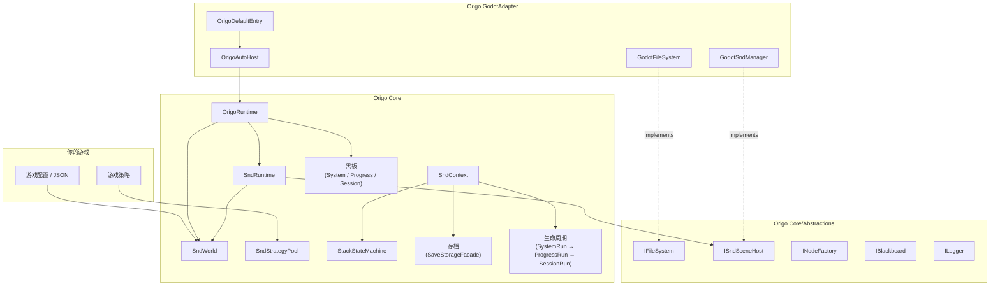
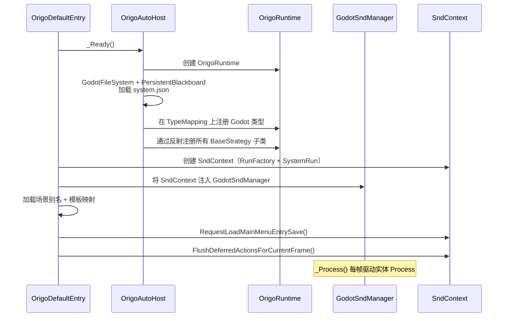

# Origo

[English](README.md)

<!-- badges placeholder -->

**Origo** 是一个平台无关的纯 C# 游戏框架，以 **SND（Strategy–Node–Data）** 实体模型和 **策略模式** 为核心。所有引擎相关代码通过接口隔离，使 Core 库完全不依赖任何引擎。官方提供 **Godot 4** 适配器。

> **目标读者：** 本 README 面向 **将 Origo 集成到项目中的游戏开发者** —— 涵盖 API 接口、配置说明、命名约定、磁盘布局以及子系统边界。内部实现细节请参阅代码与测试。

---

## ✨ 特性

- **SND 实体模型** —— 通过 Data、Node 和 Strategy 组合实体，而非深层类继承
- **无状态策略池** —— 共享、引用计数、池化的策略实例，具备快速失败的类型安全
- **三层生命周期** —— `SystemRun` → `ProgressRun` → `SessionRun`，配套对应的黑板
- **完整存档系统** —— 基于插槽的存/读档、继续游戏、自动存档、关卡切换，以及用于 UI 的 `meta.map`
- **栈式状态机** —— 基于字符串的 push/pop 状态机，具有策略钩子，按层持久化
- **类型化黑板** —— `IBlackboard` 使用 `TypedData` 值，在序列化往返中保持类型
- **内置开发者控制台** —— `spawn`、`snd_count` 及自定义命令，通过发布/订阅输出
- **确定性随机数** —— 基于 `IRandom` 接口的 XorShift128+ 实现
- **平台无关的 Core** —— 仅依赖 .NET 8；`Origo.Core` 中无任何引擎符号泄露
- **Godot 4 适配器** —— 薄层实现 + DI 连线；可替换为 Unity、MonoGame 等自定义适配器

---

## 📂 项目布局

```
Origo.Core/               纯 C# 核心（Microsoft.NET.Sdk，net8.0，无引擎依赖）
Origo.GodotAdapter/       Godot 4 适配器（Godot.NET.Sdk 4.6.1，薄层实现 + DI）
Origo.Core.Tests/         Core 单元测试（xUnit v3，283 个测试）
Origo.GodotAdapter.Tests/ Adapter 单元测试（xUnit v3，1 个测试）
scripts/                  构建与实用脚本
Directory.Build.props     共享 MSBuild 属性
Origo.sln                 解决方案文件
```

---

## 🚀 快速开始（Godot 4）

### 1. 将 Origo 添加到 Godot C# 项目

在游戏 `.csproj` 中引用两个项目：

```xml
<!-- 在你的游戏 .csproj 中 -->
<ProjectReference Include="../Origo.Core/Origo.Core.csproj" />
<ProjectReference Include="../Origo.GodotAdapter/Origo.GodotAdapter.csproj" />
```

### 2. 创建目录结构

```
res://origo/
  entry/
    entry.json            ← 主菜单实体定义
  maps/
    scene_aliases.map     ← 短名称 → PackedScene 路径
    snd_templates.map     ← 模板键 → SndMetaData JSON 路径
  initial/                ← 只读的初始存档（随游戏分发）
```

### 3. 在主场景中添加入口节点

将 `OrigoDefaultEntry` 作为根节点（或子节点）挂载。其导出属性控制路径：

| 属性 | 默认值 | 用途 |
|------|--------|------|
| `ConfigPath` | `res://origo/entry/entry.json` | 主菜单实体定义 |
| `SceneAliasMapPath` | `res://origo/maps/scene_aliases.map` | 场景别名映射 |
| `SndTemplateMapPath` | `res://origo/maps/snd_templates.map` | SND 模板映射 |
| `SaveRootPath` | `user://origo_saves` | 运行时存档目录 |
| `InitialSaveRootPath` | `res://origo/initial` | 只读初始存档 |
| `AutoDiscoverStrategies` | `true` | 通过反射自动注册策略子类 |

你可以重写 `ConfigureSaveMetadataContributors(SndContext context)` 来注册自定义 `meta.map` 贡献者。

### 4. 编写你的第一个策略

```csharp
using Origo.Core.Snd;
using Origo.Core.Snd.Strategy;

[StrategyIndex("game.player_move")]
public sealed class PlayerMoveStrategy : EntityStrategyBase
{
    public override void Process(ISndEntity entity, double delta, SndContext ctx)
    {
        // 从实体 Data 中读取状态 —— 策略必须是无状态的
        var (found, speed) = entity.TryGetData<float>("speed");
        if (!found) return;

        // 游戏逻辑写在这里...
    }

    public override void AfterSpawn(ISndEntity entity, SndContext ctx)
    {
        // 生成时初始化实体数据
        entity.SetData("speed", 200f);
    }
}
```

### 5. 在 JSON 中定义实体

```json
{
  "name": "Player",
  "node": { "pairs": { "sprite": "player_sprite" } },
  "strategy": { "indices": ["game.player_move"] },
  "data": { "pairs": { "speed": { "type": "Single", "data": 200.0 } } }
}
```

### 6. 运行

启动 Godot 项目。`OrigoDefaultEntry._Ready()` 会引导整个框架启动、加载入口存档，并在每帧调用实体的 `Process`。

---

## 🏗 架构概览



### 关键设计原则

1. **Core 平台无关** —— 所有引擎交互通过 `Abstractions/` 接口完成
2. **适配器实现接口 + 连线 DI** —— 适配器中无业务规则
3. **策略共享、池化、无状态** —— 可变状态存储在实体 Data 或黑板中
4. **组合优先于继承** —— `SndEntity` 组合 Data、Node 和 Strategy
5. **显式生命周期** —— `SystemRun` → `ProgressRun` → `SessionRun` 与黑板层一一对应
6. **快速失败，无静默回退** —— 缺失数据、错误索引和无效状态会立即抛出异常

### 对象关系图

```
OrigoDefaultEntry（Godot 入口节点）
  └─ OrigoAutoHost（创建 Runtime + 注入适配器）
       └─ OrigoRuntime
            ├─ SndWorld（StrategyPool / TypeMapping / Mappings）
            ├─ SndRuntime（ISndSceneHost 门面）
            └─ SystemBlackboard
       └─ SndContext（存档 / 读档 / 切换关卡编排）
            └─ RunFactory
                 └─ SystemRun → ProgressRun → SessionRun
```

---

## 🧩 核心概念

### SND 实体模型

SND（**Strategy–Node–Data**）将游戏对象建模为三个正交关注点的组合：

| 组件 | 存储内容 | 示例 |
|------|---------|------|
| **Strategy** | 行为（无状态，池化） | `game.player_move`、`ui.main_menu` |
| **Node** | 视觉 / 场景表示 | 精灵、网格、UI 面板 |
| **Data** | 可变状态（类型化键值对） | `health: 100`、`speed: 200.0` |

`SndEntity` 是聚合根，组合了 `SndDataManager`、`SndNodeManager` 和 `SndStrategyManager`。实体由 `SndMetaData`（可 JSON 序列化）描述，通过 `SndRuntime` 生成。

#### 实体生命周期

```
Spawn / Load
    │
    ▼
AfterSpawn / AfterLoad          ← 一次性初始化
    │
    ▼
Process(entity, delta, ctx)     ← 每帧调用
    │
    ▼
BeforeSave                      ← 持久化之前
    │
    ▼
BeforeQuit / BeforeDead         ← 清理
    │
    ▼
Dispose
```

---

### 策略系统

策略是 **共享、池化、无状态的对象**，通过点分命名空间索引注册。它们 **不能有实例字段**（注册时强制检查）。

#### 策略层次结构

```
BaseStrategy                       ← 根类型（索引 + 池标识）
  ├── EntityStrategyBase           ← 实体生命周期钩子
  ├── StateMachineStrategyBase     ← push/pop 状态机钩子
  └── （未来的领域基类）
```

#### EntityStrategyBase — 虚方法

```csharp
public virtual void Process(ISndEntity entity, double delta, SndContext ctx);
public virtual void AfterSpawn(ISndEntity entity, SndContext ctx);
public virtual void AfterLoad(ISndEntity entity, SndContext ctx);
public virtual void AfterAdd(ISndEntity entity, SndContext ctx);
public virtual void BeforeRemove(ISndEntity entity, SndContext ctx);
public virtual void BeforeSave(ISndEntity entity, SndContext ctx);
public virtual void BeforeQuit(ISndEntity entity, SndContext ctx);
public virtual void BeforeDead(ISndEntity entity, SndContext ctx);
```

#### 注册

每个具体策略 **必须** 声明 `[StrategyIndex("dot.namespace")]`。如果缺少该特性、值为空或类型包含实例字段，发现阶段会立即失败。

```csharp
[StrategyIndex("combat.attack")]
public sealed class AttackStrategy : EntityStrategyBase
{
    // 不允许实例字段 —— 状态应存储在实体 Data 或黑板中
    public override void Process(ISndEntity entity, double delta, SndContext ctx)
    {
        var (found, cooldown) = entity.TryGetData<double>("attack_cooldown");
        if (found && cooldown > 0)
            entity.SetData("attack_cooldown", cooldown - delta);
    }
}
```

通过 `SndStrategyPool.GetStrategy<EntityStrategyBase>(index)` 解析 —— 若索引对应的 `TBase` 类型不匹配则抛出 `InvalidOperationException`。

---

### 黑板系统

黑板是类型化键值存储，用于跨领域状态共享。

#### `IBlackboard` 契约

```csharp
void Set<T>(string key, T value);
(bool found, T value) TryGet<T>(string key);
void Clear();
IReadOnlyCollection<string> GetKeys();
IReadOnlyDictionary<string, TypedData> SerializeAll();
void DeserializeAll(IReadOnlyDictionary<string, TypedData> data);
```

#### 三个语义层

| 层级 | 黑板 | 生命周期 | 持久化位置 |
|------|------|---------|-----------|
| **System** | `SystemBlackboard` | 整个进程 | `saveRoot/system.json`（通过 `PersistentBlackboard`） |
| **Progress** | `ProgressBlackboard` | 存档槽 / 流程 | `current/progress.json` 和 `save_*/progress.json` |
| **Session** | `SessionBlackboard` | 当前关卡 | `current/level_*/session.json` |

每个黑板层与对应的 **Run** 对象一一对应：

- `SystemRun` ↔ `SystemBlackboard` —— 贯穿整个进程
- `ProgressRun` ↔ `ProgressBlackboard` —— 在读档或继续游戏时创建/替换
- `SessionRun` ↔ `SessionBlackboard` —— 在切换关卡时重新创建

#### PersistentBlackboard

`PersistentBlackboard` 包装 `IBlackboard`，在每次 `Set`、`Clear` 和 `DeserializeAll` 调用时自动持久化到磁盘。Godot 适配器将其用于 `SystemBlackboard`。

#### 预定义键

```csharp
WellKnownKeys.ActiveSaveId  = "origo.active_save_id";
WellKnownKeys.ActiveLevelId = "origo.active_level_id";
```

---

### 状态机系统

`StackStateMachine` 实现 `IStateMachine` —— 一个 **字符串栈**，具有策略驱动的钩子。

每台状态机在构造时需要一个 **机器键**、一个 **push 策略索引** 和一个 **pop 策略索引**（两者都必须是 `StateMachineStrategyBase` 的实现）。

#### StateMachineStrategyBase — 虚方法

```csharp
public virtual void OnPushRuntime(StateMachineStrategyContext context, SndContext ctx);
public virtual void OnPushAfterLoad(StateMachineStrategyContext context, SndContext ctx);
public virtual void OnPopRuntime(StateMachineStrategyContext context, SndContext ctx);
public virtual void OnPopBeforeQuit(StateMachineStrategyContext context, SndContext ctx);
```

#### StateMachineStrategyContext

```csharp
public readonly struct StateMachineStrategyContext
{
    public string MachineKey { get; }
    public string? BeforeTop { get; }
    public string? AfterTop { get; }
}
```

#### 钩子语义

| 操作 | 钩子 | 触发时机 |
|------|------|---------|
| 运行时 push | `OnPushRuntime` | 新值入栈后 |
| 读档重建 | `OnPushAfterLoad` | 按从栈底到栈顶顺序逐层调用 |
| 运行时 pop | `OnPopRuntime` | 栈顶值移除前 |
| 退出时展开 | `OnPopBeforeQuit` | 退出时展开栈 |

#### 持久化

状态机由 `StateMachineContainer` 管理，作用域为 `ProgressRun` 或 `SessionRun`：

- `progress_state_machines.json` —— 进度作用域的状态机
- `session_state_machines.json` —— 会话作用域的状态机

通过 `SndContext.GetProgressStateMachines()` / `GetSessionStateMachines()` 访问。

---

### 存档 / 读档系统

存档系统采用 **工作区 + 快照** 模型：

1. `current/` 是实时工作副本（始终可写）
2. `save_*/` 目录是不可变快照
3. 存档时先写入 `current/`，再快照到 `save_xxx/`
4. 读档时将快照恢复到 `current/`，然后重建 Run

#### 存档目录布局

```
saveRoot/
  system.json                       ← SystemBlackboard
  current/                          ← 可写工作副本
    progress.json                   ← ProgressBlackboard
    progress_state_machines.json    ← 进度状态机
    meta.map                        ← 显示元数据（key: value）
    level_default/                  ← 当前关卡数据
      snd_scene.json                ← 序列化的 SND 实体
      session.json                  ← SessionBlackboard
      session_state_machines.json   ← 会话状态机
  save_000/                         ← 不可变快照
    progress.json
    progress_state_machines.json
    meta.map
    level_default/
      ...
  save_001/
    ...
```

#### 严格语义

- **必需文件：** 缺少必需文件或字段视为数据损坏（抛出异常）
- **`progress.json`** 必须存在并能成功反序列化 —— 无静默回退
- **快速失败：** 未注册的策略索引、无效的状态机负载或缺失的模板 → 立即报错

#### 存档路径约定（Godot 默认值）

| 路径 | 用途 |
|------|------|
| `res://origo/initial/` | 随项目分发的只读初始存档 |
| `user://origo_saves/` | 运行时读写存档根目录 |
| `res://origo/entry/` | 入口配置（主菜单实体） |
| `res://origo/maps/` | 别名和模板映射文件 |

---

## 📘 API 参考

### SndContext

`SndContext` 是策略交互的主门面，用于黑板、存/读档、关卡切换和控制台。

#### 属性

| 属性 | 类型 | 说明 |
|------|------|------|
| `SystemBlackboard` | `IBlackboard` | 系统级黑板（始终可用） |
| `ProgressBlackboard` | `IBlackboard?` | 进度级黑板（读档后可用） |
| `SessionBlackboard` | `IBlackboard?` | 会话级黑板（读档后可用） |
| `SndRuntime` | `SndRuntime` | SND 实体运行时 |
| `SaveRootPath` | `string` | 存档文件根路径 |
| `InitialSaveRootPath` | `string` | 初始（只读）存档路径 |
| `EntryConfigPath` | `string` | 入口配置 JSON 路径 |

#### 实体与延迟方法

| 方法 | 说明 |
|------|------|
| `EnqueueBusinessDeferred(Action)` | 将操作加入帧末业务阶段队列 |
| `FlushDeferredActionsForCurrentFrame()` | 立即刷新所有延迟操作 |
| `GetPendingPersistenceRequestCount()` | 待处理的持久化请求数量 |
| `ClearAllSndEntities()` | 从场景中移除所有实体 |
| `SpawnManySndEntities(IEnumerable<SndMetaData>)` | 批量生成实体 |
| `FindSndEntity(string name)` | 按名称查找实体 |
| `CloneTemplate(string templateKey, string? overrideName)` | 从模板克隆实体 |

#### 存档 / 读档方法

| 方法 | 说明 |
|------|------|
| `RequestSaveGame(newSaveId, baseSaveId, customMeta?)` | 保存到指定存档槽 |
| `RequestSaveGameAuto(newSaveId?, customMeta?)` | 自动存档（从当前活跃存档获取基础存档） |
| `RequestLoadGame(string saveId)` | 读取存档槽 |
| `RequestContinueGame()` | 从活跃存档继续（返回 `bool`） |
| `HasContinueData()` | 检查是否存在继续数据 |
| `SetContinueTarget(string saveId)` | 设置继续游戏的存档 ID |
| `ClearContinueTarget()` | 清除继续目标 |
| `RequestLoadInitialSave()` | 加载初始（随附）存档 |
| `RequestLoadMainMenuEntrySave()` | 加载主菜单入口（无隐式存档） |
| `RequestChangeLevel(string newLevelId)` | 切换到另一个关卡 |
| `ListSaves()` | 列出可用存档槽 ID |
| `ListSavesWithMetaData()` | 列出存档及其解析后的 `meta.map` |
| `RegisterSaveMetaContributor(ISaveMetaContributor)` | 注册 meta.map 贡献者 |
| `RegisterSaveMetaContributor(Action<...>)` | 注册 meta.map 贡献者（lambda 重载） |

#### 控制台方法

| 方法 | 说明 |
|------|------|
| `TrySubmitConsoleCommand(string commandLine)` | 提交控制台命令 |
| `ProcessConsolePending()` | 处理待执行的控制台命令 |
| `SubscribeConsoleOutput(Action<string>)` | 订阅控制台输出 |
| `UnsubscribeConsoleOutput(long subscriptionId)` | 取消订阅控制台输出 |

#### 状态机方法

| 方法 | 说明 |
|------|------|
| `GetProgressStateMachines()` | 访问进度作用域的状态机 |
| `GetSessionStateMachines()` | 访问会话作用域的状态机 |

---

### OrigoRuntime

由适配器创建的顶层运行时对象。

| 成员 | 类别 | 说明 |
|------|------|------|
| `Logger` | 属性 | `ILogger` 日志接口 |
| `SndWorld` | 属性 | 策略池、类型映射、JSON 选项 |
| `Snd` | 属性 | `SndRuntime` 实体运行时门面 |
| `SystemBlackboard` | 属性 | 系统黑板 |
| `ConsoleInput` | 属性 | `IConsoleInputSource?` 控制台输入源 |
| `ConsoleOutputChannel` | 属性 | `IConsoleOutputChannel?` 控制台输出通道 |
| `Console` | 属性 | `OrigoConsole?` 控制台实例 |
| `EnqueueBusinessDeferred(Action)` | 方法 | 将操作加入业务阶段延迟队列 |
| `EnqueueSystemDeferred(Action)` | 方法 | 将操作加入系统阶段延迟队列 |
| `FlushEndOfFrameDeferred()` | 方法 | 依次刷新业务和系统延迟队列 |
| `ResetConsoleState()` | 方法 | 重置控制台为初始状态 |

---

### SndRuntime

组合 `SndWorld` 和 `ISndSceneHost` 的门面。

| 成员 | 类别 | 说明 |
|------|------|------|
| `World` | 属性 | 访问策略池和映射 |
| `SceneHost` | 属性 | 用于实体操作的场景宿主 |
| `Spawn(SndMetaData)` | 方法 | 生成单个实体 |
| `SpawnMany(IEnumerable<SndMetaData>)` | 方法 | 批量生成实体 |
| `SerializeMetaList()` | 方法 | 序列化所有实体元数据 |
| `ClearAll()` | 方法 | 移除所有实体 |
| `GetEntities()` | 方法 | 获取所有活跃实体 |
| `FindByName(string)` | 方法 | 按名称查找实体 |

---

## 📄 JSON 与配置格式

### SndMetaData

```json
{
  "name": "Player",
  "node": {
    "pairs": {
      "sprite": "player_sprite"
    }
  },
  "strategy": {
    "indices": ["game.player_move", "game.player_combat"]
  },
  "data": {
    "pairs": {
      "health": { "type": "Int32", "data": 100 },
      "speed":  { "type": "Single", "data": 200.0 }
    }
  }
}
```

### 模板简写（JSON 数组）

实体数组支持内联定义和模板引用两种方式：

```json
[
  { "sndName": "MyEntity", "templateKey": "some_template" },
  {
    "name": "InlineEntity",
    "strategy": { "indices": ["game.some_strategy"] },
    "data": { "pairs": {} }
  }
]
```

### `.map` 文件格式

每行一个 `key: value`。以 `#` 开头的行为注释。

```
# 场景别名 —— 将短名称映射到 PackedScene 路径
box: res://scenes/resource/box.tscn
camera: res://scenes/resource/camera.tscn
player_sprite: res://scenes/characters/player.tscn
```

### `meta.map`（存档显示元数据）

格式相同，用于存档槽 UI 显示：

```
# 存档显示元数据
title: Chapter 2 - Forest
play_time: 03:12:55
player_level: 18
```

通过 `SndContext.RegisterSaveMetaContributor(...)` 注册的贡献者按顺序合并（后注册的键覆盖先注册的），然后存档调用中的 `customMeta` 可按键覆盖。

---

## 🔄 启动流程（Godot）



**逐步说明：**

1. `OrigoDefaultEntry._Ready()` → `OrigoAutoHost._Ready()` 创建 `OrigoRuntime`
2. `GodotFileSystem` + `PersistentBlackboard` 加载 `saveRoot/system.json`
3. 在 `SndWorld.TypeMapping` 上注册 Godot 类型
4. 通过反射注册所有具体的 `BaseStrategy` 子类
5. 创建 `SndContext`（`RunFactory` + `SystemRun`），注入 `GodotSndManager`
6. 加载场景别名和模板映射文件
7. `RequestLoadMainMenuEntrySave()` + `FlushDeferredActionsForCurrentFrame()`
8. `GodotSndManager._Process` 每帧运行实体的 `Process`

---

## 🔀 关键流程

### 保存游戏

```
游戏调用 SndContext.RequestSaveGame(newSaveId, baseSaveId, customMeta?)
  → 加入 SystemDeferred 队列
  → 验证活跃 Run
  → 合并 meta.map（贡献者 + customMeta）
  → SaveContext 序列化黑板 + 场景 → SaveGamePayload
  → SaveStorageFacade 写入 current/，然后快照到 save_xxx/
  → 更新 SystemBlackboard 中的 active_save_id
```

### 读取存档

```
游戏调用 SndContext.RequestLoadGame(saveId)
  → 加入 SystemDeferred 队列
  → 将快照恢复到 current/
  → 读取 progress.json 获取 active_level_id
  → 重建 ProgressRun + SessionRun
  → 恢复黑板并生成场景实体
  → 设置 active_save_id
```

### 切换关卡

```
游戏调用 SndContext.RequestChangeLevel(newLevelId)
  → 加入 BusinessDeferred 队列（在 SystemDeferred 之前执行）
  → SessionRun 将当前关卡持久化到 current/level_xxx/
  → 更新 ActiveLevelId，持久化 progress.json
  → 释放旧 SessionRun
  → 恢复 current/level_{newLevelId}/（或从空白开始）
```

---

## 📏 命名约定

所有外部字符串遵循一致的风格，以防止静默的不匹配。

| 场景 | 约定 | 示例 |
|------|------|------|
| 策略索引 | 点分命名空间，`lower_snake_case` 片段 | `ui.main_menu`、`combat.attack` |
| 黑板键 | 点分命名空间，`lower_snake_case` | `origo.active_save_id` |
| `.map` 键 | `lower_snake_case`，文件内唯一 | `player_sprite`、`box` |
| `SndMetaData.name` | `PascalCase` | `Player`、`MainMenu` |

无效或缺失的数据 **快速失败** —— 没有兼容性垫片或静默回退。

---

## 🔌 GodotAdapter 模块

| 模块 | 位置 | 职责 |
|------|------|------|
| **OrigoAutoHost** | `Bootstrap/` | 创建 `OrigoRuntime`；为系统提供 `PersistentBlackboard`；`ConsoleInputQueue` + `ConsoleOutputChannel` |
| **GodotSndBootstrap** | `Bootstrap/` | 一次调用 `BindRuntimeAndContext(GodotSndManager, SndWorld, ILogger, SndContext)` |
| **OrigoConsolePump** | `Bootstrap/` | 每帧调用 `OrigoRuntime.Console.ProcessPending()` |
| **OrigoDefaultEntry** | `Bootstrap/` | 继承 `OrigoAutoHost`；启动分步；可重写 `ConfigureSaveMetadataContributors(SndContext)` |
| **GodotFileSystem** | `FileSystem/` | `IFileSystem` 实现，支持 `res://` 和 `user://` 路径 |
| **GodotLogger** | `Logging/` | `ILogger` 实现，使用 Godot 输出 |
| **GodotSndEntity** | `Snd/` | 将 `SndEntity` 绑定到 Godot `Node` 生命周期 |
| **GodotSndManager** | `Snd/` | `ISndSceneHost` 实现；`_Process` 每帧驱动实体策略 |
| **GodotPackedSceneNodeFactory** | `Snd/` | `INodeFactory` 实现，通过 Godot `PackedScene` |
| **GodotNodeHandle** | `Snd/` | `INodeHandle` 实现，包装 Godot `Node` |
| **GodotJsonConverterRegistry** | `Serialization/` | 在 `TypeStringMapping` 中注册 Godot 类型 + JSON 转换器 |

### OrigoAutoHost 导出属性

| 属性 | 默认值 | 说明 |
|------|--------|------|
| `HostPath` | `null` | 可选的 `NodePath`，指向 `IOrigoRuntimeProvider` |
| `SndManagerPath` | `null` | 可选的 `NodePath`，指向 `GodotSndManager` |
| `SystemBlackboardSaveRoot` | `user://origo_saves` | `PersistentBlackboard` 的存档根目录 |

---

## 🧱 抽象层（接口）

所有宿主提供的能力声明在 `Origo.Core/Abstractions/` 中：

| 接口 | 职责 |
|------|------|
| `IFileSystem` | 文件 I/O、路径、目录（`res://` 等虚拟路径由适配器解释） |
| `INodeFactory` | 按逻辑名称 + 资源 ID 创建节点 → `INodeHandle` |
| `INodeHandle` | 最小节点句柄：`Name`、`Native`、`Free()`、`SetVisible()` |
| `ISndSceneHost` | 场景实体操作：`Spawn`、`GetEntities`、`FindByName` |
| `ISndEntity` | 由 `ISndDataAccess` + `ISndNodeAccess` + `ISndStrategyAccess` 组合 |
| `IBlackboard` | 类型化键值存储，包含 `SerializeAll` / `DeserializeAll` |
| `ILogger` | `Log(LogLevel level, string tag, string message)`，含 `LogLevel` 枚举 |
| `IOrigoRuntimeProvider` | 访问 `OrigoRuntime` 实例 |
| `IScheduler` | 延迟操作调度 |
| `IStateMachine` | 字符串栈状态机 API |
| `IRandom` | 确定性随机数生成 |
| `IConsoleInputSource` | 控制台命令输入（`TryDequeueCommand`） |
| `IConsoleOutputChannel` | 控制台输出发布/订阅（`Publish` / `Subscribe`） |

---

## 🔧 如何扩展

### 添加新的实体策略

1. 创建继承 `EntityStrategyBase` 的类
2. 添加 `[StrategyIndex("your.namespace")]` 注解
3. 重写所需的生命周期方法
4. 确保 **无实例字段** —— 类必须是无状态的

```csharp
[StrategyIndex("game.enemy_ai")]
public sealed class EnemyAiStrategy : EntityStrategyBase
{
    public override void Process(ISndEntity entity, double delta, SndContext ctx)
    {
        // AI 逻辑 —— 通过实体 Data 读写状态
    }

    public override void AfterSpawn(ISndEntity entity, SndContext ctx)
    {
        entity.SetData("ai_state", "idle");
    }
}
```

### 添加新的状态机策略

1. 创建继承 `StateMachineStrategyBase` 的类
2. 添加 `[StrategyIndex("sm.push.your_machine")]` 注解
3. 根据需要重写 push/pop 钩子

```csharp
[StrategyIndex("sm.push.camera")]
public sealed class CameraPushStrategy : StateMachineStrategyBase
{
    public override void OnPushRuntime(StateMachineStrategyContext context, SndContext ctx)
    {
        // 响应状态入栈（例如切换摄像机模式）
    }
}
```

### 添加新的引擎适配器

要将 Origo 移植到其他引擎（Unity、MonoGame 等）：

1. **实现抽象接口** —— 为 `IFileSystem`、`ISndSceneHost`、`INodeFactory`、`INodeHandle`、`ILogger` 以及游戏所需的其他接口提供具体类型
2. **引导运行时** —— 使用你的实现创建 `OrigoRuntime`，类似于 `OrigoAutoHost`
3. **驱动帧循环** —— 每帧调用实体的 `Process`，帧末调用 `FlushEndOfFrameDeferred()`
4. **注册引擎类型** —— 将引擎类型添加到 `SndWorld.TypeMapping` 以支持序列化

Core 库 **零** 引擎依赖 —— 只有适配器项目引用目标引擎 SDK。

---

## 🧪 测试

从仓库根目录运行所有测试：

```bash
dotnet test Origo.sln
```

| 项目 | 测试数 | 覆盖范围 |
|------|--------|---------|
| `Origo.Core.Tests` | 283 | SND、存档、生命周期、控制台、序列化、黑板 |
| `Origo.GodotAdapter.Tests` | 1 | 最小适配器行为 |

测试项目使用 **xUnit v3**，不包含在主游戏构建中。

---

## 📜 许可证

本项目采用 [MIT 许可证](LICENSE) 授权。

---

<p align="center">
  <em>为追求结构化而不愿承受完整引擎框架之重的游戏开发者而构建。</em>
</p>
