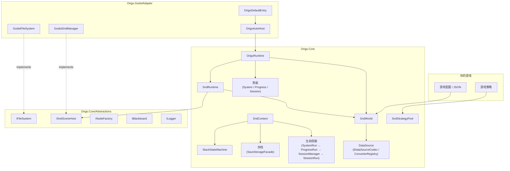
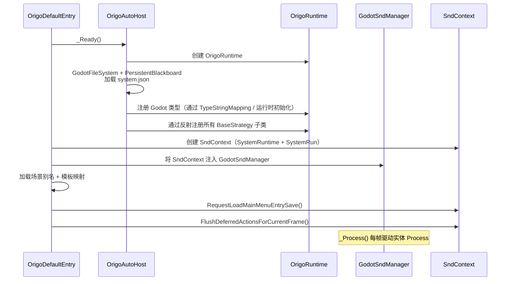

# Origo

[English](README.md)

<!-- badges placeholder -->

**Origo** 是一个平台无关的纯 C# 游戏框架，以 **SND（Strategy–Node–Data）** 实体模型和 **策略模式** 为核心。所有引擎相关代码通过接口隔离，使 Core 库完全不依赖任何引擎。官方提供 **Godot 4** 适配器。

> **目标读者：** 本 README 面向 **将 Origo 集成到项目中的游戏开发者** —— 涵盖 API 接口、配置说明、命名约定、磁盘布局以及子系统边界。内部实现细节请参阅代码与测试。

---

## 目录

锚点 ID 与英文版 [README.md](README.md) 一致，便于在中英文说明之间切换对照。

**基础与约定：** [设计理念与共识](#design-principles-and-consensus) · [存档 I/O 契约](#save-system-contracts) · [发版检查清单](#release-checklist) · [测试](#testing) · [许可证](#license)

**上手：** [特性](#features) · [项目布局](#project-layout) · [快速开始（Godot 4）](#quick-start-godot-4) · [架构概览](#architecture-overview) · [核心概念](#core-concepts)

**参考：** [API 参考](#api-reference) · [内置控制台](#built-in-console-commands) · [JSON 与配置](#json--config-formats) · [启动流程（Godot）](#startup-sequence-godot) · [关键流程](#key-flows) · [副作用与线程](#side-effects--threading-model) · [命名约定](#naming-conventions) · [GodotAdapter 模块](#godotadapter-modules) · [抽象接口](#abstractions-interfaces) · [如何扩展](#how-to-extend)

**进阶：** [自定义类型序列化](#custom-type-serialization-tutorial) · [DataSourceNode 生命周期](#datasourcenode-resource-lifecycle)

---

<a id="features"></a>

## ✨ 特性

- **SND 实体模型** —— 通过 Data、Node 和 Strategy 组合实体，而非深层类继承
- **无状态策略池** —— 共享、引用计数、池化的策略实例，具备快速失败的类型安全
- **四层生命周期** —— `SystemRun` → `ProgressRun` → `SessionManager` → `SessionRun`，配套对应的黑板与结构化参数传递
- **完整存档系统** —— 基于插槽的存/读档、继续游戏、自动存档、关卡切换，以及用于 UI 的 `meta.map`
- **栈式状态机** —— 基于字符串的 push/pop 状态机，具有策略钩子，按层持久化
- **类型化黑板** —— `IBlackboard` 使用 `TypedData` 值，在序列化往返中保持类型
- **内置开发者控制台** —— 8 个内置命令（`help`、`spawn`、`snd_count`、`find_entity`、`clear_entities`、`bb_get`、`bb_set`、`bb_keys`），支持发布/订阅输出及自定义命令扩展
- **确定性无状态随机数** —— XorShift128+ 工具方法，调用方自行维护 `(s0,s1)` 状态推进
- **程序化噪声图辅助** —— 提供 `Simplex + Worley` 的 `70%/30%` 混合噪声图，输出值域 `0..1`，更贴近玩法层直接使用
- **平台无关的 Core** —— 仅依赖 .NET 8；`Origo.Core` 中无任何引擎符号泄露
- **前台/后台关卡** —— 前台关卡和后台关卡共享同一 `ISessionRun` 接口，区别仅在于注入的 `ISndSceneHost`。通过 `ctx.SessionManager.CreateBackgroundSession(key, levelId)` 创建纯内存后台关卡，序列化与持久化由 `SessionManager` 内部管理
- **Godot 4 适配器** —— 薄层实现 + DI 连线；可替换为 Unity、MonoGame 等自定义适配器

无状态随机数快速示例：

```csharp
var (s0, s1) = RandomNumberGenerator.CreateStateFromSeed("battle-seed");
var (roll, nextS0, nextS1) = RandomNumberGenerator.NextUInt64(s0, s1);
// 由业务侧自行保存 nextS0/nextS1，然后继续生成：
var (nextRoll, s2, s3) = RandomNumberGenerator.NextUInt64(nextS0, nextS1);
```

噪声图快速示例：

```csharp
var size = 256;
var map = NoiseMapGenerator.GenerateSimplexWorleyBlendMap(size);
// map 为行优先一维数组，长度 size * size
// 每个值都归一化到 0..1
```

---

<a id="project-layout"></a>

## 📂 项目布局

下列路径均相对于 **本仓库根目录**（包含 `Origo.sln` 的目录）。若将 Origo 作为 **Git 子模块**嵌在游戏仓库中，请先 `cd` 进入子模块目录，以下命令仍以该目录为「Origo 根」执行。

```
Origo.Core/               纯 C# 核心（Microsoft.NET.Sdk，net8.0，无引擎依赖）
Origo.GodotAdapter/       Godot 4 适配器（Godot.NET.Sdk 4.6.1，薄层实现 + DI）
Origo.Core.Tests/         Core 单元测试（xUnit v3；数量见「测试」一节）
Origo.GodotAdapter.Tests/ 适配层测试（xUnit v3；Bootstrap/路径/序列化护栏）
scripts/                  ci.sh（完整 CI）、run-test.sh（仅测试的快捷方式）
Directory.Build.props     共享 MSBuild 属性
Origo.sln                 解决方案文件
```

---

<a id="design-principles-and-consensus"></a>

## 设计理念与共识

Origo 面向 **集成方**：稳定的边界与可观察的行为，优先于把实现细节全部藏起来。

- **与引擎解耦的 Core** —— `Origo.Core` 只依赖 .NET；一切引擎 API 由适配器项目中的接口实现承载。
- **快速失败的契约** —— 存档 I/O、反序列化、策略解析等倾向显式报错，而非静默扭曲数据（见 [存档 I/O 契约](#save-system-contracts)）。
- **统一的会话抽象** —— 前台与后台关卡共用 `ISessionRun`；差异在于注入的 `ISndSceneHost` 以及由谁驱动 Tick，而非两套领域模型。
- **池化、无状态策略** —— 策略实例共享；在策略类型上挂实例字段视为错误，并由测试约束。
- **本文档的职责** —— 安装步骤、磁盘布局、公开 API 与集成契约；内部实现以源码与 `Origo.Core.Tests` 为准。
- **占位类型是有意设计** —— `EmptySessionManager`、`NullNodeFactory` 等表达空对象 / 空操作边界，不是「未完成的玩法模块」。

**本仓库发版范围** —— [`Origo.Core`](Origo.Core)、[`Origo.GodotAdapter`](Origo.GodotAdapter)。引用 Origo 的游戏工程需在自身侧验证端到端行为。

---

<a id="save-system-contracts"></a>

## 存档 I/O 契约

集成方在 **Origo.Core** 持久化层应了解的约定（涉及 `SaveStorageFacade`、`SavePayloadReader`）。

### 严格读取（fail-fast）

对每个关卡目录，读取采用 **严格** 语义：

- **三个文件均不存在**（`snd_scene.json`、`session.json`、`session_state_machines.json`）：视为 **该关卡尚无存档**，API 可能返回 `null`；上层决定是否合法。
- **仅部分文件存在**：视为 **损坏存档**，抛出 `InvalidOperationException`（含路径提示）；**不会**静默合并。

回归测试：`SaveStorageAndPayloadTests`（`ReadCurrent_ActiveLevelPartial_*`、`ReadCurrent_BackgroundLevelPartial_*`、`TryReadLevelPayloadFromCurrent_AllFilesAbsent_ReturnsNull`）。

### `WriteSavePayloadToCurrentThenSnapshot`（两步，非原子）

1. 将 payload 写入 `current/`（含 `.write_in_progress` 标记处理）。
2. 将 `current/` **整体**复制到 `save_{newSaveId}/`（经临时目录再 rename）。

若 **第 2 步失败**，`current/` 可能已更新而槽位目录不完整，索引与磁盘可能不一致。库会打 **Error** 日志（含 `Snapshot failed after current/ was written` 等字样）并 **重新抛出**；**可能保留** `.write_in_progress` 标记以便检测中断写入。

**集成建议：** 向用户提示「上次保存未完成」、提供重试/从其它槽位恢复，或在确认数据一致后再清除标记。

回归测试：`WriteSavePayloadToCurrentThenSnapshot_WhenSnapshotFails_LogsError_LeavesMarkerAndUpdatedCurrent`。

### `SnapshotCurrentToSave`

快照始终是 `current/` 的 **完整拷贝**。

---

<a id="release-checklist"></a>

## 发版检查清单

在打标签或发布基于本仓库的包之前使用。

### 1. 文档与元数据

- [ ] `README.md` / `README.zh-CN.md` 中的命令与 API 说明与本仓库一致。
- [ ] [`LICENSE`](LICENSE) 存在且 README 已链接。
- [ ] 添加、移除或升级内嵌第三方依赖时，同步更新 [`THIRD_PARTY_NOTICES.md`](THIRD_PARTY_NOTICES.md)。

### 2. 构建、测试、覆盖率

- [ ] 在仓库根目录执行 `bash scripts/ci.sh` 成功（与 [`.github/workflows/ci.yml`](.github/workflows/ci.yml) 入口一致）。
- [ ] `Origo.Core` **行覆盖率 ≥ 90%**（由 `Origo.Core.Tests` 中 Coverlet 门禁保证；`Runtime/OrigoAutoInitializer.cs` 与 `Addons/FastNoiseLite/FastNoiseLite.cs` 已从分母排除，见 `Origo.Core.Tests.csproj`）。
- [ ] （可选）`dotnet test … --list-tests` 与发版说明核对。

### 3. 存档行为与产品预期

- [ ] [存档 I/O 契约](#save-system-contracts) 与发行策略一致。
- [ ] 手工冒烟：写档 → 读档 → 换关（预发构建或集成游戏）。

### 4. 功能封闭

- [ ] `Origo.Core` / `Origo.GodotAdapter` 发版路径上无 `TODO` / `FIXME` / `NotImplementedException`（测试桩除外）。
- [ ] 已知占位类型（`EmptySessionManager`、`NullNodeFactory` 等）被当作契约理解，而非隐藏未完成功能。

### 5. CI

- [ ] 默认分支上 GitHub Actions 执行 `bash scripts/ci.sh`，无与之分叉的重复步骤。

### 模块 ↔ 测试（抽样对照）

| 区域 | 主要测试 |
|------|----------|
| 存档 I/O / 严格读 | `SaveStorageAndPayloadTests` |
| 两步写入失败 | `WriteSavePayloadToCurrentThenSnapshot_*` |
| 会话 / 后台关 | `BackgroundSessionTests`, `CoreArchitectureGuardrailTests` |
| 状态机容器 | `RandomAndStateMachine.ContainerTests` |
| 控制台 / spawn | `ConsoleTests`, `ConsoleCommandExtendedTests`, `SpawnTemplateCommandHandlerTests` |
| 内存文件系统 | `MemoryFileSystemTests` |
| 发现与类型映射 | `SndWorldAndDiscoveryCoverageTests`, `AutoInitializerGuardTests` |

---

<a id="quick-start-godot-4"></a>

## 🚀 快速开始（Godot 4）

### 1. 将 Origo 添加到 Godot C# 项目

在游戏 `.csproj` 中引用两个项目：

```xml
<!-- 在你的游戏 .csproj 中 -->
<ProjectReference Include="../Origo.Core/Origo.Core.csproj" />
<ProjectReference Include="../Origo.GodotAdapter/Origo.GodotAdapter.csproj" />
```

### 2. 创建目录结构

```
res://origo/
  entry/
    entry.json            ← 主菜单实体定义
  maps/
    scene_aliases.map     ← 短名称 → PackedScene 路径
    snd_templates.map     ← 模板键 → SndMetaData JSON 路径
  initial/                ← 只读的初始存档（随游戏分发）
```

### 3. 在主场景中添加入口节点

将 `OrigoDefaultEntry` 作为根节点（或子节点）挂载。其导出属性控制路径：

| 属性 | 默认值 | 用途 |
|------|--------|------|
| `ConfigPath` | `res://origo/entry/entry.json` | 主菜单实体定义 |
| `SceneAliasMapPath` | `res://origo/maps/scene_aliases.map` | 场景别名映射 |
| `SndTemplateMapPath` | `res://origo/maps/snd_templates.map` | SND 模板映射 |
| `SaveRootPath` | `user://origo_saves` | 运行时存档目录 |
| `InitialSaveRootPath` | `res://origo/initial` | 只读初始存档 |
| `AutoDiscoverStrategies` | `true` | 通过反射自动注册策略子类 |

你可以重写 `ConfigureSaveMetadataContributors(ISndContext context)` 来注册自定义 `meta.map` 贡献者。

### 4. 编写你的第一个策略

```csharp
using Origo.Core.Snd;
using Origo.Core.Snd.Strategy;

[StrategyIndex("game.player_move")]
public sealed class PlayerMoveStrategy : EntityStrategyBase
{
    public override void Process(ISndEntity entity, double delta, ISndContext ctx)
    {
        // 从实体 Data 中读取状态 —— 策略必须是无状态的
        var (found, speed) = entity.TryGetData<float>("speed");
        if (!found) return;

        // 游戏逻辑写在这里...
    }

    public override void AfterSpawn(ISndEntity entity, ISndContext ctx)
    {
        // 生成时初始化实体数据
        entity.SetData("speed", 200f);
    }
}
```

### 5. 在 JSON 中定义实体

```json
{
  "name": "Player",
  "node": { "pairs": { "sprite": "player_sprite" } },
  "strategy": { "indices": ["game.player_move"] },
  "data": { "pairs": { "speed": { "type": "Single", "data": 200.0 } } }
}
```

### 6. 运行

启动 Godot 项目。`OrigoDefaultEntry._Ready()` 会引导整个框架启动、加载入口存档，并在每帧调用实体的 `Process`。

---

<a id="architecture-overview"></a>

## 🏗 架构概览



### 关键设计原则

1. **Core 平台无关** —— 所有引擎交互通过 `Abstractions/` 接口完成
2. **适配器实现接口 + 连线 DI** —— 适配器中无业务规则
3. **策略共享、池化、无状态** —— 可变状态存储在实体 Data 或黑板中
4. **组合优先于继承** —— `SndEntity` 组合 Data、Node 和 Strategy
5. **显式生命周期** —— `SystemRun` → `ProgressRun` → `SessionManager` → `SessionRun` 组成四层运行时层次
6. **快速失败，无静默回退** —— 缺失数据、错误索引和无效状态会立即抛出异常
7. **单向能力传递** —— 运行时能力严格向下流动，下层无法反向访问上层内部状态
8. **结构化参数传递** —— 每一层构造函数仅接收 (Runtime, Parameters) 两个结构化参数，禁止零散参数

### 运行时层级架构

Origo 的运行时分为四层，每层持有一个结构化 Runtime 容器，并通过结构化 Parameters 记录接收配置：

```
SystemRun（第一层）
  └─ 持有 SystemRuntime
       ├─ Logger, FileSystem, OrigoRuntime, StorageService, SavePathPolicy
       └─ 便捷访问: SndWorld, SndRuntime, SystemBlackboard

ProgressRun（第二层）
  构造函数: (SystemRuntime, ProgressParameters)
  └─ 内部构建 ProgressRuntime
       ├─ Logger, StorageService, SndWorld, SndRuntime, ForegroundSceneHost
       ├─ StateMachineContext, SndContext, SavePathPolicy
       └─ 便捷访问: JsonCodec, ConverterRegistry

SessionManager（第三层）
  构造函数: (ProgressRuntime, SessionManagerParameters, ProgressBlackboard)
  └─ 内部构建 SessionManagerRuntime
       ├─ Logger, StorageService, SndWorld, SndRuntime
       ├─ ForegroundSceneHost, StateMachineContext, SndContext
       └─ 便捷访问: JsonCodec, ConverterRegistry

SessionRun（第四层）
  构造函数: (SessionManagerRuntime, SessionParameters)
  └─ SessionParameters = (LevelId, SessionBlackboard, SceneHost, IsFrontSession)
```

**前台 Session 与后台 Session：**

两者均为同一 `SessionRun` 类——无子类或分叉逻辑。唯一区别是 `IsFrontSession` 标志，由 `SessionManager` 在创建时设置：

| | 前台 Session | 后台 Session |
|---|---|---|
| 数量 | 恰好 1 个（`ForegroundKey` 约束） | 0..N |
| `IsFrontSession` | `true` | `false` |
| 场景宿主 | 引擎适配层宿主（注入） | `FullMemorySndSceneHost` |
| 标志来源 | `SessionManager.CreateForegroundSession` | `SessionManager.CreateBackgroundSession` |

标志传递路径：`SessionParameters.IsFrontSession` → `SessionRun.IsFrontSession` → `ISndContext.IsFrontSession`（通过 `SessionSndContext`）。策略钩子通过 `ctx.IsFrontSession` 获取——无需跨层查询。

**运行时流动方向（严格单向）：**

```
SystemRuntime → ProgressRuntime → SessionManagerRuntime → SessionRun
```

**参数结构体流动方向：**

```
ProgressParameters → SessionManagerParameters → SessionParameters
```

每一层的 Runtime 仅暴露当前层及其子层所需的能力——不存在向上访问。例如 SessionRun 无法访问 SystemBlackboard 或 ProgressRun 的内部状态。

### 对象关系图

```
OrigoDefaultEntry（Godot 入口节点）
  └─ OrigoAutoHost（创建 Runtime + 注入适配器）
       └─ OrigoRuntime
            ├─ SndWorld（StrategyPool / TypeMapping / Mappings / JsonCodec / ConverterRegistry）
            ├─ SndRuntime（ISndSceneHost 门面）
            └─ SystemBlackboard
       └─ SndContext（存档 / 读档 / 切换关卡编排）
            └─ SystemRun（持有 SystemRuntime）
                 └─ ProgressRun（持有 ProgressRuntime）
                      └─ SessionManager（持有 SessionManagerRuntime）
                           └─ SessionRun × N
```

---

<a id="core-concepts"></a>

## 🧩 核心概念

### SND 实体模型

SND（**Strategy–Node–Data**）将游戏对象建模为三个正交关注点的组合：

| 组件 | 存储内容 | 示例 |
|------|---------|------|
| **Strategy** | 行为（无状态，池化） | `game.player_move`、`ui.main_menu` |
| **Node** | 视觉 / 场景表示 | 精灵、网格、UI 面板 |
| **Data** | 可变状态（类型化键值对） | `health: 100`、`speed: 200.0` |

`SndEntity` 是聚合根，组合了 `SndDataManager`、`SndNodeManager` 和 `SndStrategyManager`。实体由 `SndMetaData`（可 JSON 序列化）描述，通过 `SndRuntime` 生成。

#### 实体生命周期

```
Spawn / Load
    │
    ▼
AfterSpawn / AfterLoad          ← 一次性初始化
    │
    ▼
Process(entity, delta, ctx)     ← 每帧调用
    │
    ▼
BeforeSave                      ← 持久化之前
    │
    ▼
BeforeQuit / BeforeDead         ← 清理
    │
    ▼
Dispose
```

---

### 策略系统

策略是 **共享、池化、无状态的对象**，通过点分命名空间索引注册。它们 **不能有实例字段**（注册时强制检查）。

#### 策略层次结构

```
BaseStrategy                       ← 根类型（索引 + 池标识）
  ├── EntityStrategyBase           ← 实体生命周期钩子
  ├── StateMachineStrategyBase     ← push/pop 状态机钩子
  └── （未来的领域基类）
```

#### EntityStrategyBase — 虚方法

```csharp
public virtual void Process(ISndEntity entity, double delta, ISndContext ctx);
public virtual void AfterSpawn(ISndEntity entity, ISndContext ctx);
public virtual void AfterLoad(ISndEntity entity, ISndContext ctx);
public virtual void AfterAdd(ISndEntity entity, ISndContext ctx);
public virtual void BeforeRemove(ISndEntity entity, ISndContext ctx);
public virtual void BeforeSave(ISndEntity entity, ISndContext ctx);
public virtual void BeforeQuit(ISndEntity entity, ISndContext ctx);
public virtual void BeforeDead(ISndEntity entity, ISndContext ctx);
```

#### 注册

每个具体策略 **必须** 声明 `[StrategyIndex("dot.namespace")]`。如果缺少该特性、值为空或类型包含实例字段，发现阶段会立即失败。

```csharp
[StrategyIndex("combat.attack")]
public sealed class AttackStrategy : EntityStrategyBase
{
    // 不允许实例字段 —— 状态应存储在实体 Data 或黑板中
    public override void Process(ISndEntity entity, double delta, ISndContext ctx)
    {
        var (found, cooldown) = entity.TryGetData<double>("attack_cooldown");
        if (found && cooldown > 0)
            entity.SetData("attack_cooldown", cooldown - delta);
    }
}
```

通过 `SndStrategyPool.GetStrategy<EntityStrategyBase>(index)` 解析 —— 若索引对应的 `TBase` 类型不匹配则抛出 `InvalidOperationException`。

---

### 黑板系统

黑板是类型化键值存储，用于跨领域状态共享。

#### `IBlackboard` 契约

```csharp
void Set<T>(string key, T value);
(bool found, T value) TryGet<T>(string key);
void Clear();
IReadOnlyCollection<string> GetKeys();
IReadOnlyDictionary<string, TypedData> SerializeAll();
void DeserializeAll(IReadOnlyDictionary<string, TypedData> data);
```

#### 三个语义层

| 层级 | 黑板 | 生命周期 | 持久化位置 |
|------|------|---------|-----------|
| **System** | `SystemBlackboard` | 整个进程 | `saveRoot/system.json`（通过 `PersistentBlackboard`） |
| **Progress** | `ProgressBlackboard` | 存档槽 / 流程 | `current/progress.json` 和 `save_*/progress.json` |
| **Session** | `SessionBlackboard` | 当前关卡 | `current/level_*/session.json` |

每个黑板层与对应的 **Run** 对象一一对应：

- `SystemRun` ↔ `SystemBlackboard` —— 贯穿整个进程
- `ProgressRun` ↔ `ProgressBlackboard` —— 在读档或继续游戏时创建/替换
- `SessionRun` ↔ `SessionBlackboard` —— 在切换关卡时重新创建

#### PersistentBlackboard

`PersistentBlackboard` 包装 `IBlackboard`，在每次 `Set`、`Clear` 和 `DeserializeAll` 调用时自动持久化到磁盘。Godot 适配器将其用于 `SystemBlackboard`。

#### 预定义键

```csharp
WellKnownKeys.ActiveSaveId       = "origo.active_save_id";
WellKnownKeys.ActiveLevelId      = "origo.active_level_id";
WellKnownKeys.SessionTopology    = "origo.session_topology";
```

---

### 状态机系统

`StackStateMachine` 实现 `IStateMachine` —— 一个 **字符串栈**，具有策略驱动的钩子。

每台状态机在构造时需要一个 **机器键**、一个 **push 策略索引** 和一个 **pop 策略索引**（两者都必须是 `StateMachineStrategyBase` 的实现）。

#### StateMachineStrategyBase — 虚方法

```csharp
public virtual void OnPushRuntime(StateMachineStrategyContext context, IStateMachineContext ctx);
public virtual void OnPushAfterLoad(StateMachineStrategyContext context, IStateMachineContext ctx);
public virtual void OnPopRuntime(StateMachineStrategyContext context, IStateMachineContext ctx);
public virtual void OnPopBeforeQuit(StateMachineStrategyContext context, IStateMachineContext ctx);
```

#### StateMachineStrategyContext

```csharp
public readonly struct StateMachineStrategyContext
{
    public string MachineKey { get; }
    public string? BeforeTop { get; }
    public string? AfterTop { get; }
}
```

#### 钩子语义

| 操作 | 钩子 | 触发时机 |
|------|------|---------|
| 运行时 push | `OnPushRuntime` | 新值入栈后 |
| 读档重建 | `OnPushAfterLoad` | 按从栈底到栈顶顺序逐层调用 |
| 运行时 pop | `OnPopRuntime` | 栈顶值移除前 |
| 退出时展开 | `OnPopBeforeQuit` | 退出时展开栈 |

#### 持久化

状态机由 `StateMachineContainer` 管理，作用域为 `ProgressRun` 或 `SessionRun`：

- `progress_state_machines.json` —— 进度作用域的状态机
- `session_state_machines.json` —— 会话作用域的状态机

通过 `SndContext.GetProgressStateMachines()` / `SessionManager.ForegroundSession?.GetSessionStateMachines()` 访问。

---

### 序列化 / DataSource 抽象

Origo 中的所有序列化均通过 **DataSource 抽象层**（`Origo.Core/DataSource/`）进行，使整个 Core 与任何具体 JSON 库（如 `System.Text.Json`）完全解耦。

#### 关键组件

| 类型 | 职责 |
|------|------|
| `DataSourceNode` | 不可变树节点：Object、Array、String、Number、Boolean、Null —— 惰性展开 |
| `IDataSourceCodec` | 在 `DataSourceNode` 与原始文本（JSON、`.map` 等）之间编码 / 解码 |
| `DataSourceConverterRegistry` | 类型安全的领域对象 ↔ `DataSourceNode` 读写 |
| `DataSourceConverter<T>` | 每种类型转换逻辑的抽象基类 |
| `DataSourceFactory` | 工厂方法，创建预配置的注册表和所有内置转换器 |

#### 编解码器实现

- **`JsonDataSourceCodec`** —— 内部包装 `System.Text.Json`；STJ 仅在此处出现
- **`MapDataSourceCodec`** —— 简单的 `key: value` 行格式，用于 `.map` 文件

#### 工作原理

```
领域对象  ←→  DataSourceNode  ←→  原始文本（JSON / .map）
     ↑ registry.Write/Read ↑    ↑ codec.Encode/Decode ↑
```

`SndWorld` 暴露 `JsonCodec` 和 `ConverterRegistry`，使所有子系统（Save、StateMachine、Blackboard）无需依赖任何 JSON 库即可完成序列化。

#### 扩展自定义类型

要为引擎特定类型（如 Godot `Vector2`）添加序列化支持：

1. 为你的类型实现 `DataSourceConverter<T>`
2. 在引导阶段注册：

```csharp
sndWorld.ConverterRegistry.Register(new MyVector2Converter());
```

参见 `GodotJsonConverterRegistry.RegisterDataSourceConverters()` 获取注册引擎类型的完整示例。

---

### 存档 / 读档系统

存档系统采用 **工作区 + 快照** 模型：

1. `current/` 是实时工作副本（始终可写）
2. `save_*/` 目录是不可变快照
3. 存档时先写入 `current/`，再快照到 `save_xxx/`
4. 读档时将快照恢复到 `current/`，然后重建 Run

#### 存档目录布局

```
saveRoot/
  system.json                       ← SystemBlackboard
  current/                          ← 可写工作副本
    progress.json                   ← ProgressBlackboard
    progress_state_machines.json    ← 进度状态机
    meta.map                        ← 显示元数据（key: value）
    level_default/                  ← 当前关卡数据
      snd_scene.json                ← 序列化的 SND 实体
      session.json                  ← SessionBlackboard
      session_state_machines.json   ← 会话状态机
  save_000/                         ← 不可变快照
    progress.json
    progress_state_machines.json
    meta.map
    level_default/
      ...
  save_001/
    ...
```

#### 严格语义

- **必需文件：** 缺少必需文件或字段视为数据损坏（抛出异常）
- **`progress.json`** 必须存在并能成功反序列化 —— 无静默回退
- **快速失败：** 未注册的策略索引、无效的状态机负载或缺失的模板 → 立即报错

#### 存档路径约定（Godot 默认值）

| 路径 | 用途 |
|------|------|
| `res://origo/initial/` | 随项目分发的只读初始存档 |
| `user://origo_saves/` | 运行时读写存档根目录 |
| `res://origo/entry/` | 入口配置（主菜单实体） |
| `res://origo/maps/` | 别名和模板映射文件 |

---

<a id="api-reference"></a>

## 📘 API 参考

### SndContext

`SndContext` 实现 `ISndContext` —— 策略交互的主门面，用于黑板、存/读档、关卡切换和控制台。`ISndContext` 暴露实体策略所需的完整业务 API；内部实现细节（`SndRuntime`、文件路径等）仅保留在具体类上。

#### 属性（通过 `ISndContext`）

| 属性 | 类型 | 说明 |
|------|------|------|
| `SystemBlackboard` | `IBlackboard` | 系统级黑板（始终可用） |
| `ProgressBlackboard` | `IBlackboard?` | 进度级黑板（读档后可用） |
| `SessionManager` | `ISessionManager` | 创建、序列化、持久化和销毁会话的唯一入口；通过此管理器访问 `ForegroundSession` 和后台会话 |
| `CurrentSession` | `ISessionRun?` | 当前策略上下文绑定的会话；全局上下文下通常为当前前台会话 |

#### 仅具体类属性（不在 `ISndContext` 上）

| 属性 | 类型 | 说明 |
|------|------|------|
| `SndRuntime` | `SndRuntime` | SND 实体运行时（内部实现细节） |
| `SaveRootPath` | `string` | 存档文件根路径 |
| `InitialSaveRootPath` | `string` | 初始（只读）存档路径 |
| `EntryConfigPath` | `string` | 入口配置 JSON 路径 |

#### 实体与延迟方法

| 方法 | 说明 |
|------|------|
| `EnqueueBusinessDeferred(Action)` | 将操作加入帧末业务阶段队列 |
| `FlushDeferredActionsForCurrentFrame()` | 立即刷新所有延迟操作 |
| `GetPendingPersistenceRequestCount()` | 在精简单入口链路中恒定返回 `0` |
| `CloneTemplate(string templateKey, string? overrideName)` | 从模板克隆实体 |

#### 启动方法

| 方法 | 说明 |
|------|------|
| `RequestLoadMainMenuEntrySave()` | 加载主菜单入口（无隐式存档） |

#### 控制台方法

| 方法 | 说明 |
|------|------|
| `TrySubmitConsoleCommand(string commandLine)` | 提交控制台命令 |
| `ProcessConsolePending()` | 处理待执行的控制台命令 |
| `SubscribeConsoleOutput(Action<string>)` | 订阅控制台输出 |
| `UnsubscribeConsoleOutput(long subscriptionId)` | 取消订阅控制台输出 |

#### 状态机方法

| 方法 | 说明 |
|------|------|
| `GetProgressStateMachines()` | 访问进度作用域的状态机 |
| `SessionManager.ForegroundSession?.GetSessionStateMachines()` | 访问前台会话作用域的状态机（通过 `ISessionRun`） |

---

### OrigoRuntime

由适配器创建的顶层运行时对象。

| 成员 | 类别 | 说明 |
|------|------|------|
| `Logger` | 属性 | `ILogger` 日志接口 |
| `SndWorld` | 属性 | 策略池、类型映射、JsonCodec、ConverterRegistry |
| `Snd` | 属性 | `SndRuntime` 实体运行时门面 |
| `SystemBlackboard` | 属性 | 系统黑板 |
| `ConsoleInput` | 属性 | `ConsoleInputQueue?` 控制台输入源 |
| `ConsoleOutputChannel` | 属性 | `IConsoleOutputChannel?` 控制台输出通道 |
| `Console` | 属性 | `OrigoConsole?` 控制台实例 |
| `EnqueueBusinessDeferred(Action)` | 方法 | 将操作加入业务阶段延迟队列 |
| `EnqueueSystemDeferred(Action)` | 方法 | 将操作加入系统阶段延迟队列 |
| `FlushEndOfFrameDeferred()` | 方法 | 依次刷新业务和系统延迟队列 |
| `ResetConsoleState()` | 方法 | 重置控制台为初始状态 |

---

### SndRuntime

组合 `SndWorld` 和 `ISndSceneHost` 的门面。

| 成员 | 类别 | 说明 |
|------|------|------|
| `World` | 属性 | 访问策略池和映射 |
| `SceneHost` | 属性 | 用于实体操作的场景宿主 |
| `Spawn(SndMetaData)` | 方法 | 生成单个实体 |
| `SpawnMany(IEnumerable<SndMetaData>)` | 方法 | 批量生成实体 |
| `SerializeMetaList()` | 方法 | 序列化所有实体元数据 |
| `ClearAll()` | 方法 | 移除所有实体 |
| `GetEntities()` | 方法 | 获取所有活跃实体 |
| `FindByName(string)` | 方法 | 按名称查找实体 |

### 前台关卡与后台关卡

在 Origo 中，**关卡** 是 `ISndSceneHost`（实体管理）与生命周期基建（`IStateMachineContext` / `ProgressRun` / `SessionRun`）的组合。前台关卡与后台关卡均实现同一 `ISessionRun` 接口 —— 具体的 `SessionRun` 类是内部实现细节。唯一区别在于注入的 **场景宿主 / 节点工厂**：

| | 前台关卡 | 后台关卡 |
|---|---|---|
| 会话类型 | `ISessionRun` | `ISessionRun`（同一接口） |
| 场景宿主 | 引擎适配层的 `ISndSceneHost`（如 Godot 适配器） | `FullMemorySndSceneHost` |
| 节点工厂 | 引擎适配层（如 `GodotPackedSceneNodeFactory`） | `NullNodeFactory`（仅记录名称，不实例化） |
| 渲染 | 节点被实例化并显示 | 无节点、无渲染 |
| 实体类型 | 真正的 `SndEntity`，完整策略钩子 | 真正的 `SndEntity`，完整策略钩子 |
| 进度黑板 | 共享 | 共享（通过 `IStateMachineContext` 创建时） |
| 会话黑板 | 独立 | 独立 |
| 状态机 | 独立 | 独立 |
| Process / Tick | 引擎调用 `_Process` | 调用方手动调用 `FullMemorySndSceneHost.ProcessAll(delta)` |
| 格式 | 通过标准 `LevelPayload` 存读 | 相同 — 完全互通 |

二者使用 **相同的** `SndEntity` 代码路径、**相同的** 策略生命周期，产出 **完全相同的** 序列化格式。后台关卡可保存到磁盘后作为前台关卡加载，反之亦然。策略钩子通过 `ctx.IsFrontSession` 区分前台/后台，无需类型分叉。

#### 架构设计：为什么前台和后台共享 `ISessionRun`

前台关卡是唯一且**常驻**的 —— 它在整个游戏会话期间存在，由 `ProgressRun` 管理。后台关卡是**临时**的 —— 按需创建（如运行时程序化生成、后台 AI 仿真），用完即销毁。`IsFrontSession` 标志在构造时注入，策略钩子可直接检查而无需查询 `SessionManager`。

由于前台关卡"始终存在"，后台关卡在概念上**依附**于前台关卡。当调用 `ctx.SessionManager.CreateBackgroundSession(key, levelId)` 时：

1. **拷贝共享引用** —— 从前台关卡获取 `SndWorld`（策略池、编解码器）、`ProgressBlackboard`、`IFileSystem`、`SaveRootPath`
2. **创建隔离数据** —— 后台关卡独有的新 `SessionBlackboard`、新 `StateMachineContainer`、新 `FullMemorySndSceneHost`
3. **自动挂载** —— 会话以给定的 key 注册到 `SessionManager` 并返回 `ISessionRun`

此设计确保：
- **一致性** —— 后台关卡自动共享前台的策略、模板和进度数据
- **隔离性** —— 每个后台关卡拥有独立的会话状态和实体集合，不会干扰前台场景
- **简洁性** —— 无需额外包装类；调用方使用熟悉的 `ISessionRun` 契约

#### 创建后台关卡

**从已有 `SndContext` 创建**（推荐用于生产环境 — 共享策略池、进度黑板和文件系统）：

```csharp
// 在策略或游戏逻辑中，通过 SessionManager 创建后台关卡：
using var bgSession = ctx.SessionManager.CreateBackgroundSession("dungeon", "generated_dungeon");

// SceneHost 直接提供完整实体操作 — 无需强转
var host = bgSession.SceneHost;

// 前台 SndWorld 上注册的所有策略均可使用
host.Spawn(new SndMetaData
{
    Name = "Boss_01",
    NodeMetaData = new NodeMetaData(),
    StrategyMetaData = new StrategyMetaData { Indices = { "ai.boss" } },
    DataMetaData = new DataMetaData()
});

// 设置后台关卡的会话数据
bgSession.SessionBlackboard.Set("difficulty", "nightmare");

// 写入 ProgressBlackboard — 对前台关卡也可见
ctx.ProgressBlackboard!.Set("dungeon_ready", true);

// 执行一帧 — 所有实体的 Process 被触发
host.ProcessAll(0.016);

// 序列化与持久化由 SessionManager 内部管理。
// 后台会话生命周期与持久化由 SessionManager 内部管理。
```

**测试中创建** —— 使用 `CreateForegroundContext` 模式（参见 `BackgroundSessionTests.cs`）：

```csharp
// 通过 SessionManager 创建用于测试的后台会话：
using var bg = ctx.SessionManager.CreateBackgroundSession("test", "test_level");
var host = bg.SceneHost;

// 生成实体 — 每个策略的 AfterSpawn 钩子被触发
var guard = host.Spawn(new SndMetaData
{
    Name = "Guard_01",
    NodeMetaData = new NodeMetaData(),
    StrategyMetaData = new StrategyMetaData { Indices = { "patrol" } },
    DataMetaData = new DataMetaData()
});

// 读写黑板
bg.SessionBlackboard.Set("alert_level", 3);

// 执行一帧 — 对所有实体调用 Process
host.ProcessAll(0.016);

// 运行时动态添加 / 移除策略
guard.AddStrategy("combat");
guard.RemoveStrategy("patrol");

// 序列化所有实体
var snapshot = bg.SceneHost.SerializeMetaList();

// 销毁指定实体 — 触发 BeforeDead 钩子
host.DeadByName("Guard_01");

// Dispose 清除所有实体（触发 BeforeQuit）并释放会话
```

> **持久化：** `SessionManager` 管理的全部会话（前台+后台）仍会写入会话拓扑，并通过 `ProgressBlackboard` 中的 `WellKnownKeys.SessionTopology` 恢复。
>
> **生命周期所有权：** `SessionManager` 完全拥有 `SessionRun` 的生命周期。会话始终通过 `SessionManager` 创建并自动挂载——没有单独的 Mount/Unmount 操作。后台会话通过 `ctx.SessionManager.DestroySession(key)` 销毁。调用方仍需负责每帧 tick 会话；可使用 `ctx.SessionManager.ProcessAllSessions(delta)` 简化操作。
>
> **序列化：** 会话状态（黑板、状态机、实体）的序列化与持久化由 `SessionManager` 内部管理。`ISessionRun` 不再暴露 `SerializeToPayload()`、`LoadFromPayload()` 或 `PersistLevelState()`。

#### 序列化与加载后台会话

后台会话支持与前台关卡相同的 `LevelPayload` 序列化格式。序列化与持久化由 `SessionManager` 内部管理。

**从 payload 恢复：**

```csharp
// 先创建后台会话，再通过 SessionManager 内部恢复入口加载 LevelPayload。
using var restored = ctx.SessionManager.CreateBackgroundSession("arena", "ai_arena");
((SessionManager)ctx.SessionManager).LoadSessionFromPayload("arena", payload);
```

**完整流程：后台 → 前台关卡：**

```csharp
// 1. 后台会话构建关卡
using var bg = ctx.SessionManager.CreateBackgroundSession("dungeon", "procedural_dungeon");
var host = bg.SceneHost;
// ... 填充实体 ...

// 2. SessionManager 内部处理持久化。
// 3. 前台挂载由生命周期内部流程控制。
```

**创建后台会话用于仿真：**

```csharp
// 创建后台会话用于 AI 仿真
using var simulation = ctx.SessionManager.CreateBackgroundSession("sim", "sim_arena");
var simHost = simulation.SceneHost;

// 运行 100 帧模拟
for (int i = 0; i < 100; i++)
    simHost.ProcessAll(0.016);

// 从仿真的黑板中读取结果
var (_, score) = simulation.SessionBlackboard.TryGet<int>("final_score");
```

#### 会话恢复机制（责任链模式）

Origo 对会话的序列化与反序列化采用 **责任链模式**（Chain of Responsibility）。运行时层次中的每一层仅处理自身拥有的数据，然后委托给下一层。**层间不传递已构建的运行时对象（如 `IBlackboard` 实例）**——每个模块自主读写自身的持久化数据。

**设计哲学：模块自主读写，入口仅需 saveId。**

- `ProgressRun` 始终在内部自行创建空白 `ProgressBlackboard`。构造函数仅接受 `saveId` 字符串（通过 `ProgressParameters`），不接受外部注入的黑板。
- 恢复逻辑完全通过 `LoadFromPayload()` 触发，该方法读取 `SaveGamePayload` 并按职责链顺序反序列化每层数据。
- 模块间通过轻量级结构（存储在黑板已知键中的拓扑字符串）传递会话元数据，而非预填充的对象实例。

**序列化链**（存档）：

```
SessionRun            → 序列化自身数据（SessionBlackboard、状态机、实体 → LevelPayload）
  ↓ 返回 LevelPayload
SessionManager        → 收集所有后台会话的 LevelPayload
  ↓ 返回 Dictionary<key, LevelPayload>
ProgressRun           → 将会话拓扑写入 ProgressBlackboard（WellKnownKeys.SessionTopology）
                      → 序列化 ProgressBlackboard、进度状态机
                      → 组装最终 SaveGamePayload
```

**反序列化链**（读档）：

```
ProgressRun           → 反序列化自身数据（ProgressBlackboard、进度状态机）
                      → 从自身 ProgressBlackboard 读取会话拓扑
  ↓ 将拓扑描述符传递给 SessionManager
SessionManager        → 遍历拓扑描述符
                      → 按正确属性创建/挂载每个 SessionRun
                        （前台身份通过 ForegroundKey 确认，Tick 状态通过 syncProcess 确认）
  ↓ 将数据加载委托给 SessionRun
SessionRun            → 反序列化自身数据（SessionBlackboard、会话状态机、SND 场景实体）
```

**反序列化后恢复的属性：**

| 属性 | 恢复机制 |
|------|----------|
| 前台身份（`IsFrontSession`） | 拓扑条目的 key 为 `ISessionManager.ForegroundKey` → 以前台方式挂载 |
| Tick 注册（syncProcess） | 拓扑条目第三字段（`true`/`false`） → 传递给 `CreateBackgroundSession` |
| ProgressBlackboard 引用 | 所有会话共享来自 `ProgressRun` 的同一 `ProgressBlackboard` 实例 |
| SessionBlackboard 隔离 | 每个会话获得新的 `IBlackboard` 实例；数据从 `LevelPayload.SessionJson` 恢复 |

**前台唯一性约束：** 最多一个会话可挂载在 `ISessionManager.ForegroundKey`。`SessionManager` 强制保证此约束：挂载新的前台会话时会自动销毁旧的前台会话。

#### API 一览

由于后台关卡实现了标准 `ISessionRun` 接口，其 API 与前台关卡相同：

| 成员 | 类型 | 说明 |
|------|------|------|
| `ISessionManager.ForegroundKey` | `ISessionManager` 常量 | 前台会话的保留挂载键（`"__foreground__"`） |
| `ctx.SessionManager.ForegroundSession` | `ISessionManager` 属性 | 访问前台会话（读档后可用）；等价于 `TryGet(ForegroundKey)` |
| `ctx.SessionManager.Keys` | `ISessionManager` 属性 | 所有已挂载会话的键（包含前台会话键，如果存在） |
| `ctx.SessionManager.Contains(key)` | `ISessionManager` 方法 | 检查指定键的会话是否已挂载 |
| `ctx.SessionManager.TryGet(key)` | `ISessionManager` 方法 | 按键查找会话 |
| `ctx.SessionManager.CreateBackgroundSession(key, levelId, syncProcess?)` | `ISessionManager` 方法 | 创建后台 `ISessionRun`（自动挂载）— 共享 `SndWorld`、`ProgressBlackboard`、文件系统。当 `syncProcess` 为 `true` 时，该会话参与 `ProcessAllSessions` 帧更新 |
| `ctx.SessionManager.DestroySession(key)` | `ISessionManager` 方法 | 销毁并释放后台会话 |
| `ctx.SessionManager.ProcessAllSessions(delta, includeForeground?)` | `ISessionManager` 方法 | 处理所有开启 `syncProcess` 的会话一帧 |
| `LevelId` | `ISessionRun` 属性 | 关卡标识符 |
| `SessionBlackboard` | `ISessionRun` 属性 | 会话级黑板（独立） |
| `GetSessionStateMachines()` | `ISessionRun` 方法 | 访问会话级状态机 |
| `SceneHost` | `ISessionRun` 属性 | `ISndSceneHost` — 直接提供完整实体操作（Spawn/FindByName/GetEntities），无需强转 |
| `Dispose()` | `ISessionRun` 方法 | 关闭关卡（清除实体、黑板、状态机） |

通过 `SceneHost`（`ISndSceneHost` 接口）访问的实体操作：

| 成员 | 类型 | 说明 |
|------|------|------|
| `Spawn(SndMetaData)` | 方法 | 生成实体 → `AfterSpawn` |
| `FindByName(string)` | 方法 | 按名称查找 |
| `GetEntities()` | 方法 | 所有存活实体 |
| `ClearAll()` | 方法 | 移除所有实体 → `BeforeQuit` |
| `SerializeMetaList()` | 方法 | 快照所有元数据 → `BeforeSave` |
| `LoadFromMetaList(IEnumerable)` | 方法 | 清除并从元数据重新加载 |

`FullMemorySndSceneHost` 上的附加方法（仅后台关卡）：

| 成员 | 类型 | 说明 |
|------|------|------|
| `DeadByName(string)` | 方法 | 按名称销毁实体 → `BeforeDead` |
| `ProcessAll(double)` | 方法 | 所有实体执行一帧 `Process` |

#### 辅助类型

| 类型 | 说明 |
|------|------|
| `FullMemorySndSceneHost` | 基于真正 `SndEntity` 实例的 `ISndSceneHost`（无引擎节点）；额外提供 `DeadByName` 和 `ProcessAll` |
| `MemoryFileSystem` | 纯内存 `IFileSystem` — 无磁盘 I/O |

#### 允许与禁止的差异

由于前台和后台关卡共享 `ISessionRun` 契约，消费会话的代码应保持类型无关：

| | 允许 ✅ | 禁止 ❌ |
|---|---|---|
| 场景访问 | 不同的 `ISndSceneHost` 实现（前台引擎适配层 vs 后台 `FullMemorySndSceneHost`） | 业务逻辑中根据会话类型分叉（如 `if (isForeground) { … }`） |
| 实体操作 | 通过 `SceneHost` 统一使用 `ISndSceneHost` 方法 | 将 `ISessionRun` 强制转换为具体类型 `SessionRun` |
| 扩展 | 为新后端自定义 `ISndSceneHost` 实现 | 在策略或游戏逻辑中硬编码前台/后台检查 |

> **经验法则：** 如果你的代码需要知道当前运行在*哪种*会话中，说明设计需要重新审视。会话类型相关的行为应放在注入的 `ISndSceneHost` / `INodeFactory` 中，而不是消费方。

#### 可注入服务

以下接口将生命周期基建与具体实现解耦，便于测试、替换适配器和配置行为：

| 接口 | 替代 | 说明 |
|------|------|------|
| `IStateMachineContext` | 直接依赖 `SndContext` | `StateMachineContainer` 消费的上下文接口 — 提供 `SessionBlackboard`（当前会话）、`SceneAccess`（当前会话场景）和会话元数据，无需耦合完整上下文。**两种实现**：`SndContext` 作为全局/流程级默认实现（指向前台会话）；`SessionStateMachineContext` 是内部适配器，将每个会话的黑板和场景宿主绑定到自身——前后台会话状态机钩子**无语义分差** |
| `ISaveStorageService` | 直接文件系统存档逻辑 | 存档槽持久化抽象（列出、读取、写入、快照、枚举）。**所有** 方法 — 包括 `EnumerateSaveIds`、`EnumerateSavesWithMetaData`、`WriteSavePayloadToCurrentThenSnapshot` 和 `SnapshotCurrentToSave` — 均由注入的 `ISavePathPolicy` 完整驱动。注入以替换文件系统存储为云端、数据库或内存后端 |
| `ISavePathPolicy` | 硬编码路径布局 | 决定存档文件目录结构和命名。通过 `SndContext` 构造函数注入后，自动传播到默认的 `DefaultSaveStorageService`（主存储和初始存储）、`SystemRuntime`、`SessionRun` 和 `LevelBuilder` — **所有** 存储路径由同一策略实例驱动。实现此接口以自定义存档文件夹布局，无需修改核心代码 |

策略钩子接收 `IStateMachineContext` 而非具体的 `SndContext`，使策略保持可测试性并与完整运行时解耦。会话级状态机接收 `SessionStateMachineContext`，保证 `ctx.SessionBlackboard` 和 `ctx.SceneAccess` 始终指向当前会话——前后台会话一视同仁。

---

<a id="built-in-console-commands"></a>

## 🖥 内置控制台命令

开发者控制台提供 8 个内置命令，覆盖实体管理和黑板检查。通过 `SndContext.TrySubmitConsoleCommand(string)` 提交命令，通过 `SubscribeConsoleOutput` 接收输出。

### 实体命令

| 命令 | 用法 | 说明 |
|------|------|------|
| `spawn` | `spawn <name> <template>` | 通过克隆已注册模板生成实体 |
| | `spawn name=<n> template=<t>` | 命名参数形式（不可与位置参数混用） |
| `snd_count` | `snd_count` | 输出当前已生成实体的数量 |
| `find_entity` | `find_entity <name>` | 按名称查找实体并显示其节点信息 |
| `clear_entities` | `clear_entities` | 销毁所有已生成的实体 |

### 黑板命令

| 命令 | 用法 | 说明 |
|------|------|------|
| `bb_get` | `bb_get <layer> <key>` | 从指定黑板层读取值 |
| `bb_set` | `bb_set <layer> <key> <value>` | 写入值（自动推断 int / float / bool / string 类型） |
| `bb_keys` | `bb_keys <layer>` | 列出指定黑板层的所有键 |

> **layer** —— 目前支持 `system`。当存在具有活跃 Run 的 `SndContext` 时，Progress / Session 层亦可用。

### 实用命令

| 命令 | 用法 | 说明 |
|------|------|------|
| `help` | `help` | 列出所有已注册的命令名称 |

### 自定义命令

通过 `OrigoConsole.RegisterHandler(IConsoleCommandHandler)` 注册自定义命令。

每个处理器需声明：

| 属性 | 说明 |
|------|------|
| `Name` | 命令关键字（不区分大小写） |
| `HelpText` | 帮助信息，由 `help` 命令自动收集展示 |
| `MinPositionalArgs` | 允许的位置参数最小数量（含） |
| `MaxPositionalArgs` | 允许的位置参数最大数量（含），-1 表示无上限 |

继承 `ConsoleCommandHandlerBase` 可获得**自动参数数量校验** — 只有参数数量合法时才会调用 `ExecuteCore`：

```csharp
public sealed class TeleportCommandHandler : ConsoleCommandHandlerBase
{
    public override string Name => "teleport";
    public override string HelpText => "teleport <x> <y> — 将玩家传送到指定坐标。";
    public override int MinPositionalArgs => 2;
    public override int MaxPositionalArgs => 2;

    protected override bool ExecuteCore(
        CommandInvocation invocation,
        IConsoleOutputChannel outputChannel,
        out string? errorMessage)
    {
        var x = invocation.PositionalArgs[0];
        var y = invocation.PositionalArgs[1];
        outputChannel.Publish($"已传送到 ({x}, {y})。");
        errorMessage = null;
        return true;
    }
}
```

随时注册：

```csharp
runtime.Console?.RegisterHandler(new TeleportCommandHandler());
```

内置 `help` 命令会自动列出所有已注册处理器的 `HelpText`。

---

<a id="json--config-formats"></a>

## 📄 JSON 与配置格式

### SndMetaData

```json
{
  "name": "Player",
  "node": {
    "pairs": {
      "sprite": "player_sprite"
    }
  },
  "strategy": {
    "indices": ["game.player_move", "game.player_combat"]
  },
  "data": {
    "pairs": {
      "health": { "type": "Int32", "data": 100 },
      "speed":  { "type": "Single", "data": 200.0 }
    }
  }
}
```

### 模板简写（JSON 数组）

实体数组支持内联定义和模板引用两种方式：

```json
[
  { "sndName": "MyEntity", "templateKey": "some_template" },
  {
    "name": "InlineEntity",
    "strategy": { "indices": ["game.some_strategy"] },
    "data": { "pairs": {} }
  }
]
```

### `.map` 文件格式

每行一个 `key: value`。以 `#` 开头的行为注释。

```
# 场景别名 —— 将短名称映射到 PackedScene 路径
box: res://scenes/resource/box.tscn
camera: res://scenes/resource/camera.tscn
player_sprite: res://scenes/characters/player.tscn
```

### `meta.map`（存档显示元数据）

格式相同，用于存档槽 UI 显示：

```
# 存档显示元数据
title: Chapter 2 - Forest
play_time: 03:12:55
player_level: 18
```

存档元数据贡献者在当前精简链路中由生命周期内部组件管理。

---

<a id="startup-sequence-godot"></a>

## 🔄 启动流程（Godot）



**逐步说明：**

1. `OrigoDefaultEntry._Ready()` → `OrigoAutoHost._Ready()` 创建 `OrigoRuntime`
2. `GodotFileSystem` + `PersistentBlackboard` 加载 `saveRoot/system.json`
3. 在运行时的 `TypeStringMapping` 上注册 Godot 类型（例如构建 `SndWorld` 前调用 `GodotJsonConverterRegistry.RegisterTypeMappings(...)`，见 `OrigoAutoHost`）
4. 通过反射注册所有具体的 `BaseStrategy` 子类
5. 创建 `SndContext`（内部创建 `SystemRuntime` + `SystemRun`），注入 `GodotSndManager`
6. 加载场景别名和模板映射文件
7. `RequestLoadMainMenuEntrySave()` + `FlushDeferredActionsForCurrentFrame()`
8. `GodotSndManager._Process` 每帧运行实体的 `Process`

---

<a id="key-flows"></a>

## 🔀 关键流程

### 启动主菜单

```
游戏调用 SndContext.RequestLoadMainMenuEntrySave()
  → 加入 SystemDeferred 队列
  → 重置运行时控制台状态
  → 重建 ProgressRun 并挂载主菜单前台会话
  → 从 `entry.json` 生成入口实体
```

### 会话恢复（Play-Stop-Play）

```
ProgressRun 仅使用 saveId 创建（内部空白 ProgressBlackboard）
  → 调用 LoadFromPayload(payload) 传入 SaveGamePayload
  → ProgressRun 反序列化自身数据（ProgressBlackboard、状态机）
  → 从自身 ProgressBlackboard 读取 WellKnownKeys.SessionTopology
  → 对拓扑中每个描述符：
      若 key == ForegroundKey → SessionManager.CreateForegroundSession（IsFrontSession=true）
      否则                    → SessionManager.CreateBackgroundSession（syncProcess 保留）
  → SessionManager 将数据加载委托给 SessionRun.LoadFromPayload
  → SessionRun 恢复 SessionBlackboard、会话状态机、SND 场景实体
  → 前台身份、Tick 注册、黑板隔离均被完整恢复
```

---

<a id="side-effects--threading-model"></a>

## ⚠️ 副作用与线程模型

### 延迟执行

`RequestLoadMainMenuEntrySave` **不会**立即执行，而是将延迟动作加入游戏循环队列。

| 行为 | 详情 |
|------|------|
| **延迟动作何时执行？** | 仅在调用 `FlushDeferredActionsForCurrentFrame()` 时执行（通常由适配层每帧调用一次） |
| **执行顺序** | 业务延迟 → 系统延迟，严格按序 |
| **重入守卫** | 同一时刻只允许一个生命周期工作流；重叠请求抛 `InvalidOperationException` |
| **持久化计数器** | 在当前精简链路中，`GetPendingPersistenceRequestCount()` 恒定返回 `0` |

### 线程模型

| 规则 | 详情 |
|------|------|
| **单线程假设** | `SndContext`、所有 Run 类型、实体生命周期必须在游戏循环线程上访问 |
| **延迟队列** | 入队操作线程安全；刷新仅限游戏循环线程 |
| **控制台** | `ConsoleInputQueue.Enqueue()` 和 `ConsoleOutputChannel.Subscribe/Publish` 线程安全 |
| **黑板** | `IBlackboard` 实现 **非** 线程安全 |
| **后台关卡** | 在游戏循环线程创建，之后可在任意单线程上 Process（不可并发） |

### 常见陷阱

- **在启动加载前访问 `ProgressBlackboard` / `SessionManager.ForegroundSession?.SessionBlackboard`** —— 返回 `null`；请先调用 `RequestLoadMainMenuEntrySave` + flush
- **`SessionRun` 释放后访问属性** —— 所有访问抛 `ObjectDisposedException`；释放顺序为：自动持久化（尽力而为）→ 从 `SessionManager` 自动卸载 → 弹出所有状态机 → 清空状态机 → 清空场景 → 清空黑板
- **后台关卡生命周期** —— 后台会话通过 `SessionManager` 创建和销毁；调用方需负责调用 `ProcessAllSessions(delta)` 或手动 tick 每个会话

---

<a id="naming-conventions"></a>

## 📏 命名约定

所有外部字符串遵循一致的风格，以防止静默的不匹配。

| 场景 | 约定 | 示例 |
|------|------|------|
| 策略索引 | 点分命名空间，`lower_snake_case` 片段 | `ui.main_menu`、`combat.attack` |
| 黑板键 | 点分命名空间，`lower_snake_case` | `origo.active_save_id` |
| `.map` 键 | `lower_snake_case`，文件内唯一 | `player_sprite`、`box` |
| `SndMetaData.name` | `PascalCase` | `Player`、`MainMenu` |

无效或缺失的数据 **快速失败** —— 没有兼容性垫片或静默回退。

---

<a id="godotadapter-modules"></a>

## 🔌 GodotAdapter 模块

| 模块 | 位置 | 职责 |
|------|------|------|
| **OrigoAutoHost** | `Bootstrap/` | 创建 `OrigoRuntime`；为系统提供 `PersistentBlackboard`；`ConsoleInputQueue` + `ConsoleOutputChannel` |
| **GodotSndBootstrap** | `Bootstrap/` | 一次调用 `BindRuntimeAndContext(GodotSndManager, SndWorld, ILogger, ISndContext)` |
| **OrigoConsolePump** | `Bootstrap/` | 每帧调用 `OrigoRuntime.Console.ProcessPending()` |
| **OrigoDefaultEntry** | `Bootstrap/` | 继承 `OrigoAutoHost`；启动分步；可重写 `ConfigureSaveMetadataContributors(ISndContext context)` |
| **GodotFileSystem** | `FileSystem/` | `IFileSystem` 实现，支持 `res://` 和 `user://` 路径 |
| **GodotLogger** | `Logging/` | `ILogger` 实现，使用 Godot 输出 |
| **GodotSndEntity** | `Snd/` | 将 `SndEntity` 绑定到 Godot `Node` 生命周期 |
| **GodotSndManager** | `Snd/` | `ISndSceneHost` 实现；`_Process` 每帧驱动实体策略 |
| **GodotPackedSceneNodeFactory** | `Snd/` | `INodeFactory` 实现，通过 Godot `PackedScene` |
| **GodotNodeHandle** | `Snd/` | `INodeHandle` 实现，包装 Godot `Node` |
| **GodotJsonConverterRegistry** | `Serialization/` | 在 `TypeStringMapping` 中注册 Godot 类型 + JSON 转换器 |

### OrigoAutoHost 导出属性

| 属性 | 默认值 | 说明 |
|------|--------|------|
| `SystemBlackboardSaveRoot` | `user://origo_saves` | `PersistentBlackboard` 的存档根目录 |

---

<a id="abstractions-interfaces"></a>

## 🧱 抽象层（接口）

所有宿主提供的能力声明在 `Origo.Core/Abstractions/` 中：

| 接口 | 职责 |
|------|------|
| `IFileSystem` | 文件 I/O、路径、目录（`res://` 等虚拟路径由适配器解释） |
| `INodeFactory` | 按逻辑名称 + 资源 ID 创建节点 → `INodeHandle` |
| `INodeHandle` | 最小节点句柄：`Name`、`Native`、`Free()`、`SetVisible()` |
| `ISndSceneHost` | 场景实体操作：`Spawn`、`GetEntities`、`FindByName` |
| `ISndEntity` | 由 `ISndDataAccess` + `ISndNodeAccess` + `ISndStrategyAccess` 组合 |
| `IBlackboard` | 类型化键值存储，包含 `SerializeAll` / `DeserializeAll` |
| `IDataSourceCodec` | 在 `DataSourceNode` 与原始文本（如 JSON）之间编码 / 解码 |
| `ILogger` | `Log(LogLevel level, string tag, string message)`，含 `LogLevel` 枚举 |
| `IScheduler` | 延迟操作调度 |
| `IStateMachine` | 字符串栈状态机 API |
| `IConsoleInputSource` | 控制台命令输入（`TryDequeueCommand`） |
| `IConsoleOutputChannel` | 控制台输出发布/订阅（`Publish` / `Subscribe`） |

---

<a id="how-to-extend"></a>

## 🔧 如何扩展

### 添加新的实体策略

1. 创建继承 `EntityStrategyBase` 的类
2. 添加 `[StrategyIndex("your.namespace")]` 注解
3. 重写所需的生命周期方法
4. 确保 **无实例字段** —— 类必须是无状态的

```csharp
[StrategyIndex("game.enemy_ai")]
public sealed class EnemyAiStrategy : EntityStrategyBase
{
    public override void Process(ISndEntity entity, double delta, ISndContext ctx)
    {
        // AI 逻辑 —— 通过实体 Data 读写状态
    }

    public override void AfterSpawn(ISndEntity entity, ISndContext ctx)
    {
        entity.SetData("ai_state", "idle");
    }
}
```

### 添加新的状态机策略

1. 创建继承 `StateMachineStrategyBase` 的类
2. 添加 `[StrategyIndex("sm.push.your_machine")]` 注解
3. 根据需要重写 push/pop 钩子

```csharp
[StrategyIndex("sm.push.camera")]
public sealed class CameraPushStrategy : StateMachineStrategyBase
{
    public override void OnPushRuntime(StateMachineStrategyContext context, IStateMachineContext ctx)
    {
        // 响应状态入栈（例如切换摄像机模式）
    }
}
```

### 添加新的引擎适配器

要将 Origo 移植到其他引擎（Unity、MonoGame 等）：

1. **实现抽象接口** —— 为 `IFileSystem`、`ISndSceneHost`、`INodeFactory`、`INodeHandle`、`ILogger` 以及游戏所需的其他接口提供具体类型
2. **引导运行时** —— 使用你的实现创建 `OrigoRuntime`，类似于 `OrigoAutoHost`
3. **驱动帧循环** —— 每帧调用实体的 `Process`，帧末调用 `FlushEndOfFrameDeferred()`
4. **注册引擎类型** —— 通过 `SndWorld.RegisterTypeMappings(...)` 映射 CLR 类型到稳定名称（或在构造 `SndWorld` 前填充 `TypeStringMapping`），并通过 `SndWorld.ConverterRegistry` 注册 `DataSourceConverter<T>` 实现

Core 库 **零** 引擎依赖 —— 只有适配器项目引用目标引擎 SDK。

---

<a id="custom-type-serialization-tutorial"></a>

## 📦 自定义类型序列化教程

Origo 使用 `DataSourceNode` 树作为序列化的中间表示。要序列化和反序列化你自己的类型，需要：

1. **编写转换器** —— 实现 `DataSourceConverter<T>`
2. **注册转换器** —— 将其添加到 `DataSourceConverterRegistry`
3. **注册类型名称** —— 将其添加到 `TypeStringMapping`（`TypedData` / 黑板使用时需要）

### 步骤 1：定义你的类型

```csharp
public sealed class Inventory
{
    public string OwnerName { get; set; } = "";
    public int[] ItemIds { get; set; } = [];
    public double TotalWeight { get; set; }
}
```

### 步骤 2：实现转换器

```csharp
using Origo.Core.DataSource;

public sealed class InventoryConverter : DataSourceConverter<Inventory>
{
    public override Inventory Read(DataSourceNode node)
    {
        return new Inventory
        {
            OwnerName = node["ownerName"].AsString(),
            ItemIds   = node["itemIds"].Elements.Select(e => e.AsInt()).ToArray(),
            TotalWeight = node["totalWeight"].AsDouble()
        };
    }

    public override DataSourceNode Write(Inventory value)
    {
        var itemIds = DataSourceNode.CreateArray();
        foreach (var id in value.ItemIds)
            itemIds.Add(DataSourceNode.CreateNumber(id));

        return DataSourceNode.CreateObject()
            .Add("ownerName",   DataSourceNode.CreateString(value.OwnerName))
            .Add("itemIds",     itemIds)
            .Add("totalWeight", DataSourceNode.CreateNumber(value.TotalWeight));
    }
}
```

### 步骤 3：注册转换器和类型名称

在启动阶段（例如在你的引导代码中）注册转换器和类型名称：

```csharp
// 注册类型名称（TypedData / 黑板需要）。类型映射由 SndWorld 内部持有，请使用：
sndWorld.RegisterTypeMappings(m => m.RegisterType<Inventory>("Game.Inventory"));

// 注册转换器
sndWorld.ConverterRegistry.Register(new InventoryConverter());
```

### 步骤 4：使用

```csharp
// 序列化
using var node = registry.Write(myInventory);
string json = jsonCodec.Encode(node);

// 反序列化
using var decoded = jsonCodec.Decode(json);
Inventory restored = registry.Read<Inventory>(decoded);
```

### 内置支持的类型

以下所有类型均有内置转换器，可直接与 `TypedData` 和黑板配合使用：

| 原始类型 | 数组类型 |
|---------|---------|
| `byte`、`sbyte` | `byte[]`、`sbyte[]` |
| `short`、`ushort` | `short[]`、`ushort[]` |
| `int`、`uint` | `int[]`、`uint[]` |
| `long`、`ulong` | `long[]`、`ulong[]` |
| `float`、`double`、`decimal` | `float[]`、`double[]`、`decimal[]` |
| `bool`、`char`、`string` | `bool[]`、`char[]`、`string[]` |

---

<a id="datasourcenode-resource-lifecycle"></a>

## ♻️ DataSourceNode 资源生命周期

`DataSourceNode` 实现了 `IDisposable` 接口。它是一种 **资源**，使用后应显式释放，以便及时回收节点树（子节点、延迟展开闭包、缓存字符串等）。

### 一次性反序列化（最常见）

解码 JSON、读取数据后即完成时，使用 `using` 语句包裹节点：

```csharp
using var node = codec.Decode(json);
var result = registry.Read<MyType>(node);
// 节点在此处被释放 —— 所有子节点递归释放
```

### 一次性序列化

同理，将数据写入 JSON 时：

```csharp
using var node = registry.Write(myObject);
string json = codec.Encode(node);
// 节点在此处被释放
```

### 长期持有的 DataSourceNode

如果需要在单个方法之外持有 `DataSourceNode`（例如作为缓存或延迟加载的配置），将其存储为字段，并在所有者不再使用时释放：

```csharp
public sealed class ConfigCache : IDisposable
{
    private DataSourceNode? _root;

    public void Load(IDataSourceCodec codec, string json)
    {
        _root?.Dispose();           // 重新加载时释放前一个
        _root = codec.Decode(json);
    }

    public string GetValue(string key) => _root![key].AsString();

    public void Dispose()
    {
        _root?.Dispose();
        _root = null;
    }
}
```

### 关键规则

- **始终使用 `using`** 处理瞬态（解码 → 读取 → 完成）工作流。
- 如果节点需要在单个方法之外存活，**存储为字段 + 实现 `IDisposable`**。
- **`Dispose()` 之后**，任何访问都会抛出 `ObjectDisposedException` —— 快速失败，无静默错误。
- **Dispose 是递归的** —— 释放根节点会自动释放所有子节点。
- **Dispose 是幂等的** —— 多次调用是安全的。

---

<a id="testing"></a>

## 🧪 测试

**本地与 GitHub 使用同一套流程：** 在 Origo 仓库根目录执行：

```bash
bash scripts/ci.sh
```

依次执行 `dotnet restore`、`dotnet build`（Release）、`dotnet test`；[`.github/workflows/ci.yml`](.github/workflows/ci.yml) 仅调用该脚本，无额外步骤。**行覆盖率在 `dotnet test` 阶段由 Coverlet（`Origo.Core.Tests`）校验**（`Origo.Core` 总行覆盖率 ≥ 90%）；脚本在 restore/测试前会打印说明横幅，Core 测试结束后 Coverlet 会打印汇总表；未达标则整个任务失败（无需单独的「仅跑覆盖率」步骤）。

已构建后只想跑测试时，可选用：`bash scripts/run-test.sh`。

手动等价命令：

```bash
dotnet test Origo.sln --configuration Release
```

CI 对 `Origo.Core` 强制执行 **行覆盖率 ≥ 90%**（Coverlet）。`Runtime/OrigoAutoInitializer.cs` 与 `Addons/FastNoiseLite/FastNoiseLite.cs` 已从该百分比统计中**排除**（反射/引导代码与内嵌第三方源码），见 `Origo.Core.Tests.csproj`。本地生成覆盖率报告示例：

```bash
dotnet test Origo.Core.Tests/Origo.Core.Tests.csproj -c Release \
  -p:CollectCoverage=true -p:Threshold=90 -p:ThresholdType=line -p:ThresholdStat=total
```

| 项目 | 说明 |
|------|------|
| `Origo.Core.Tests` | SND、存档、生命周期、控制台、DataSource、序列化、黑板、后台关卡等 |
| `Origo.GodotAdapter.Tests` | 适配层测试（Bootstrap 契约、文件系统路径策略、Godot 转换器注册） |

测试项目使用 **xUnit v3**。当前测试数量请使用 `dotnet test ... --list-tests` 查看。发版前请按上文 [发版检查清单](#release-checklist) 与 [存档 I/O 契约](#save-system-contracts) 自检。

### 测试目录结构

```
Origo.Core.Tests/
├── SystemRuntimeTests/           # 系统层测试（控制台、调度、类型映射）
├── ProgressRuntimeTests/         # 流程层测试（存档、生命周期、入口流程）
├── SessionManagerRuntimeTests/   # 会话管理器测试（后台会话、解耦、契约）
├── SessionRuntimeTests/          # 会话层测试（实体、状态机、策略）
│   ├── FrontSession/             # 前台 Session 标志、唯一性、策略 Context
│   └── BackgroundSession/        # 后台 Session 标志、多实例、Context
├── IntegrationTests/             # 跨层集成与工具测试
├── TestDoubles.cs                # 共享测试替身和 TestFactory
└── GlobalUsings.cs               # 共享全局 using

Origo.GodotAdapter.Tests/
├── FileSystemTests/              # Godot 路径辅助与文件系统契约测试
├── BootstrapTests/               # 启动装配与空参数守卫测试
└── SerializationTests/           # Godot 类型映射与转换器注册测试
```

---

<a id="license"></a>

## 📜 许可证

本项目采用 [MIT 许可证](LICENSE) 授权。

本仓库同时包含第三方代码：

- `FastNoiseLite`（MIT），内嵌路径：`Origo.Core/Addons/FastNoiseLite/FastNoiseLite.cs`
- 署名与许可证文本见 [`THIRD_PARTY_NOTICES.md`](THIRD_PARTY_NOTICES.md) 与 [`LICENSE.FastNoiseLite`](LICENSE.FastNoiseLite)。

---

<p align="center">
  <em>为追求结构化而不愿承受完整引擎框架之重的游戏开发者而构建。</em>
</p>
